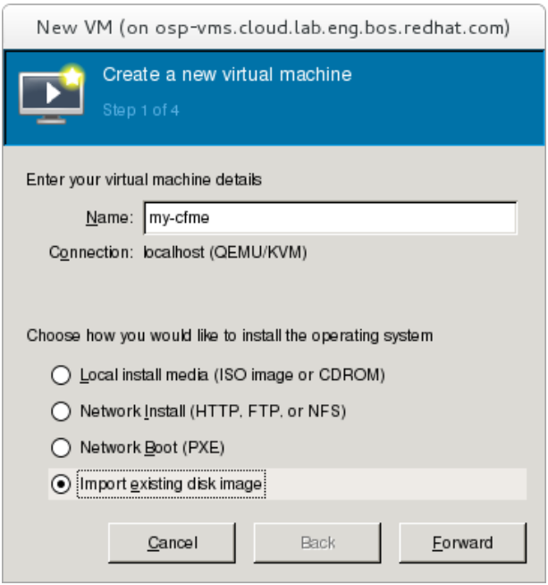
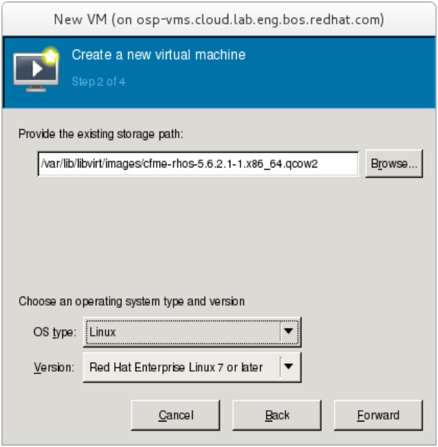
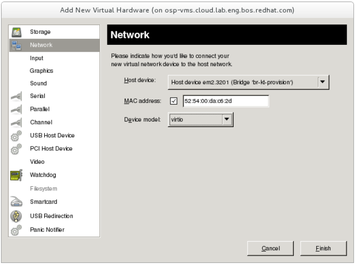

1.  Log in as `root` to the virtual machine host.

2.  Copy the appliance to `/var/lib/libvirt/images/`.

3.  Run `virt-manager`. Doing so will launch the Virtual Machine Manager.

4.  Enter a name for the virtual machine in the **Name** field; for example, use `my-cfme`. Select
    **Import existing disk image** and click **Forward**.

    

5.  Click **Browse** to select the copy of the appliance stored in `/var/lib/libvirt/images/`.

    

    Select **Linux** from the **OS type** drop-down. For **Version**, select
    **Red Hat Enterprise Linux 7 or later**. Click **Forward**.

6.  Configure the appliance with 4 CPUs and 8192MiB or memory. Select
    **Customize configuration before install** then click **Finish**.

    

7.  Add a second network interface for the virtual machine. Select **virtio** as its
    **Device Model**.

    

8.  Configure the virtual machine with two additional virtual disks. One will be used for the
    internal database, while the other will be used for mounting images and SmartState analysis.

    

9.  Click **Finish** to launch the virtual machine.
