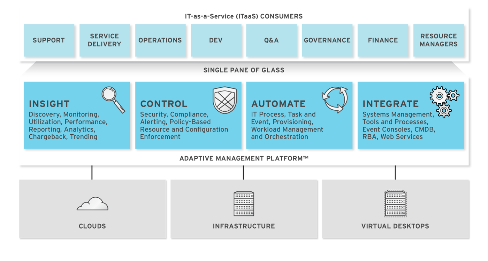

## Introduction to {{ site.data.product.title }}

{{ site.data.product.title }} delivers the insight, control, and automation that
enterprises need to address the challenges of managing virtual
environments. This technology enables enterprises with existing virtual
infrastructures to improve visibility and control, and those starting
virtualization deployments to build and operate a well-managed virtual
infrastructure.

{{ site.data.product.title }} provides the following feature sets:

  - Insight: Discovery, Monitoring, Utilization, Performance, Reporting,
    Analytic, Chargeback, and Trending.

  - Control: Security, Compliance, Alerting, and Policy-Based Resource,
    and Configuration Enforcement.

  - Automate: IT Process, Task and Event, Provisioning, and Workload
    Management and Orchestration.

  - Integrate: Systems Management, Tools and Processes, Event Consoles,
    Configuration Management Database (CMDB), Role-based Administration
    (RBA), and Web Services.

### Architecture

The diagram below describes the capabilities of {{ site.data.product.title }}. Its
features are designed to work together to provide robust management and
maintenance of your virtual infrastructure. 

The architecture comprises the following components:

  - The {{ site.data.product.title }} appliance (appliance) which is supplied as a
    secure, high-performance, preconfigured virtual machine. It provides
    support for HTTPS communications.

  - The {{ site.data.product.title }} Server (Server) resides on the appliance. It is
    the software layer that communicates between the SmartProxy and the
    Virtual Management Database. It includes support for HTTPS
    communications.

  - The Virtual Management Database (VMDB) resides either on the
    appliance or another computer accessible to the appliance. It is the
    definitive source of intelligence collected about your Virtual
    Infrastructure. It also holds status information regarding appliance
    tasks.

  - The {{ site.data.product.title }} Console (Console) is the Web interface used to
    view and control the Server and appliance. It is consumed through
    Web 2.0 mash-ups and web services (WS Management) interfaces.

  - The SmartProxy can reside on the appliance or on an ESX Server. If
    not embedded in the Server, the SmartProxy can be deployed from the
    appliance. A SmartProxy agent must configured in each storage
    location, and must be visible to the appliance. The SmartProxy acts
    on behalf of the appliance communicating with it over HTTPS on
    standard port 443.

### Requirements

To use {{ site.data.product.title }}, certain virtual hardware, database, and browser
requirements must be met in your environment.

#### Virtual Hardware Requirements

The {{ site.data.product.title }} appliance requires the following virtual hardware at
minimum:

  - 4 VCPUs

  - 12 GB RAM

  - 44 GB HDD + optional database disk

#### Database Requirements

Red Hat recommends allocating the virtual machine disk fully at the time
of creation. Three main factors affect the size of your database over
time:

  - Virtual Machine Count: the most important factor in the calculation
    of virtual machine database (VMDB) size over time.

  - Host Count: the number of hosts associated with the provider.

  - Storage Count: the number of individual storage elements as seen
    from the perspective of the provider or host. It is not the total
    number of virtual disks for all virtual machines.

Use the following table as a guideline to calculate minimum requirements
for your database:

When enabling capacity and utilization for metrics gathering over a
period of time, it is recommended that the VMDB size scale accordingly.
Evaluate the number of instances in your provider inventory and storage
duration requirements to plan for increased VMDB sizing requirements.

Use the following information to plan for your increased VMDB needs when
working with metrics gathering:

  - Realtime metrics data are stored for 4 hours.

  - Rollup metrics data are stored for 6 months.

**Example**:

|                                 |                        |                                                                                   |                                                                                                |
| ------------------------------- | ---------------------- | --------------------------------------------------------------------------------- | ---------------------------------------------------------------------------------------------- |
|                                 | **Minute**             | **Hour**                                                                          | **Day**                                                                                        |
| **OpenStack Provider Instance** | **3** Realtime Metrics | **181** (3 records \* 60 minutes = 180 Realtime Metrics + 1 hourly Rollup Metric) | **4,345** (3 records \* 60 minutes \* 24 hours =4320 Realtime Metrics + 1 daily Rollup Metric) |

  - Metrics data storage times can be configured by editing the Advanced
    Settings.

#### Browser Requirements

To use {{ site.data.product.title }}, the following browser requirements must be met:

  - One of the following web browsers:

      - Google Chrome

      - Mozilla Firefox

      - Safari

      - Internet Explorer 10 or higher

#### Additional Requirements

Additionally, the following must be configured to use {{ site.data.product.title }}:

  - The {{ site.data.product.title }} appliance must already be installed and
    activated in your enterprise environment.

  - The SmartProxy must have visibility into the virtual machines and
    cloud instances that you want to control.

  - For more information, see
    [SmartProxies](https://access.redhat.com/documentation/en-us/red_hat_cloudforms/4.2/html-single/general_configuration/#smartproxies)
    in the {{ site.data.product.title_short }} *General Configuration* guide.

### Terminology

The following terms are used throughout the documentation. Review them
before proceeding.

  - Account Role
    The level of access a user has to different parts and functions of
    the {{ site.data.product.title }} console. There are a variety of Account Roles,
    which can be assigned to users to restrict or allow access to parts
    of the console and virtual infrastructure.

  - Action
    An execution that is performed after a condition is evaluated.

  - Alert
    {{ site.data.product.title }} alerts notify administrators and monitoring systems
    of critical configuration changes and threshold limits in the
    virtual environment. The notification can take the form of either an
    email or an SNMP trap.

  - Analysis Profile
    A customized scan of hosts, virtual machines, or instances. You can
    collect information from categories, files, event logs, and registry
    entries.

  - Cloud
    A pool of on-demand and highly available computing resources. The
    usage of these resources are scaled depending on the user
    requirements and metered for cost.

  - {{ site.data.product.title }} Appliance
    A virtual machine where the virtual management database (VMDB) and
    {{ site.data.product.title }} reside.

  - {{ site.data.product.title }} Console
    A web-based interface into the {{ site.data.product.title }} appliance.

  - {{ site.data.product.title }} Role
    A designation assigned to a {{ site.data.product.title }} server that defines what
    a {{ site.data.product.title }} server can do.

  - {{ site.data.product.title }} Server
    The application that runs on the {{ site.data.product.title }} appliance and
    communicates with the SmartProxy and the VMDB.

  - Cluster
    Hosts that are grouped together to provide high availability and
    load balancing.

  - Condition
    A control policy test triggered by an event, which determines a
    subsequent action.

  - Discovery
    Process run by the {{ site.data.product.title }} server which finds virtual
    machine and cloud providers.

  - Drift
    The comparison of a virtual machine, instance, host, cluster to
    itself at different points in time.

  - Event
    A trigger to check a condition.

  - Event Monitor
    Software on the {{ site.data.product.title }} appliance which monitors external
    providers for events and sends them to the {{ site.data.product.title }} server.

  - Host
    A computer running a hypervisor, capable of hosting and monitoring
    virtual machines. Supported hypervisors include RHV-H, VMware ESX
    hosts, Windows Hyper-V hosts.

  - Instance/Cloud Instance
    A on-demand virtual machine based upon a predefined image and uses a
    scalable set of hardware resources such as CPU, memory, networking
    interfaces.

  - Managed/Registered VM
    A virtual machine that is connected to a host and exists in the
    VMDB. Also, a template that is connected to a provider and exists in
    the VMDB. Note that templates cannot be connected to a host.

  - Managed/Unregistered VM
    A virtual machine or template that resides on a repository or is no
    longer connected to a provider or host and exists in the VMDB. A
    virtual machine that was previously considered registered may become
    unregistered if the virtual machine was removed from provider
    inventory.

  - Provider
    An external management system that {{ site.data.product.title_short }} integrates
    in order to collect data and perform operations.

  - Policy
    A combination of an event, a condition, and an action used to manage
    a virtual machine.

  - Policy Profile
    A set of policies.

  - Refresh
    A process run by the {{ site.data.product.title }} server which checks for
    relationships of the provider or host to other resources, such as
    storage locations, repositories, virtual machines, or instances. It
    also checks the power states of those resources.

  - Regions
    A region is the collection of zones that share the same database for
    reporting and charting. A master region may be added to synchronize
    multiple VMDBs into one VMDB for higher-level reporting, providing a
    "single pane of glass" view.

  - Resource
    A host, provider, instance, virtual machine, repository, or
    datastore.

  - Resource Pool
    A group of virtual machines across which CPU and memory resources
    are allocated.

  - Repository
    A place on a datastore resource which contains virtual machines.

  - SmartProxy
    The SmartProxy is a software agent that acts on behalf of the
    {{ site.data.product.title }} appliance to perform actions on hosts, providers,
    storage and virtual machines.

  -
    The SmartProxy can be configured to reside on the {{ site.data.product.title }}
    appliance or on an ESX server version. The SmartProxy can be
    deployed from the {{ site.data.product.title }} appliance, and provides visibility
    to the VMFS storage. Each storage location must have a SmartProxy
    with visibility to it. The SmartProxy acts on behalf of the
    {{ site.data.product.title }} appliance. If the SmartProxy is not embedded in the
    {{ site.data.product.title }} server, it communicates with the {{ site.data.product.title }}
    appliance over HTTPS on standard port 443.

  - SmartState Analysis
    Process run by the SmartProxy which collects the details of a
    virtual machine or instance. Such details include accounts, drivers,
    network information, hardware, and security patches. This process is
    also run by the {{ site.data.product.title }} server on hosts and clusters. The
    data is stored in the VMDB.

  - SmartTags
    Descriptors that allow you to create a customized, searchable index
    for the resources in your clouds and infrastructure.

  - Storage Location
    A device, such as a VMware datastore, where digital information
    resides that is connected to a resource.

  - Tags
    Descriptive terms defined by a {{ site.data.product.title }} user or the system
    used to categorize a resource.

  - Template
    A template is a copy of a preconfigured virtual machine, designed to
    capture installed software and software configurations, as well as
    the hardware configuration, of the original virtual machine.

  - Unmanaged Virtual Machine
    Files discovered on a datastore that do not have a virtual machine
    associated with them in the VMDB. These files may be registered to a
    provider that the {{ site.data.product.title }} server does not have configuration
    information on. Possible causes may be that the provider has not
    been discovered or that the provider has been discovered, but no
    security credentials have been provided.

  - Virtual Machine
    A software implementation of a system that functions similar to a
    physical machine. Virtual machines utilize the hardware
    infrastructure of a physical host, or a set of physical hosts, to
    provide a scalable and on-demand method of system provisioning.

  - Virtual Management Database (VMDB)
    Database used by the {{ site.data.product.title }} appliance to store information
    about your resources, users, and anything else required to manage
    your virtual enterprise.

  - Virtual Thumbnail
    An image in the web interface representing a resource, such as a
    provider or a virtual machine, showing the resource’s properties at
    a glance. Each virtual thumbnail is divided into quadrants, which
    provide information about the resource, such as its software and
    power state.

  - Worker Appliance
    A {{ site.data.product.title_short }} appliance dedicated to a role other than
    user interface or database.

  - Zones
    {{ site.data.product.title }} Infrastructure can be organized into zones to
    configure failover and to isolate traffic. Zones can be created
    based on your environment. Zones can be based on geographic
    location, network location, or function. When first started, new
    servers are put into the default zone.
