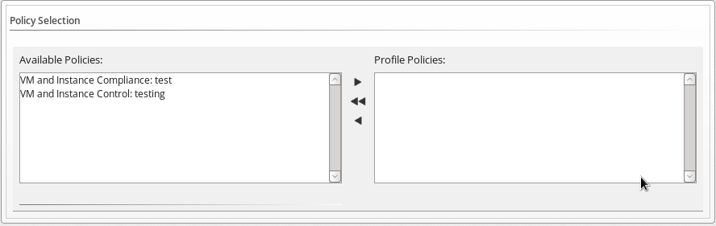

1.  Browse  to menu: **Control > Explorer**.

2.  Click on the **Policy Profiles** accordion, then click **Configuration**, then
     (**Add a New Policy Profile**).

3.  In the **Basic Information** area, type in a unique description for the policy profile.

    

4.  From **Available Policies** in the **Policy Selection** area select all the policies you need
    to apply to this policy profile. Use the `Ctrl` key to select multiple policies.

    

5.  Click  to add the **Policies**.

    

6.  Add to the **Notes** area if required.

7.  Click **Add**.
