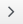

1.  Browse to menu: **Control > Explorer**.

2.  Expand the **Policies** accordion, and click **Control Policies**.

3.  Select **Vm Control Policies**.

4.  Click **Configuration**, then
     (**Add a New VM and Instance Control Policy**).

5.  Enter a **Description**. This will be the name given to your VM control policy.

6.  Uncheck **Active** if you do not want this policy processed even when assigned to a resource.

7.  Optionally, enter **Scope** (you can also create a scope as part of a condition, or not use one
    at all). If the virtual machine is not included in the scope, the assigned action will not run.

    You can use the drop-down below the
     (**Commit expression element changes**) icon to create an
    expression for the **Scope**. {{ site.data.product.title_short }} will generate drop-downs
    containing relevant options depending on your choices. Click
     (**Commit expression element changes**) to add the scope.

8.  Enter **Notes** if required.

9.  Click **Add**. The policy is added and listed under **Vm Control Policies** in the **Policies**
    accordion.

10. Select the newly-added VM control policy. You can now associate events, conditions, and actions
    with the policy.

11. Click **Configuration**, then
     (**Edit this Policy’s Event assignments**).

12. Under **VM Operation**, select **VM Analysis Start**.

13. Click **Save**.

14. Click the **VM Analysis Start** event to configure actions.

15. Click **Configuration**, then
     (**Edit Actions for this Policy Event**).

16. In **Order of Actions if ALL Conditions are True**, select the action created in
    [Creating an Action to Assign the Virtual Machine Analysis Profile to the Analysis Task](#assign-profile-analysis-task-action)
    from the **Available Actions** list. This action will take place if the resources meet the
    conditions of the policy.

    

    **Note:**

    Each selected action can be executed synchronously or asynchronously; a synchronous action will
    not start until the previous synchronous action is completed, while an asynchronous action
    allows the next action to start whether or not the first action has completed. Also, at least
    one {{ site.data.product.title_short }} server in the {{ site.data.product.title_short }} zone
    must have the notifier server role enabled for the trap to be sent.

17. Click () which will move the action to **Selected Actions**. The
    selected action is set to (S) Synchronous by default. From **Selected Actions**, select the
    action, then:

      - Click **A** (Set selected Actions to Asynchronous) to make it asynchronous.

      - Click **S** (Set selected Actions to Synchronous) to make it synchronous. If creating a
        synchronous action, use the up and down arrows to identify in what order you want the
        actions to run.

18. Click **Save**.
