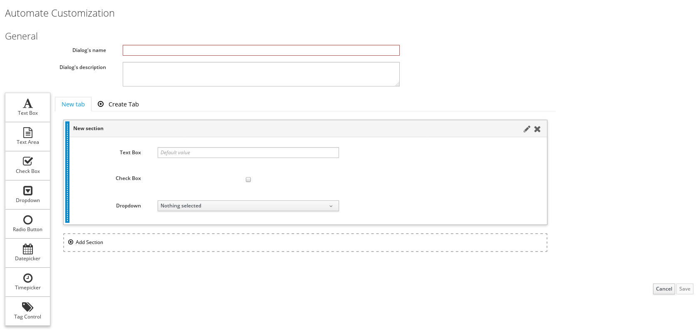

{{ site.data.product.title_short }} includes a drag-and-drop service dialog editor to create service dialogs. The editor, with its drag-and-drop feature, provides a visual representation of the components that comprise a service dialog. You can easily design your service dialog utilizing dialog tabs, sections (previously referred to as boxes), and elements.

When users access a service, the majority of options available to them are preset and
cannot be altered. The requirements for the service determine the options and fields that
need to be present in the dialog for user input. A service dialog exposes some of those
options to the user so that even if they are ordering a basic Red Hat Enterprise Linux 7
machine, for example, they can at least choose the amount of memory, virtual CPUs, or
other options available to the instance they order. In cases where certain fields must be
unique, such as the name of virtual machines in RedHat Virtualization, users must enter
their own unique name for the virtual machine they choose or the operation will fail, so
this field must be exposed.

A service dialog contains three components:

- One or more **Tabs**.

- Inside the tabs, one or more **Sections**. Note that in the previous method of creating service dialogs using the {{ site.data.product.title_short }} user interface, **Sections** were referred to as **Boxes**.

- Inside the sections, one or more **Elements**. Elements are controls that accept input. Elements contain methods, like check boxes, drop-down lists or text fields, to fill in the options on the provisioning dialog.

**Important:**

The names of the elements must correspond to the options used in the provisioning dialog.

1. Browse to menu: **Automation > Automate > Customization**.

2. Click the **Service Dialogs** accordion.

3. Click **Configuration**, and then  **Add a new Dialog**.

    

4. Enter basic details under **General**:

    1. Enter the **Dialog’s name** and **Dialog’s description**.

5. Add a new tab to the dialog:

    1. Click **Create Tab**. Then, click the  icon on the new tab to edit tab information.

    2. Enter a **Label**.

    3. Optional: Enter a description for the tab in **Description**.

    4. Click **Save**.

6. Add a new section to the tab:

    1. Click  **Add Section**. Then, click the  icon on the upper-right to edit section details.

    2. Enter a **Label**.

    3. Optional: Enter a description for the section in **Description**.

    4. Click **Save**.

7. Add elements to the section:

    1. From the list of elements on the left, click an element you want to add, then drag-and-drop it inside the section. Then, click the  icon next to the element to edit its field details.

        | Element Types | Additional Info                                                                                                                                                                                                                                                                |
        | ------------- | ------------------------------------------------------------------------------------------------------------------------------------------------------------------------------------------------------------------------------------------------------------------------------ |
        | Text Area     | Provides text area for users to enter text. You can enter the default text in **Default Value**, or leave it as blank.                                                                                                                                                         |
        | Text Box      | Text box is similar to a text area with the added option to enable **Protected** so the text is shown as asterisks(\*), instead of plain text.                                                                                                                                 |
        | Check Box     | Enable **Default Value** if you want the box checked by default.                                                                                                                                                                                                               |
        | Drop Down     | Use drop down to create list entries either manually or using automate methods. Enable **Dynamic** to create lists using automate methods; use **Entry Point** to select an automate instance. Enable **Show Refresh Button** to allow users to refresh list options manually. |
        | Radio Button  | Similar to a drop down but displays options using radio buttons.                                                                                                                                                                                                               |
        | Datepicker    | Use this to enable users to pick a date by clicking the calendar icon.                                                                                                                                                                                                         |
        | Timepicker    | use this to enable users to pick a date and time.                                                                                                                                                                                                                              |
        | Tag Control   | Select a **Category** of tags you want assigned to virtual machines associated with the service dialog. Enable **Single Select** if only one tag can be selected.                                                                                                              |

    2. Enter a **Label**, **Name**, and **Description** for the element.

        

        Element names must correspond to the options used in the provisioning dialog. **Name** must use only alphanumeric characters and underscores without spaces. It is also used to retrieve the value of this element in the method used with the dialog and must start with **dialog\_service\_type**.

        

    3. Optional: Add additional information in **Help** to assist the user to complete the fields in the service dialog. This field is useful for explaining unfamiliar terminology or providing configuration tips. This information is presented when you hover over the \[\!\] exclamation mark in the Service Dialog while ordering a Service Catalog later.

    4. Set other options as required.

    5. Click **Save**.

8. Optional: Repeat the above step to add more elements to the existing section, or
   create and add elements to a new section as required.

9. Optional: Repeat the step to add a new tab to the dialog, and subsequent steps to add sections and elements to it as required.

10. Click **Save** to create the dialog.

The service dialog is now created, and added to the **Service Dialogs** accordion.
