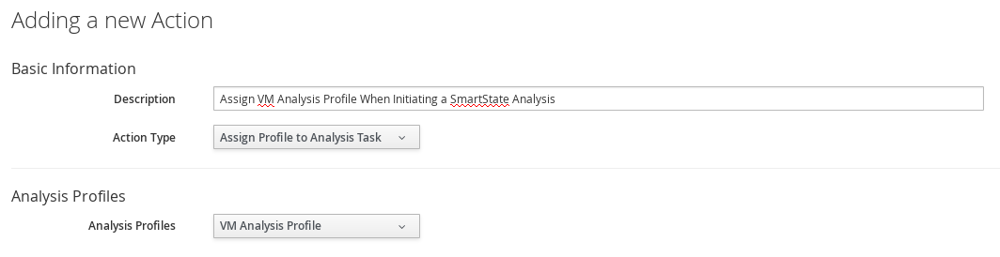

[[assign-profile-analysis-task-action]]

== Creating an Action to Assign the Virtual Machine Analysis Profile to the Analysis Task

Actions are performed after the condition is evaluated. You can associate actions with specific events when you create a policy. {product-title} provides a set of default actions, but you can also create custom actions using the {product-title_short} user interface.

Use this procedure to create a custom action by adding the *Assign Profile to Analysis Task* action type to the virtual machine analysis profile (created in xref:vm-analysis-profile[]).

. Navigate to menu:Control[Explorer].           
. Expand the *Actions* accordion and click image:../images/1847.png[image] (*Configuration*), then image:../images/1862.png[image] (*Add a new Action*).
. Enter a *Description* for the new action. This will be the name given to your new action.
. Select *Assign Profile to Analysis Task* from the *Action Type* list.
. Select the newly-created virtual machine analysis profile from the *Analysis Profiles* list.
. Click *Add*.

[NOTE]
====
You can only associate this action with an analysis start event.
====

The action is created and added to the *Available Actions* list. Associate this action with the *VM Analysis Start* event when you create a virtual machine control policy in the next procedure.

