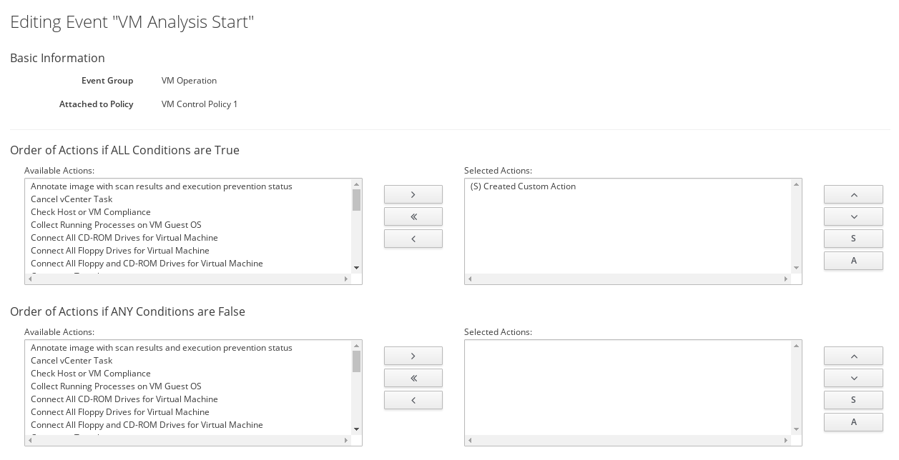

[[create-vm-control-policy]]

== Creating a Virtual Machine Control Policy

You can create a control policy by combining an event, a condition, and an action. The procedure below describes how to create a virtual machine control policy to assign the newly-created action to the *VM Analysis Start* event. Optionally, you can use a scope expression that is tested immediately when the policy is triggered by an event. If the item is out of scope, then the policy will not continue on to the conditions, and the assigned action will not run. 

. Navigate to menu:Control[Explorer].                         
. Expand the *Policies* accordion, and click *Control Policies*.
. Select *Vm Control Policies*.
. Click image:../images/1847.png[image] (*Configuration*), then image:../images/1862.png[image] (*Add a New VM and Instance Control Policy*).        
. Enter a *Description*. This will be the name given to your VM control policy.     
. Clear the *Active* box if you do not want this policy processed even when assigned to a resource.
. Optionally, enter a *Scope* (you can also create a scope as part of a condition, or not use one at all). If the virtual machine is not included in the scope, the assigned action will not run.
+
You can use the drop-down list to create an expression for the *Scope*. {product-title_short} will generate drop-downs containing relevant options depending on your choices. Click image:../images/1863.png[image] (*Commit expression element changes*) to add the scope.
. Enter *Notes* if required.
. Click *Add*. The policy is added and listed under *Vm Control Policies* in the *Policies* accordion.
. Select the newly-added VM control policy. You can now associate events, conditions, and actions with the policy.
.. Click image:../images/1847.png[image] (*Configuration*), then image:../images/1851.png[image] (*Edit this Policy’s Event assignments*).
.. Under *VM Operation*, set *VM Analysis Start* to *Yes*.    
.. Click *Save*.
.. Click the *VM Analysis Start* event to configure actions.
.. Click image:../images/1847.png[image] (*Configuration*), then image:../images/1851.png[image] (*Edit Actions for this Policy Event*).    
.. In *Order of Actions if ALL Conditions are True*, select the action created in xref:assign-profile-analysis-task-action[] from the *Available Actions* list. This action will take place if the resources meet the conditions of the policy. 
+

+
[NOTE]
====
Each selected action can be executed synchronously or asynchronously; a synchronous action will not start until the previous synchronous action is completed, while an asynchronous action allows the next action to start whether or not the first action has completed. Also, at least one {product-title_short} server in the {product-title_short} zone must have the notifier server role enabled for the trap to be sent.
====
+
.. Click () which will move the action to *Selected Actions*. The selected action is set to (S) Synchronous by default. From *Selected Actions*, select the action, then:
* Click *A* (Set selected Actions to Asynchronous) to make it asynchronous.                                 
* Click *S* (Set selected Actions to Synchronous) to make it synchronous. If creating a synchronous action, use the up and down arrows to identify in what order you want the actions to run. 
. Click *Save*.

