=== Creating a Condition

You can create a condition either from within a policy screen or by going directly to the expression editor in the {product-title} console. You need to define a description and an expression element. The expression element defines what criteria you want to use to
test the condition.

. Navigate to menu:Control[Explorer].

. Click the *Conditions* accordion, and select either *Host Conditions* or *VM Conditions*.

. Click image:../images/1847.png[image] (*Configuration*), then image:../images/1848.png[image] (*Add a New Host Condition*) or image:../images/1848.png[image] (*Add a New VM Condition*).

. Enter a *Description* for the condition.
+
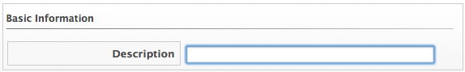

. Click image:../images/1851.png[image] (*Edit this Scope*) in the *Scope* area to create a general condition based on a simple attribute. Based on what you choose, different options appear. Creating a scope is optional.
+
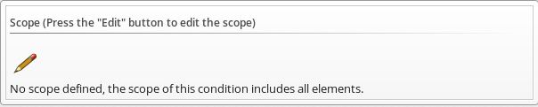

* Click *Field* to create criteria based on field values.
+
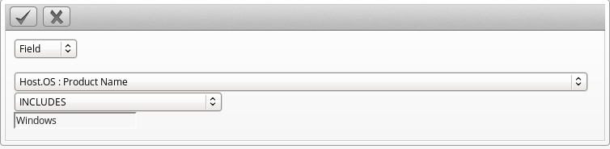
* Click *Count of* to create criteria based on the count of something, such as the number of network adapters on the host.
+
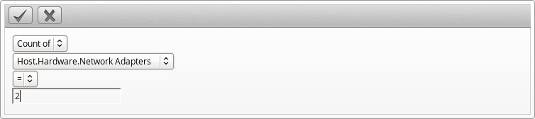
* Click *Tag* to create criteria based on tags assigned to your resources. For example, you can check the power state of a virtual machine or see if it is tagged as production.
+
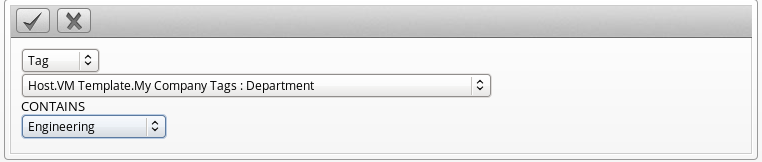
* Click *Find* to seek a particular value, and then check a property. For example, finding the Admin account and checking that it is enabled. Use the following check commands:
** *Check Any*: The result is true if one or more of the find results satisfy the check condition.
** *Check All*: All of the find results must match for a true result.
** *Check Count*: If the result satisfies the expression in check count, the result is true.
+
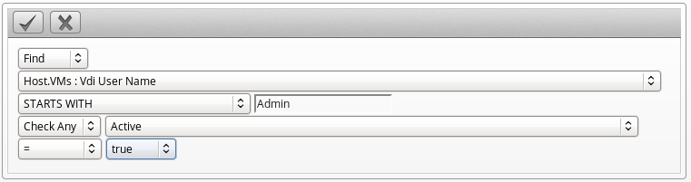
* Click *Registry* to create criteria based on registry values. For example, you can check if DCOM is enabled on a Windows System. Note that this applies only to Windows operating systems. Registry will only be available if you are creating a VM Condition.
+
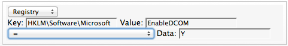

. Click image:../images/1863.png[image] (*Commit expression element changes*) to add the scope.

. Click image:../images/1851.png[image] (*Edit this Expression*) in the *Expression* area to create a general condition based on a simple attribute. Based on what you choose, different options appear.

* Click *Field* to create criteria based on field values.
+
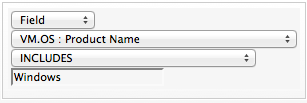
* Click *Count of* to create criteria based on the count of something, such as the number of snapshots for a virtual machine, or the number of virtual machines on a host.
+
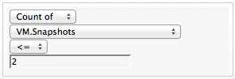
* Click *Tag* to create criteria based on tags assigned to your resources. For example, you can check the power state of a virtual machine or see if it is tagged as production.
+
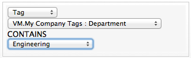
* Click *Find* to seek a particular value, and then check a property. For example, finding the Admin account and checking that it is enabled. Use the following check commands.
** *Check Any*: The result is true if one or more of the find results satisfy the check condition.
** *Check All*: All of the find results must match for a true result.
** *Check Count*: If the result satisfies the expression in check count, the result is true.
+
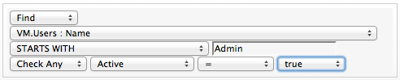
* Click *Registry* to create criteria based on registry values. For example, you can check if DCOM is enabled on a Windows System. Note that this applies only to Windows operating systems.
+
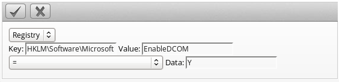

. Click image:../images/1863.png[image] (*Commit expression element changes*) to add the expression.

. In *Notes*, type in a detailed explanation of the condition.

. Click *Add*.