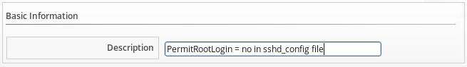
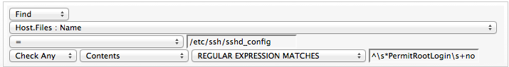

==== Creating a Compliance Condition to Check Host File Contents

{product-title} Control provides the ability to create a compliance condition that checks file contents. Use this to be sure that internal operating system settings meet your security criteria. Regular expressions are used to create the search pattern. Test your regular
expressions thoroughly before using them in a production environment.

Note that to search file contents you will need to have collected the file using a host analysis profile. See the link:https://access.{product-title}.com/documentation/en/{product-title}-{product-title}/version-{product-version}-beta/managing-infrastructure-and-inventory/#sect_hosts[Hosts] chapter in the *Managing Infrastructure and Inventory* guide for instructions.

. Navigate to menu:Control[Explorer].

. Click the *Conditions* accordion, and select *Host Conditions*.

. Click image:../images/1847.png[image] (*Configuration*), image:../images/1848.png[image] (*Add a New Host Condition*).

. In *Basic Information*, type in a *Description* for the condition.
+

+
. Editing the *Scope* area is not necessary for this procedure. Skip editing any *Scope* conditions.

. If the *Expression* area is not automatically opened, click image:../images/1851.png[image] (*Edit this Expression*), then edit the condition area to create a general condition based on a simple attribute. Based on what you choose, different options appear.

* Click *Find*, then *Host.Files : Name*, and the parameters to select the file that you want to check.
* Click *Check Any*, *Contents*, *Regular Expression Matches*, and type the expression. For example, if you want to make sure that permit root login is set to no, type `^\s*PermitRootLogin\s+no`.
+

+
. Click image:../images/1863.png[image] (*Commit expression element changes*) to add the expression.

. In *Notes* area, type in a detailed explanation of the condition.

. Click *Add*.

