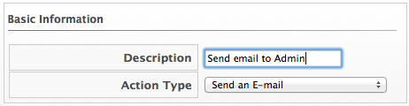
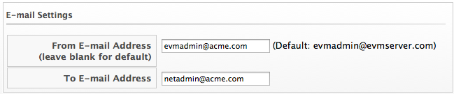

==== Creating an E-mail Action

To send emails from the {product-title} server, you must have the notifier server role enabled and have defined settings for SMTP email. For further information regarding SMTP, see the link:https://access.{product-title}.com/documentation/en/{product-title}-{product-title}/{product-version}/general-configuration/general-configuration[General Configuration]
guide.

. Navigate to menu:Control[Explorer].

. Click the *Actions* accordion, then click image:../images/1847.png[image] (*Configuration*), image:../images/1848.png[image] (*Add a new Action*).

. Type in a *Description* for the action.
+

. Select *Send an E-mail* from *Action Type*.

. Type in a *From E-mail Address* and *To E-mail Address*.
+

. Click *Add*.

