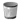

=== Deleting an Action

Delete unused actions to keep your environment uncluttered. You cannot
delete default actions or actions that are currently assigned to a
policy. The delete button is unavailable if the action is in use.

. Navigate to ControlExplorer.

. Click the Actions accordion, click on the action you need to remove.

. Click image:../images/1847.png[image] (Configuration),
 (Delete this Action) on the detail view of
the tree.

. Click OK to confirm.
