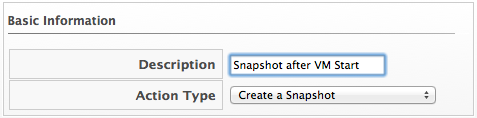
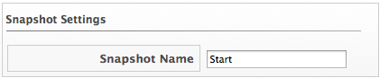

==== Creating a Snapshot Action

. Navigate to ControlExplorer.

. Click the Actions accordion, then click image:../images/1847.png[image]
(Configuration), image:../images/1848.png[image] (Add a new Action).

. Type in a Description for the action.
+

. Select Create a Snapshot from Action Type.

. Type in a Snapshot Name.
+

. Click Add when you are finished.
