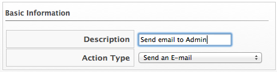
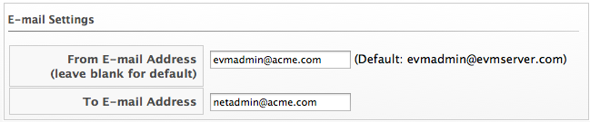

==== Creating an E-mail Action

To send emails from the CloudForms Management Engine server, you must
have the notifier server role enabled and have defined settings for SMTP
email. For further information regarding SMTP, see
https://access.redhat.com/documentation/en-US/CloudForms/3.2/html/Settings_and_Operations_Guide/index.html[CloudForms
Management Engine Settings and Operations Guide].

. Navigate to ControlExplorer.

. Click the Actions accordion, then click image:../images/1847.png[image]
(Configuration), image:../images/1848.png[image] (Add a new Action).

. Type in a Description for the action.
+

. Select Send an E-mail from Action Type.

. Type in a From E-mail Address and To E-mail Address.
+

. Click Add.
