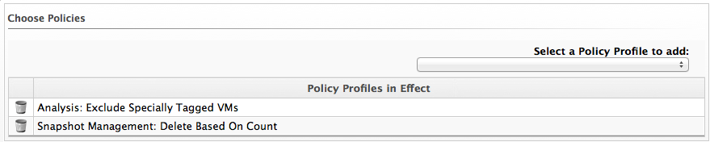

==== Simulating Policy Profiles on Virtual Machines

. Navigate to InfrastructureVirtual Machines, select the virtual machines
you need to evaluate.

. Click image:../images/1941.png[image] (Policy), and then click
 (Policy Simulation).

. From the Select a Policy Profile to add dropdown, click the policy you
need to apply to the selected virtual machines.
+

. The virtual machine thumbnail displays in the Policy Simulation area.

* A check sign in the lower right quadrant of the virtual thumbnail
shows that the virtual machine passes policy.
* A minus sign in the lower right quadrant of the virtual thumbnail
shows that the virtual machine fails policy.

. Click on a virtual machine in the Policy Simulation area to see its
details.

. Expand a policy profile by clicking on it to see its member policies and
the status of the conditions.

* Check `Show out of scope items` to show all conditions, whether or not
the virtual machine passes the scope part of the condition. Uncheck it
to hide conditions where the scope part fails.
* Next to `Show policies`, check `Successful` to show policies that are
passed and check `Failed` to see the policies that have failed. The
default is to show both.
* Items in green text passed the condition.
* Items in red text failed the condition.
* Items in red italics failed the condition, but do not change the
outcome of the scope.

_Result:_. +
If you evaluate multiple policy profiles, you can see both policy
profiles and a tree expanding down to their conditions.
