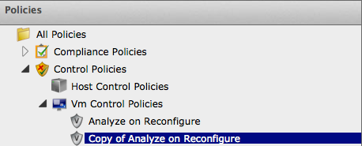

==== Copying a Policy

You can copy a policy if its contents are similar to a new one that you
want to create, then change the condition or event associated with it.
This enables you to make new policies efficiently.

. Navigate to *Control → Explorer*.

. Click the *Policies* accordion, and select the policy you want to copy.
+

. Click image:../images/1847.png[image](*Configuration*),
image:../images/1859.png[image] (*Copy this Policy to new Policy*).

. Click *OK* to confirm.

The new policy is created with a prefix of *Copy of* in its description,
and it can be viewed in the Policy accordion.
