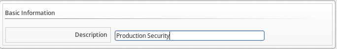
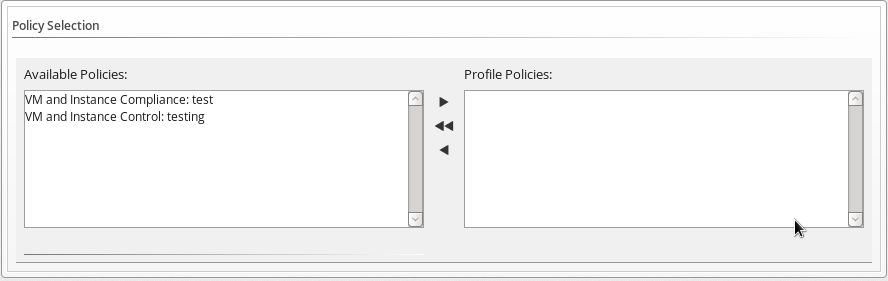
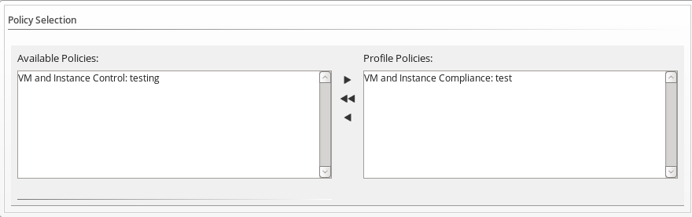

=== Creating Policy Profiles

Policy profiles are groups of policies that you need to use at the same
time. A policy profile can have one or more policies. Policy profiles
can be assigned to either a host or a virtual machine.

. Navigate to `Control` -> `Explorer`.

. Click on the `Policy Profiles` accordion, then click
image:../images/1847.png[image] (`Configuration`), then
image:../images/1848.png[image] (`Add a New Policy Profile`).

. In the `Basic Information` area, type in a unique description for the
policy profile.
+

. From `Available Policies` in the `Policy Selection` area select all the
policies you need to apply to this policy profile. Use the `Ctrl` key to
select multiple policies.
+

. Click image:../images/1876.png[image] to add the `Policies`.
+

. Add to the `Notes` area if required.

. Click `Add`.

The policy profile is added. You can now assign the policy profile to
providers, hosts, and repositories. In addition, you can verify that the
virtual machine complies with the policy profile using the _Resultant
Set of Policy_ feature.
