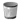

=== Deleting a Policy Profile

Remove policy profiles that you no longer need. This does not remove the policies associated with the policy profile.

. Navigate to menu:Control[Explorer].

. Click on the *Policy Profile* accordion, then click the policy profile you want to remove.

. Click image:../images/1847.png[image] (*Configuration*),  (*Remove this Policy Profile*).

. Click *OK* to confirm.