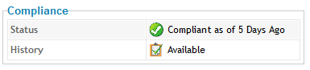

===== Checking a Host for Compliance from the Summary Screen

. Navigate to *Infrastructure → Hosts*, click the host you want to check for compliance.

. Click image:../images/1941.png[image] (*Policy*), and then
image:../images/1942.png[image] (*Check Compliance of Last Known
Configuration*) or  (*Analyze then Check
Compliance*).

. To view the compliance history, click *Available* next to *History*.
+

