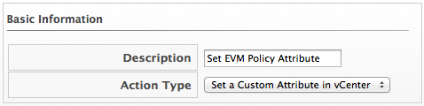
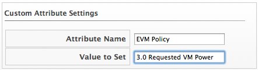

==== Creating a Set Custom Attribute Action

The custom attribute must already exist in vCenter. See vCenter
documentation for instructions. In this example, an attribute called
CloudForms Management Engine policy already exists.

. Navigate to menu:Control[Explorer].

. Click the *Actions* accordion, then click image:../images/1847.png[image] (*Configuration*), image:../images/1848.png[image] (*Add a new Action*).

. Type in a *Description* for the action.
+

+
. Select *Set a Custom Attribute in vCenter* from *Action Type*.

. Type in the *Attribute Name* and *Value to Set*.
+

+
. Click *Add*.
