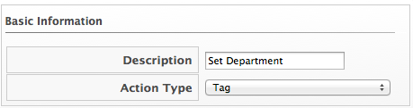
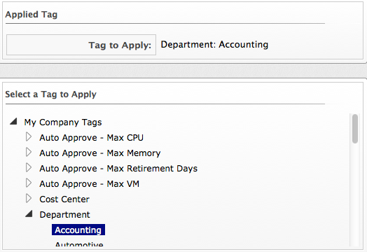

==== Creating a Tag Action

. Navigate to *Control → Explorer*.

. Click the *Actions* accordion, then click image:../images/1847.png[image]
(*Configuration*), image:../images/1848.png[image] (*Add a new Action*).

. Type in a *Description* for the action.
+

. Select *Tag* from *Action Type*.

. Click on the appropriate tag to apply from the list provided.
+

. Click *Add*.
