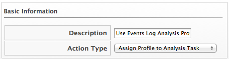

==== Creating an Assign Profile to Analysis Task Action

Use this action for assigning specific analysis profiles to virtual machines. You must create an analysis profile before assigning it to an action. You can only assign this action to an analysis start event. See the _General Configuration_ guide, available from https://access.redhat.com/documentation/en/red-hat-cloudforms/, for information on how to create analysis profiles.

. Navigate to `Control` -> `Explorer`.

. Click the `Actions` accordion, then click image:../images/1847.png[image]
(`Configuration`), image:../images/1848.png[image] (`Add a new Action`).

. Type in a `Description` for the `Action Type`.
+

. Select `Assign Profile to Analysis Task` from `Action Type`.

. Select a profile from the `Analysis profiles`.

. Click `Add`.

