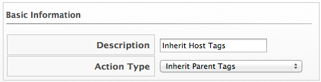
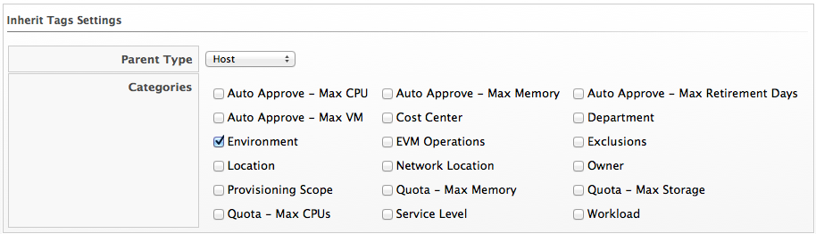

==== Creating an Inherit Tag Action

. Navigate to menu:Control[Explorer].

. Click the *Actions* accordion, and click image:../images/1847.png[image] (*Configuration*), image:../images/1848.png[image] (*Add a new Action*).

. Type in a *Description* for the action.
+

. Select *Inherit Parent Tag* from *Action Type*.

. Select the type of parent item to inherit from in *Parent Type*.

. Check all categories that you want inherited.
+

. Click *Add*.