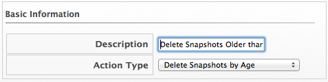
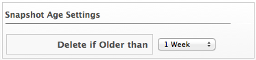

==== Deleting Snapshots by Age

. Navigate to `Control` -> `Explorer`.

. Click the `Actions` accordion, then click image:../images/1847.png[image]
(`Configuration`), image:../images/1848.png[image] (`Add a new Action`).

. Type in a `Description` for the action.
+

. Select `Delete Snapshots by Age` from `Action Type`.

. Select the age of snapshots to delete.
+

. Click `Add`.
