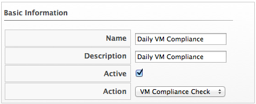

===== Scheduling a Compliance Check

. Navigate to `Configure` -> `Configuration`

. Click the `Settings` accordion, and select `Schedules`.

. Click image:../images/1847.png[image] (`Configuration`),
image:../images/1848.png[image] (`Add a new Schedule`).

. In the `Basic Information` area, type in a name and description for the
schedule.
+

. Check `Active` if you want to enable this scan.

. From the `Action` dropdown, select the type of compliance check you want to schedule. Depending on the type of analysis you choose, you are presented with one of the following group boxes:

* If you choose `VM Compliance Check`, you are presented with `VM Selection` where you can choose to check all VMs, all VMs for a specific provider, all VMs for a cluster, all VMs for a specific host, a single VM, or you can select VMs using a global filter.
+

* If you choose `Host Compliance Check`, you are presented with `Host
Selection` where you can choose to analyze all hosts, all hosts for a
specific provider, all hosts for a cluster, a single host, or you can
select hosts using a global filter.
+

[NOTE]
======
You can only schedule a host analysis for connected virtual machines,
not repository virtual machines that were discovered through that host.
Since repository virtual machines do not retain a relationship with the
host that discovered them, there is no current way to scan them through
the scheduling feature. The host is shown because it may have connected
virtual machines in the future when the schedule is set to run.
======

. In the `Timer` area, click the `Run` dropdown to specify how often you want the analysis to run. Your options after that depend on which run option you choose.
+

* Select `Once` to have the analysis run just one time.
* Select `Daily` to run the analysis on a daily basis. You are prompted to
select how many days you want between each analysis.
* Select `Hourly` to run the analysis hourly. You are prompted to select
how many hours you want between each analysis.

. Select the time zone for the schedule.

. Type or select a date to begin the schedule in `Starting Date`.

. Select a starting time based on a 24-hour clock in the selected time
zone.

. Click `Add`.
