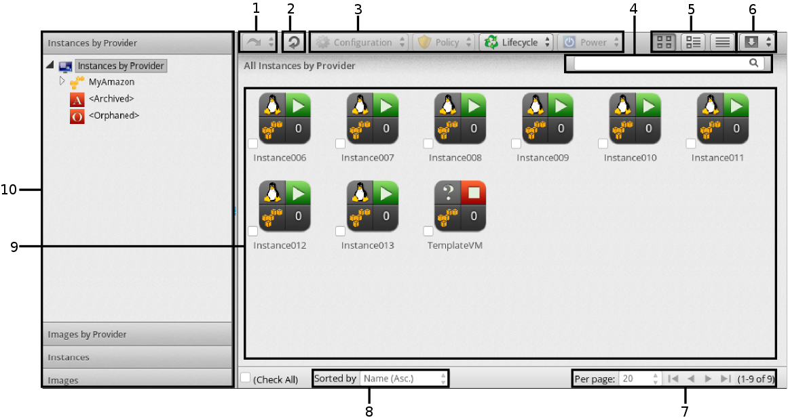

[[instances]]
= Instances

The #Instance# container combined with the ability to analyze information inside each instance provides in-depth information across the cloud environment.
This rich set of information enables CloudForms Management Engine users to improve problem resolution times and effectively manage instances in their cloud environment.

The #Instances# pages display all instances the server discovered from your cloud providers.
The #Instances# taskbar is a menu driven set of buttons that provide access to functions related to instances.

. History button
. Refresh screen button
. Taskbar
. Name search bar/Advanced Search button
. View buttons
. Download buttons
. Navigation bar
. Sort dropdown
. Main area in Grid View
. Cloud/Filter Navigation

Console uses #Virtual Thumbnails# to describe instances and images.
Each thumbnail contains four quadrants by default.
This allows you to glance at an instance for a quick view of its contents.

image::images/3393.png[]

. Top left quadrant: Operating system of the Instance
. Bottom left quadrant: Instance Cloud Provider
. Top right quadrant: Power state of Instance or Status icon
. Bottom right quadrant: Number of Snapshots for this Instance

[cols="1,1", frame="all", options="header"]
|===
|

								Icon

|

								Description

|

image:images/2138.png[]

|

								Template: Cloud Image

|

image:images/2139.png[]

|

								Retired: Instance has been retired

|

image:images/2140.png[]

|

								Archived: Instance has no provider or availability zone associated with it.

|

image:images/2141.png[]

|

								Orphaned: Instance has no availability zone but does have a provider associated with it.

|

image:images/2142.png[]

|

								Disconnected: Instance is disconnected.

|

image:images/2143.png[]

|

								On: Instance is powered on.

|

|

								Off: Instance is powered off.

|

image:images/2145.png[]

|

								Suspended: Instance has been suspended.

|===

The #Instances# page has four accordions organizing your instances and images in different ways.
All of these accordions share a set of common controls

* Use #Instances by Provider# and #Images by Provider# to view your instances and images organized by Provider.
  In addition, you can see archived and orphaned items here.
* Use the #Instances# to view, apply filters, and collect information about all of your instances.
* Use #Images# to view, apply filters, and collect information about all of your images.

Through the console, you are able to view your instances in multiple ways.
For your instances, you can:

* Filter instances
* Change views
* Sort
* Create a report
* Search by Tags
* Search by collected data

:leveloffset: 2
[[_sect_filtering_instances_and_images]]
= Filtering Instances and Images

The #Instance Filter# accordion is provided so that you can easily navigate through groups of instances.
You can use the ones provided or create your own through #Advanced Filtering# capabilities.

:leveloffset: 3
include::topics/Using_an_Instance_or_Image_Filter.adoc[]

:leveloffset: 3
include::topics/Creating_an_Instance_or_Image_Filter.adoc[]

:leveloffset: 3
include::topics/Loading_a_Report_Filter_or_Search_Expression.adoc[]

:leveloffset: 2
include::topics/Changing_Views_for_Instances_and_Images.adoc[]

:leveloffset: 2
include::topics/Sorting_Instances_and_Images.adoc[]

:leveloffset: 2
include::topics/Creating_an_Instance_or_Image_Report.adoc[]

:leveloffset: 2
include::topics/Searching_for_Instances_or_Images.adoc[]

:leveloffset: 2
include::topics/Analyzing_Instances_and_Images.adoc[]

:leveloffset: 2
[[_sect_comparing_instances_and_images]]
= Comparing Instances and Images

You can compare multiple instances in CloudForms Management Engine server.
This allows you to see how different instances are from their original image.
This helps detect missing patches, unmanaged user accounts, or unauthorized services.

Use the comparison feature to:

* Compare multiple instances from different hosts
* Compare multiple instances side-by-side
* Quickly see similarities and differences among multiple instances and a base
* Narrow the comparison display to categories of properties
* Print or export in the comparison results to a PDF or CSV file

. Navigate to menu:Clouds[Instances]
. Click the accordion for the items to analyze
. Click the checkboxes for the items to compare
. Click   btn:[(Configuration)], and then   btn:[(Compare Selected items)].
  The comparison displays in a compressed view with a limited set of properties listed.
. To delete an item from the comparison, click  image:images/1861.png[]btn:[(Remove this VM from the comparison)] at the bottom of the items column.
. To view many items on one screen, go to a compressed view by clicking  image:images/2024.png[] btn:[(Compressed View)].
  To return to an expanded view, click  image:images/2023.png[] btn:[(Expanded View)].
. To limit the mode of the view, there are two buttons in the task bar.
+
* Click  image:images/2022.png[] btn:[(Details Mode)] to see all details for an attribute.
* Click  image:images/2025.png[] btn:[(Exists Mode)] to limit the view to if an attribute exists compared to the base or not.
  This only applies to attributes that can have a boolean property.
  For example, a user account exists or does not exist, or a piece of hardware that does or does not exist.

. To change the base instance that all the others are compared to, click its label at the top of its column.
. To go to the summary screen for an instance, click its btn:[Virtual Thumbnail] or icon.

:leveloffset: 3
include::topics/Creating_an_Instance_Comparison_Report.adoc[]

:leveloffset: 2
include::topics/Refreshing_Instances_and_Images.adoc[]

:leveloffset: 2
include::topics/Extracting_Running_Processes_from_Instances_and_Images.adoc[]

:leveloffset: 2
include::topics/Setting_Ownership_for_Instances_and_Images.adoc[]

:leveloffset: 2
include::topics/Removing_Instances_and_Images_from_the_VMDB.adoc[]

:leveloffset: 2
include::topics/Tagging_Instances_and_Images.adoc[]

:leveloffset: 2
include::topics/Reviewing_an_Instance_or_Image.adoc[]

:leveloffset: 2
include::topics/Instance_and_Image_Taskbars.adoc[]

:leveloffset: 2
include::topics/Performing_SmartState_Analysis_on_an_Instance_or_Image.adoc[]

:leveloffset: 2
include::topics/Viewing_Running_Processes_after_Collection.adoc[]

:leveloffset: 2
include::topics/Editing_Instance_or_Image_Properties.adoc[]

:leveloffset: 2
include::topics/Controlling_the_Power_State_of_an_Instance.adoc[]

:leveloffset: 2
include::topics/Right_Sizing_an_Instance.adoc[]

:leveloffset: 2
include::topics/Viewing_Capacity_and_Utilization_Charts_for_an_Instance.adoc[]

:leveloffset: 2
include::topics/Viewing_the_Instance_or_Image_Timeline.adoc[]

:leveloffset: 2
include::topics/Instance_or_Image_Summary.adoc[]

:leveloffset: 2
include::topics/Changing_the_Summary_View_of_an_Instance_or_Image.adoc[]

:leveloffset: 2
include::topics/Viewing_the_Operating_System_Properties1.adoc[]

:leveloffset: 2
include::topics/Viewing_a_User_Information_for_an_Instance_or_Image.adoc[]

:leveloffset: 2
include::topics/Viewing_a_Group_Information_for_an_Instance_or_Image.adoc[]

:leveloffset: 2
include::topics/Viewing_Genealogy_of_an_Instance_or_Image.adoc[]

:leveloffset: 2
include::topics/Detecting_Drift_on_Instances_or_Images.adoc[]

:leveloffset: 2
include::topics/Creating_a_Drift_Report_for_an_Instance_or_Image.adoc[]

:leveloffset: 2
include::topics/Viewing_Analysis_History_for_an_Instance_or_Image.adoc[]

:leveloffset: 2
include::topics/Viewing_Event_Logs_for_an_Instance_or_Image.adoc[]
