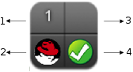

[[_sect_providers1]]
= Providers

A provider is a server with software to manage multiple virtual machines that reside on multiple hosts.
menu:Infrastructure[Providers] displays the providers in your environment. 

The web interface uses virtual thumbnails to represent providers.
Each thumbnail contains four quadrants by default, which display basic information about each provider. 

. Number of hosts 
. Management system software 
. Currently unused 
. Authentication status 

[cols="1,1", frame="all", options="header"]
|===
| 
							
								Icon
							
						
| 
							
								Description
							
						

| 
							
								
									
								
							
						
| 
							
								Validated: Valid authentication credentials have been added.
							
						

| 
							
								
									
								
							
						
| 
							
								Invalid: Authentication credentials are invalid.
							
						

| 
							
								
									
								
							
						
| 
							
								Unknown: Authentication status is unknown or no credentials have been entered.
							
						
|===

:leveloffset: 2
include::topics/Discovering_Multiple_Management_Systems.adoc[]

:leveloffset: 2
= Red Hat Enterprise Virtualization Manager Providers

To use a Red Hat Enterprise Virtualization Manager provider, add it to the appliance and authenticate its hosts.

:leveloffset: 3
include::topics/Adding_a_Red_Hat_Enterprise_Virtualization_Manager_Provider.adoc[]

:leveloffset: 3
include::topics/Authenticating_Red_Hat_Enterprise_Virtualization_Hosts.adoc[]

:leveloffset: 2
= OpenStack Infrastructure Providers

Enable an OpenStack Infrastructure provider by adding it to the appliance.

:leveloffset: 3
include::topics/Adding_an_OpenStack_Infrastructure_Provider.adoc[]

:leveloffset: 2
= VMware vCenter Providers

To use a VMWare vCenter provider, add it to the appliance and authenticate its hosts.

:leveloffset: 3
include::topics/Adding_a_VMware_vCenter_Provider.adoc[]

:leveloffset: 3
include::topics/Authenticating_VMware_vCenter_Hosts.adoc[]

:leveloffset: 2
= Microsoft SCVMM Providers

To use a Microsoft System Center Virtual Machine Manager provider, add it to the appliance and set up the SCVMM server for authentication.

:leveloffset: 3
include::topics/Adding_a_Microsoft_System_Center_Virtual_Machine_Manager_Provider.adoc[]

:leveloffset: 3
include::topics/Authenticating_to_Microsoft_SCVMM.adoc[]

:leveloffset: 2
include::topics/Refreshing_Multiple_Management_Systems.adoc[]

:leveloffset: 2
include::topics/Tagging_Multiple_Management_Systems.adoc[]

:leveloffset: 2
include::topics/Reviewing_a_Management_System.adoc[]

:leveloffset: 2
include::topics/To_remove_Management_Systems.adoc[]

:leveloffset: 2
include::topics/Viewing_the_Management_System_Timeline.adoc[]

:leveloffset: 2
include::topics/Viewing_Hosts_and_Clusters.adoc[]

:leveloffset: 2
include::topics/Viewing_Virtual_Machines_and_Templates.adoc[]

