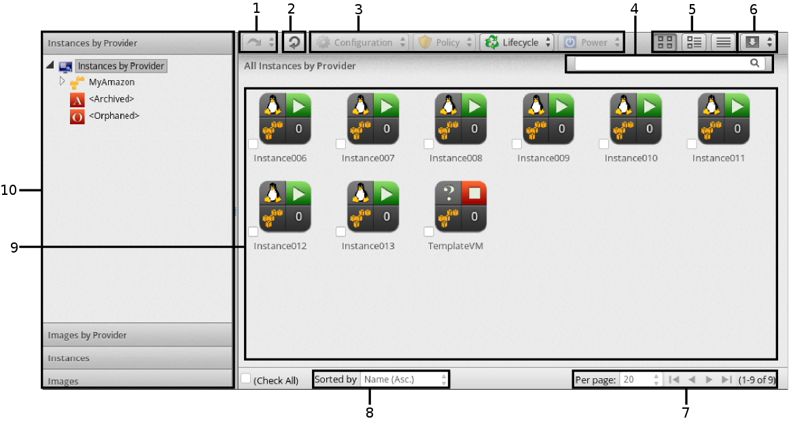
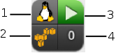

[[_chap_clouds]]
= Clouds

Cloud computing provides a set of pooled resources used to create a set of scalable virtual machine instances.
Resources includes CPUs, memory, storage, and networking.
While users of virtualization infrastructure environments provision whole virtual machines, users of cloud computing environments provision only the necessary resources to build their instances.
This means the customer can easily scale their instances by provisioning more resources.
Metric usage is focused on the hardware layer, and results in the user paying only the necessary resources. 

For example, a user might use an instance to store a web server.
During peak times of use, the user provisions more cloud resources to maintain the performance of the server.
During quiet times, the user reduces the consumption of cloud resources.
As a result, the user only uses and pays for the resources used. 

CloudForms Management Engine offers a set of tools for viewing and maintaining cloud providers and their associated resources.
Supported cloud providers include: 

* +Amazon EC2 (public cloud)+: is a central part of Amazon.com's cloud computing platform that allows users to rent virtual computers on which to run their own computer applications.
  It allows scalable deployment of applications by providing a Web service through which a user can boot an Amazon Machine Image to create a virtual machine, which Amazon calls an "instance", containing any software desired. 
* +OpenStack (private cloud)+: Red Hat Enterprise Linux OpenStack Platform provides the foundation to build a private or public Infrastructure-as-a-Service (IaaS) cloud on top of Red Hat Enterprise Linux.
  It offers a massively scalable, fault-tolerant platform for the development of cloud-enabled workloads.
  To learn more about OpenStack, see https://access.redhat.com/documentation/en-US/Red_Hat_Enterprise_Linux_OpenStack_Platform/[Red Hat Enterprise Linux OpenStack Platform], Getting Started category. 

:leveloffset: 2
[[_sect_availability_zones]]
= Availability Zones

An availability zone is a provider-specific method of grouping cloud instances and services.
CloudForms Management Engine uses Amazon EC2 regions and OpenStack Nova zones as availability zones. 

:leveloffset: 3
include::topics/Reviewing_an_Availability_Zone.adoc[]

:leveloffset: 3
include::topics/Viewing_Availability_Zone_Relationships.adoc[]

:leveloffset: 2
[[_sect_tenants]]
= Tenants

A Tenant is an OpenStack term for an organizational unit or project.
OpenStack uses tenants for the following reasons: 

* Assigning users to a project 
* Defining quotas for a project 
* Applying access and security rules for a project 
* Managing resources and instances for a project 

This helps administrators and users organize their OpenStack environment and define limits for different groups of people.
For example, one project might require higher quotas and another project might require restricted access to certain ports.
OpenStack allows you to define these limits and apply them to a project. 

CloudForms Management Engine can abstract information from tenants including quotas and relationships to other OpenStack objects. 

To see multiple tenants in CloudForms Management Engine, the user authenticating to your OpenStack environment from CloudForms must be configured to have visibility into these tenants. 

:leveloffset: 3
include::topics/Viewing_a_Tenant.adoc[]

:leveloffset: 3
include::topics/Viewing_Tenant_Relationships.adoc[]

:leveloffset: 2
[[_sect_flavors]]
= Flavors

Flavors indicate the resource profiles available for instances.
Each Flavor contains a value set for CPUs, CPU Cores and memory.
CloudForms Management Engine provides the ability to view individual flavor information and instances currently using the flavor. 

:leveloffset: 3
include::topics/Reviewing_a_Flavor.adoc[]

:leveloffset: 3
include::topics/Viewing_Flavor_Relationships.adoc[]

:leveloffset: 2
[[_sect_security_groups]]
= Security Groups

You can group instances using security groups to restrict port or IP address accessibility.
Security groups are to be created from the cloud provider side and can be assigned to instances using CloudForms Management Engine instance provisioning. 

Cloud providers that currently support this function include: Amazon EC2, OpenStack, and Red Hat Enterprise Virtualization. 

:leveloffset: 3
include::topics/Viewing_Security_Groups.adoc[]

:leveloffset: 3
include::topics/Tagging_Security_Groups.adoc[]

:leveloffset: 2
[[_sect_instances]]
= Instances

The [label]#Instance# container combined with the ability to analyze information inside each instance provides in-depth information across the cloud environment.
This rich set of information enables CloudForms Management Engine users to improve problem resolution times and effectively manage instances in their cloud environment. 

The [label]#Instances# pages display all instances the server discovered from your cloud providers.
The [label]#Instances# taskbar is a menu driven set of buttons that provide access to functions related to instances. 

. History button 
. Refresh screen button 
. Taskbar 
. Name search bar/Advanced Search button 
. View buttons 
. Download buttons 
. Navigation bar 
. Sort dropdown 
. Main area in Grid View 
. Cloud/Filter Navigation 

Console uses [label]#Virtual Thumbnails# to describe instances and images.
Each thumbnail contains four quadrants by default.
This allows you to glance at an instance for a quick view of its contents. 

. Top left quadrant: Operating system of the Instance 
. Bottom left quadrant: Instance Cloud Provider 
. Top right quadrant: Power state of Instance or Status icon 
. Bottom right quadrant: Number of Snapshots for this Instance 

[cols="1,1", frame="all", options="header"]
|===
| 
							
								Icon
							
						
| 
							
								Description
							
						

| 
							
								
									

									
								
							
						
| 
							
								Template: Cloud Image
							
						

| 
							
								
									

									
								
							
						
| 
							
								Retired: Instance has been retired
							
						

| 
							
								
									

									
								
							
						
| 
							
								Archived: Instance has no provider or availability zone associated with it.
							
						

| 
							
								
									

									
								
							
						
| 
							
								Orphaned: Instance has no availability zone but does have a provider associated with it.
							
						

| 
							
								
									

									
								
							
						
| 
							
								Disconnected: Instance is disconnected.
							
						

| 
							
								
									

									
								
							
						
| 
							
								On: Instance is powered on.
							
						

| 
							
								
									

									
								
							
						
| 
							
								Off: Instance is powered off.
							
						

| 
							
								
									

									
								
							
						
| 
							
								Suspended: Instance has been suspended.
							
						
|===

The [label]#Instances# page has four accordions organizing your instances and images in different ways.
All of these accordions share a set of common controls 

* Use [label]#Instances by Provider# and [label]#Images by Provider# to view your instances and images organized by Provider.
  In addition, you can see archived and orphaned items here. 
* Use the [label]#Instances# to view, apply filters, and collect information about all of your instances. 
* Use [label]#Images# to view, apply filters, and collect information about all of your images. 

Through the console, you are able to view your instances in multiple ways.
For your instances, you can: 

* Filter instances 
* Change views 
* Sort 
* Create a report 
* Search by Tags 
* Search by collected data 

:leveloffset: 3
[[_sect_filtering_instances_and_images]]
= Filtering Instances and Images

The [label]#Instance Filter# accordion is provided so that you can easily navigate through groups of instances.
You can use the ones provided or create your own through [label]#Advanced Filtering# capabilities. 

:leveloffset: 4
include::topics/Using_an_Instance_or_Image_Filter.adoc[]

:leveloffset: 4
include::topics/Creating_an_Instance_or_Image_Filter.adoc[]

:leveloffset: 4
include::topics/Loading_a_Report_Filter_or_Search_Expression.adoc[]

:leveloffset: 3
include::topics/Changing_Views_for_Instances_and_Images.adoc[]

:leveloffset: 3
include::topics/Sorting_Instances_and_Images.adoc[]

:leveloffset: 3
include::topics/Creating_an_Instance_or_Image_Report.adoc[]

:leveloffset: 3
include::topics/Searching_for_Instances_or_Images.adoc[]

:leveloffset: 3
include::topics/Analyzing_Instances_and_Images.adoc[]

:leveloffset: 3
[[_sect_comparing_instances_and_images]]
= Comparing Instances and Images

You can compare multiple instances in CloudForms Management Engine server.
This allows you to see how different instances are from their original image.
This helps detect missing patches, unmanaged user accounts, or unauthorized services. 

Use the comparison feature to: 

* Compare multiple instances from different hosts 
* Compare multiple instances side-by-side 
* Quickly see similarities and differences among multiple instances and a base 
* Narrow the comparison display to categories of properties 
* Print or export in the comparison results to a PDF or CSV file 

.Procedure: To Compare Instances and Images
. Navigate to menu:Clouds[Instances] 
. Click the accordion for the items to analyze 
. Click the checkboxes for the items to compare 
. Click  image:images/1847.png[] btn:[(Configuration)], and then   btn:[(Compare Selected items)].
  The comparison displays in a compressed view with a limited set of properties listed. 
. To delete an item from the comparison, click  image:images/1861.png[]btn:[(Remove this VM from the comparison)] at the bottom of the items column. 
. To view many items on one screen, go to a compressed view by clicking  image:images/2024.png[] btn:[(Compressed View)].
  To return to an expanded view, click  image:images/2023.png[] btn:[(Expanded View)]. 
. To limit the mode of the view, there are two buttons in the task bar. 
+
* Click   btn:[(Details Mode)] to see all details for an attribute. 
* Click   btn:[(Exists Mode)] to limit the view to if an attribute exists compared to the base or not.
  This only applies to attributes that can have a boolean property.
  For example, a user account exists or does not exist, or a piece of hardware that does or does not exist. 

. To change the base instance that all the others are compared to, click its label at the top of its column. 
. To go to the summary screen for an instance, click its btn:[Virtual Thumbnail] or icon. 

:leveloffset: 4
include::topics/Creating_an_Instance_Comparison_Report.adoc[]

:leveloffset: 3
include::topics/Refreshing_Instances_and_Images.adoc[]

:leveloffset: 3
include::topics/Extracting_Running_Processes_from_Instances_and_Images.adoc[]

:leveloffset: 3
include::topics/Setting_Ownership_for_Instances_and_Images.adoc[]

:leveloffset: 3
include::topics/Removing_Instances_and_Images_from_the_VMDB.adoc[]

:leveloffset: 3
include::topics/Tagging_Instances_and_Images.adoc[]

:leveloffset: 3
include::topics/Reviewing_an_Instance_or_Image.adoc[]

:leveloffset: 3
include::topics/Instance_and_Image_Taskbars.adoc[]

:leveloffset: 3
include::topics/Performing_SmartState_Analysis_on_an_Instance_or_Image.adoc[]

:leveloffset: 3
include::topics/Viewing_Running_Processes_after_Collection.adoc[]

:leveloffset: 3
include::topics/Editing_Instance_or_Image_Properties.adoc[]

:leveloffset: 3
include::topics/Controlling_the_Power_State_of_an_Instance.adoc[]

:leveloffset: 3
include::topics/Right_Sizing_an_Instance.adoc[]

:leveloffset: 3
include::topics/Viewing_Capacity_and_Utilization_Charts_for_an_Instance.adoc[]

:leveloffset: 3
include::topics/Viewing_the_Instance_or_Image_Timeline.adoc[]

:leveloffset: 3
include::topics/Instance_or_Image_Summary.adoc[]

:leveloffset: 3
include::topics/Changing_the_Summary_View_of_an_Instance_or_Image.adoc[]

:leveloffset: 3
include::topics/Viewing_the_Operating_System_Properties1.adoc[]

:leveloffset: 3
include::topics/Viewing_a_User_Information_for_an_Instance_or_Image.adoc[]

:leveloffset: 3
include::topics/Viewing_a_Group_Information_for_an_Instance_or_Image.adoc[]

:leveloffset: 3
include::topics/Viewing_Genealogy_of_an_Instance_or_Image.adoc[]

:leveloffset: 3
include::topics/Detecting_Drift_on_Instances_or_Images.adoc[]

:leveloffset: 3
include::topics/Creating_a_Drift_Report_for_an_Instance_or_Image.adoc[]

:leveloffset: 3
include::topics/Viewing_Analysis_History_for_an_Instance_or_Image.adoc[]

:leveloffset: 3
include::topics/Viewing_Event_Logs_for_an_Instance_or_Image.adoc[]

