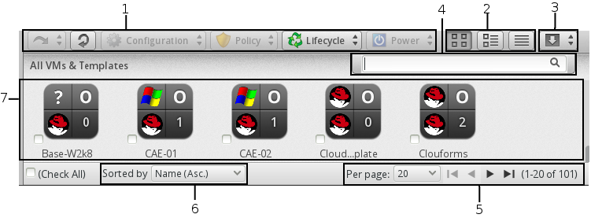

[[_chap_common_infrastructure_and_cloud_controls]]
= Common Infrastructure and Cloud Controls

The user views resources in multiple ways through the console.
Each type of resource provides different buttons in the main tool bar.
For all infrastructure items, users can: 

* Change views 
* Sort 
* Create a report 
* Search by collected data 

.The Infrastructure User Interface

. Taskbar buttons 
. View buttons 
. Infrastructure Report outputs 
. Advanced Search bar 
. Navigation bar 
. Sort dropdown 
. Main area 

:leveloffset: 2
include::topics/Changing_List_Views.adoc[]

:leveloffset: 2
include::topics/Sorting_Infrastructure_Items.adoc[]

:leveloffset: 2
include::topics/Creating_an_Infrastructure_Report.adoc[]

:leveloffset: 2
include::topics/Searching_by_Name.adoc[]

:leveloffset: 2
[[_sect_advanced_searching]]
= Advanced Searching

Use CloudForms Management Engine's advanced filtering capabilities to do the following. 

* Search by any information that has been discovered or collected using SmartState Analysis and by Company and System Tags that you have assigned. 
* Import a filter used in a report. 
* Save a search to be used again. 

:leveloffset: 3
include::topics/To_search_for_infrastructure_items.adoc[]

:leveloffset: 3
include::topics/To_save_a_search.adoc[]

:leveloffset: 3
include::topics/To_load_a_report_filter_or_search_expression1.adoc[]

