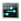

= Managing Containers

Starting with Red Hat CloudForms 4.0, CloudForms Management Engine allows for container management. The orchestration system can be OpenShift Enterprise or Atomic Enterprise Platform. These systems can be added to the CloudForms Management Engine appliance as container providers. You can also connect your container providers with OpenStack, RHEV, or VMware vCenter environments.

The *Containers* area in the top menu bar has options to manage containers, containers providers, images, nodes, registries, pods, and other components.

== Core Concepts

The following is a list of some of the core concepts and objects you will encounter when using CloudForms Management Engine with OpenShift Enterprise or Atomic Enterprise Platform. Many of these objects come from Kubernetes, which is extended by OpenShift Enterprise to provide a more feature-rich development life cycle platform.

* *Node* is a machine that pods run on.
  For more information, see https://access.redhat.com/documentation/en/openshift-enterprise/3.1/architecture/chapter-2-infrastructure-components#node[OpenShift Enterprise 3.1 Architecture Information]

* *Pod* is a group of containers. 
  For more information, see https://access.redhat.com/documentation/en/openshift-enterprise/3.1/architecture/chapter-3-core-concepts#pods[OpenShift Enterprise 3.1 Architecture Information].

* *Replicator* ensures that there is always available a certain number of replicas of a specific pod.
  For more information, see https://access.redhat.com/documentation/en/openshift-enterprise/3.1/architecture/chapter-3-core-concepts#replication-controllers[OpenShift Enterprise 3.1 Architecture Information].

* *Container service* is a base load balancer that provides traffic to pods.
  For more information, see https://access.redhat.com/documentation/en/openshift-enterprise/3.1/architecture/chapter-3-core-concepts#services[OpenShift Enterprise 3.1 Architecture Information].

* *Image* is a binary on which a container is based on. An image includes all of the requirements for running a single container, as well as metadata describing its needs and capabilities.
  For more information, see https://access.redhat.com/documentation/en/openshift-enterprise/3.1/architecture/chapter-3-core-concepts#docker-images[OpenShift Enterprise 3.1 Architecture Information].

* *Image Registry* is a service for storing and retrieving images.
  For more information, see https://access.redhat.com/documentation/en/openshift-enterprise/3.1/architecture/chapter-3-core-concepts#docker-registries[OpenShift Enterprise 3.1 Architecture Information].

* *Project (namespace)* is an ability to partition resources created by users into logical groups.
  For more information, see https://access.redhat.com/documentation/en/openshift-enterprise/3.1/architecture/chapter-3-core-concepts#namespaces[OpenShift Enterprise 3.1 Architecture Information].

* *Route* announces your service to the world.
  For more information, see https://access.redhat.com/documentation/en/openshift-enterprise/3.1/architecture/chapter-3-core-concepts#routes[OpenShift Enterprise 3.1 Architecture Information].

== Insight and Control

CloudForms Management Engine can connect to OpenShift Enterprise and Atomic Enterprise Platform containers providers and supports managing them similarly to how infrastructure and cloud providers are managed. This allows you to gain control over different aspects of your environment and answer questions such as:

* How many containers exist in my environment?
* Does a specific node have enough resources?
* How many distinct images are used?
* Which image registries are used?

When CloudForms Management Engine connects to a containers environment, it collects information on different areas of the environment:

* Entities such as pods, nodes, or services.
* Basic relationships between the entities, for example: Which services are serving which pods?
* Advanced insight into relationships, for example: Which two different containers are using the same image?
* Additional information, such as events, projects, routes (OpenShift Enterprise only), and metrics.

=== Cross-Providers Insight

Cross-providers insight is a feature that connects all layers of infrastructure, cloud, and containers known to CloudForms Management Engine and collects data for analysis.

It supports cross-linking all of the layers available in the following environments:

* OpenStack
* oVirt or RHEV
* VMware vCenter

The collected information includes all the data available in other (infrastructure or cloud) providers.

=== Working with the Containers Overview Page

The information on all containers providers and entities known to CloudForms Management Engine is summarized on the Containers *Overview* page. The *Overview* page provides links to other summary pages which contain further information on the containers providers and entities.

[caption="Containers Overview"]
image::containers-overview.png[Containers Overview, height=460]

.Working with the Containers Overview Page
. Navigate to menu:Containers[Overview].
. Click the desired containers entity, or provider, if applicable, for viewing the summary with further information.

=== Viewing a Containers Provider Summary

A *Containers Provider* summary page allows you to view information on different aspects of a containers provider, for example:

* Status of the provider and its components.
* Relationships between different entities of the containers provider. These relationships are summarized in the *Relationships* box on the right-hand side of the summary page.
+
[caption="Entity Relationships"]
image::entity-relationships.png[Entity Relationships, height=460]
+
* Additional information on aggregated capacity of all CPU cores of all nodes, and aggregated capacity of all memory of all nodes.

.Viewing a Containers Provider Summary
. Navigate to menu:Containers[Providers]. 
. Click the desired containers provider for viewing the provider summary.

=== Viewing a Container Nodes Summary

A *Container Node* summary page allows you to view information on different aspects of a container node, for example:

* How many entities are on a node?
* What is the capacity and utilization?
* What are the versions of the underlying operating system and software?

.Viewing a Container Nodes Summary
. Navigate to menu:Containers[Providers]. 
. Click the desired containers provider for viewing the provider summary.
. In the *Relationships* box on the right-hand side of the summary page, click *Nodes*.
. Click the desired container node for viewing.
. Alternatively, you can access the desired container node from menu:Containers[Container Nodes].

==== Viewing a Container Nodes Timeline

You can view the timeline of events for a node. To access the timeline from a container nodes summary page, click image:images/1994.png[Monitoring] (*Monitoring*), and then  (*Timelines*).

For more information on working with timelines, see the following procedure:

=== Viewing a Containers Summary

A *Containers* summary page allows you to view information on different aspects of a container, for example:

* What are the relationships of the container to a related node, pod, or image?
* Which node is the container running on?
* Which part of a pod is the container?
* What is the container ID?
* What is the name of the container image? What are other properties of the container image (for example, tag)?

.Viewing a Containers Summary
. Navigate to menu:Containers[Providers]. 
. Click the desired containers provider for viewing the provider summary.
. In the *Relationships* box on the right-hand side of the summary page, click *Containers*.
. Click the desired container for viewing.
. Alternatively, you can access the desired container from menu:Containers[Containers].

=== Viewing a Container Images Summary

A *Container Images* summary page allows you to view information on different aspects of a container image, for example:

* Which containers are using the image?
* Which image registry is the image coming from?

.Viewing a Container Images Summary
. Navigate to menu:Containers[Providers]. 
. Click the desired containers provider for viewing the provider summary.
. In the *Relationships* box on the right-hand side of the summary page, click *Images*.
. Click the desired image for viewing.
. Alternatively, you can access the desired image from menu:Containers[Container Images].

=== Viewing an Image Registries Summary

An *Image Registries* summary page allows you to view information on different aspects of an image registry, for example:

* How many images are coming from the registry? What are the images?
* Which containers are using images from the registry?
* What is the host and port of the registry?

.Viewing an Image Registries Summary
. Navigate to menu:Containers[Providers]. 
. Click the desired containers provider for viewing the provider summary.
. In the *Relationships* box on the right-hand side of the summary page, click *Image Registries*.
. Click the desired image registry for viewing.
. Alternatively, you can access the desired image registry from menu:Containers[Image Registries].

=== Viewing a Pods Summary

A *Pods* summary page allows you to view information on different aspects of a pod, for example:

* Which containers are part of the pod?
* Which services reference the pod?
* Which node does the pod run on?
* Is the pod controlled by a replicator?
* What is the IP address of the pod?

.Viewing a Pods Summary
. Navigate to menu:Containers[Providers]. 
. Click the desired containers provider for viewing the provider summary.
. In the *Relationships* box on the right-hand side of the summary page, click *Pods*.
. Click the desired pod for viewing.
. Alternatively, you can access the desired pod from menu:Containers[Pods].

=== Viewing a Replicators Summary

A *Replicators* summary page allows you to view information on different aspects of a replicator, for example:

* What is the number of requested pods?
* What is the number of current pods?
* What are the labels and selector for the replicator?

.Viewing a Replicators Summary
. Navigate to menu:Containers[Providers]. 
. Click the desired containers provider for viewing the provider summary.
. In the *Relationships* box on the right-hand side of the summary page, click *Replicators*.
. Click the desired replicator for viewing.
. Alternatively, you can access the desired replicator from menu:Containers[Replicators].

=== Viewing a Container Services Summary

A *Container Services* summary page allows you to view information on different aspects of a container service, for example:

* What are the pods that the container service provides traffic to?
* What are the port configurations for the container service?
* What are the labels and selector for the container service?

.Viewing a Container Services Summary
. Navigate to menu:Containers[Providers]. 
. Click the desired containers provider for viewing the provider summary.
. In the *Relationships* box on the right-hand side of the summary page, click *Services*.
. Click the desired service for viewing.
. Alternatively, you can access the desired service from menu:Containers[Container Services].

=== Using the Topology Widget

The *Topology* widget is an interactive topology graph, showing the status and relationships between the different entities of the containers providers that CloudForms Management Engine has access to.

* The topology graph includes pods, containers, services, nodes, virtual machines, hosts, routes, and replicators within the overall containers provider environment.
* Each entity in the graph displays a color indication of its status.
* Hovering over any individual graph element will display a summary of details for the individual element.
* Double-click the entities in the graph to navigate to their summary pages.
* It is possible to drag elements to reposition the graph.
* Click the legend at the top of the graph to show or hide entities.
* Click *Display Names* on the right-hand side of the page to show or hide entity names.

[caption="Topology Widget"]
image::topology-widget.png[Topology Widget, width=660]

.Viewing the Topology Widget
. Navigate to menu:Containers[Providers].
. Click the desired containers provider for viewing the provider summary.
. On the provider summary page, click *Topology* in the *Overview* box on the right-hand side of the page.

=== Running a SmartState Analysis

Perform a SmartState Analysis of a container image to inspect the packages included in an image.

.Running a SmartState Analysis
. Navigate to menu:Containers[Container Images].
. Check the container image to analyze. You can check multiple images.
. Click  image:images/1847.png[Configuration] (*Configuration*), and then   (*Perform SmartState Analysis*).
+
The container image is scanned. The process will copy over any required files for the image. After reloading the image page, all new or updated packages are listed.
+
To monitor the status of container image SmartState Analysis tasks, navigate to menu:Configure[Tasks]. The status of each task is displayed including time started, time ended, what part of the task is currently running, and any errors encountered.

