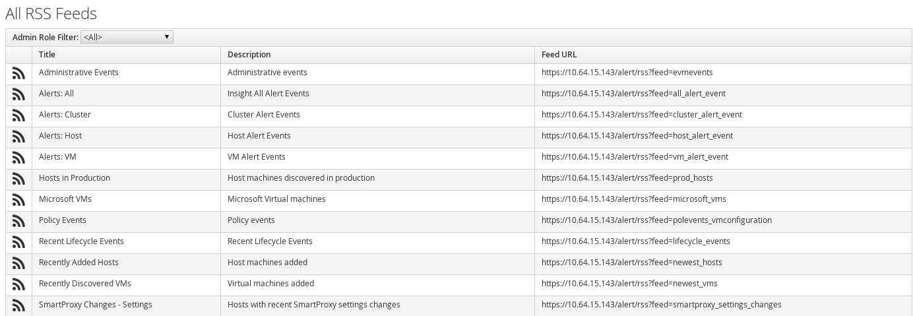

[[_sect_rss]]
= RSS

Use RSS to view RSS feeds based on administrative roles.
You can subscribe to the RSS feeds and have them delivered to an RSS reader. 

You can filter the list of RSS feeds by administrative role using the [label]#Admin Role Filter# drop down. 	
