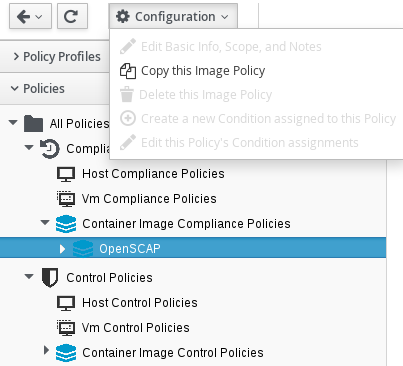

. Navigate to menu:Control[Explorer].

. Click the *Policies* accordion, and select the policy you want to copy.

. Click image:../images/1847.png[image](*Configuration*), and an option to copy the policy should appear; for example, image:../images/1859.png[image] (*Copy this Image Policy*).
+

. Click *OK* to confirm.

The new policy is created with a prefix of *Copy of* in its description, and it can be viewed in the Policy accordion.

image:../images/1860-cppolicy.png[image]
