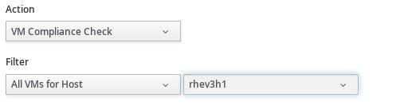

[[compliance-schedule]]
===== Scheduling a Compliance Check

. Navigate to menu:Settings[Configuration].

. Click the *Settings* accordion, and select *Schedules*.

. Click image:../images/1847.png[image] (*Configuration*),
image:../images/1862.png[image] (*Add a new Schedule*).

. In the *Adding a new Schedule* area, type in a name and description for the
schedule.
+
image:../images/1940.png[image]

. Check *Active* if you want to enable this scan.

. From the *Action* dropdown, select the type of compliance check you want to schedule. Depending on the type of analysis you choose, you are presented with one of the following group boxes:

* If you choose *VM Compliance Check*, you are presented with *VM Selection* where you can choose to check all VMs, all VMs for a specific provider, all VMs for a cluster, all VMs for a specific host, a single VM, or you can select VMs using a global filter.
+

* If you choose *Host Compliance Check*, you are presented with *Host Selection* where you can choose to analyze all hosts, all hosts for a specific provider, all hosts for a cluster, a single host, or you can select hosts using a global filter.
+

[NOTE]
======
You can only schedule a host analysis for connected virtual machines, not repository virtual machines that were discovered through that host. Since repository virtual machines do not retain a relationship with the host that discovered them, there is no current way to scan them through
the scheduling feature. The host is shown because it may have connected virtual machines in the future when the schedule is set to run.
======

include::compliance_check_timer.adoc[]
