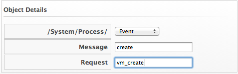
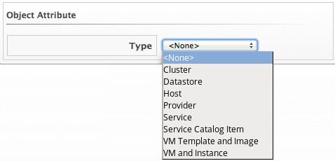
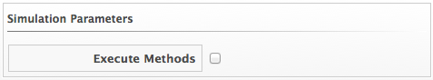

==== Simulating an Automate Model

This procedure shows you how to simulate an automate model.

. Navigate to `Automate` -> `Simulation`.

. In `Object Details`, select a type of object from `/System/Process/` that will initiate the model. The `Message` should be `create`. Type in the name of the `Request` where you are starting from.
+

. Select the `Type` of item you want to run the simulation on. Then, select a specific one to use as the example.
+

. Check `Execute Methods` if you want to perform the model and not just simulate it.
+

. Type in the `Attribute/Value Pairs` fields if applicable.

. Click `Submit`.

_Result:_. +
Click on the `Tree View` or `XML View` tabs to see results.
