## Configuration



### Settings

The options under the **Settings** area provide a hierarchical view of options that allow you to configure global options for the infrastructure of your {{ site.data.product.title_short }} environment. At the top level, you have **Settings** including users, LDAP Groups, account roles, capacity and utilization collection, tag categories, values, and imports, custom variable imports, and license uploads. When you click on
**Settings** and expand it, you can configure **Analysis Profiles**, **Zones**, and **Schedules**.

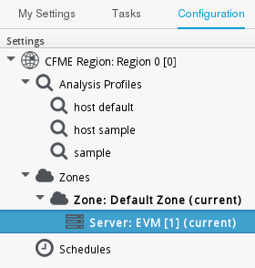

When you go the **Settings** accordion, you are automatically taken to the server list under **Zones**.

#### Regions

Use **Regions** for centralizing data which is collected from public and private virtualization environments. A region is ultimately represented as a single database for the VMDB. Regions are particularly useful when
multiple geographical locations need to be managed as they enable all the data collection to happen at each particular location and avoid data collection traffic across slow links between networks.

When multiple regions are being used, each with their own unique ID, a master region can be created to centralize the data of all the children regions into a single master database. To do this, configure each child
region to replicate its data to the master region database (Red Hat recommends use of region 99). This parent and child region is a one-to-many relationship.

Regions can contain multiple zones, which in turn contain appliances.
Zones are used for further segregating network traffic along with enabling failover configurations. Each appliance has the capability to be configured for a number of specialized server roles. These roles are
limited to the zone containing the appliance they run on.

Only one failover type of each server role can run in a zone. If multiple appliances have the same failover role, the extras are used as backups that activate only if the primary appliance fails. Non-failover server roles can run on multiple appliances simultaneously in a zone, so resources can be adjusted according to the workload those roles are responsible for.

The following diagram demonstrates an example of the multiple regions working together in a {{ site.data.product.title_short }} environment.


The Master appliance is located in Chicago and contains a master region and a subregion that manages the worker appliances. The Mahwah technology center contains a single subregion that manages two zones.
Likewise the San Diego technology center contains a single subregion managing a single zone.

**Note:**

  - Replicating a parent region to a higher-level parent is not supported.

  - Parent regions can be configured after the child regions are online.

The following diagram provides a closer look at a region:
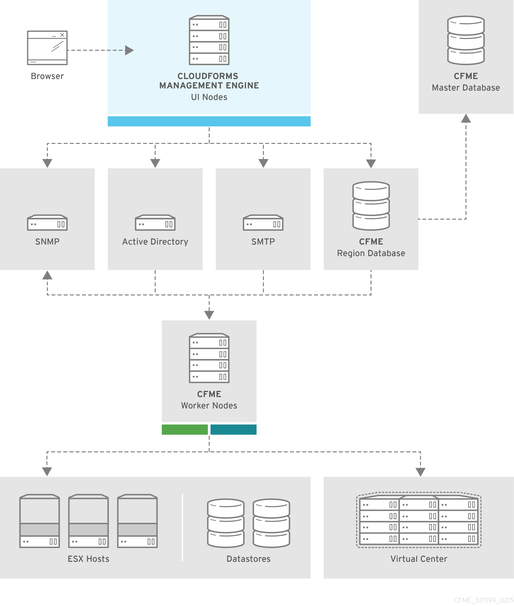

In this region, we have several {{ site.data.product.title_short }} appliances acting as UI nodes and worker nodes. These worker nodes execute tasks on the providers in your environment. The Region also uses a region database that reports to a master database on the main {{ site.data.product.title_short }} appliance.
All appliances can connect to the authentication services (Active Directory, LDAP, Identity Management), outgoing mail (SMTP), and network services (SNMP).

##### Region Scope

Regions are used to consolidate data from multiple VMDBs to a central database. The database at the top level, the master VMDB, cannot be used for operational tasks such as SmartState Analysis or Capacity and Utilization data collection. It is intended for use as a reporting
database that includes all information across multiple subordinate regions. The subordinate regions replicate their information to the master.

**Note:**

The subordinate regions are not aware of each other from a database perspective. You cannot see information from one subordinate region in another. The only VMDB with data visibility to all subordinate regions is the top level.

**Master Regions Scope**

  - Reports all information from all subordinate VMDBs reporting up to it.

  - Can perform power operations on virtual machines from subordinate regions.

  - Controls its own access control list.

**Subordinate Regions Scope**

  - Each subordinate controls its own access control independent of the other regions.

  - Can only do work (such as SmartState Analysis and Capacity and Utilization collection) in its own region.

  - Has no knowledge of the other regions.

  - Replicates its data up to the master region.

##### Region Settings

In the **Region** area, set items that apply to your entire {{ site.data.product.title_short }} infrastructure such as users, LDAP Groups, capacity and
utilization collection, company tags and tag categories, and licensing.
Regions are also used for database replication.

##### Capacity and Utilization Collection

###### Capacity and Utilization Collection Settings

Use **C & U Collection Settings** to select specifically which clusters and datastores you want to collect usage data for. By selecting a cluster, you are choosing to collect data for all hosts and virtual machines that are part of that cluster. You must also have a server with
the Capacity & Utilization **Coordinator**, **Data Collector**, and **Data Processor** roles enabled as well. See Section **Server Control Settings**.

After a provider has been discovered and its relationships refreshed, view the clusters, hosts, and datastores from the settings menu.
Navigate to **Settings**, then click on **Application Settings**. Click the menu: **Settings** > **Region**, then select the **C & U Collection** tab.

###### Enabling a Cluster, Host, or Datastore for Capacity and
Utilization Collection

To enable a cluster, host, or datastore for Capacity and Utilization Collection:

1.  Click **Settings**, then click on **Application Settings**. 
2.  Click the **Settings** accordion, then select **Region**, then click on the **C & U Collection** tab.

3.  In the **Clusters** area, check all clusters and hosts that you want
    to collect data for.

4.  In the **Datastores** area, check all datastores that you want to
    collect data for.

5.  Click **Save**.

**Note:**

1.  As new clusters, hosts, and datastores are discovered, you will need
    to come back to this configuration to enable collection of capacity
    and utilization data unless you have used the **Collect for All**
    check boxes.

2.  **Collect for All Clusters** must be checked to be able to collect
    capacity and utilization data from cloud providers such as Red Hat
    OpenStack Platform or Amazon EC2.

##### Tags

###### Company Tag Categories and Tags

{{ site.data.product.title_short }} allows you to create your own set of tags and tag
categories. Use tags to create a customized, searchable index for your resources. Depending on your database type, your tags may be case sensitive. After creating these values, you can apply them to your resources. There are two kinds of tags.

  - **Company tags** which you will see under **My Company Tags** for a resource. Create company tags from the settings menu. Browse to **Settings** > **Application Settings**. Click the **Settings** accordion, then select the **Region** and click on the **Tags** tab, then **My Company Tags**. A selection of company tags is provided to you by default as
    samples. These can be deleted if you do not need them, but are not
    recreated by {{ site.data.product.title_short }}.

  - **System tags** are assigned automatically by {{ site.data.product.title_short }}.

###### Creating a Tag Category

To create a tag category:

1.  Browse to **Settings** > **Application Settings**.
2.  Click on the **Settings** accordion, then **Region**.
3.  Select the **Tags** tab, then click on
    the **My Company Categories** tab.

4.  Click **Add** under the **Actions** column to create a new category.

5.  In the **Category Information** area: 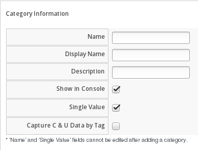

      - Use **Name** to create a short name that refers to category in
        the VMDB.

        **Note:**

        The **Name** and **Single Value** fields cannot be changed after
        the category has been added.

      - Use **Description** to type a brief explanation of how the
        category should be used. This shows when you try to add a value
        to the category.

      - Use **Long Description** to type a detailed explanation of the
        category.

      - Set **Show in Console** to `ON` when the category is ready for
        use in the console. For example, you want to populate values for
        the category before exposing it to users.

      - Set **Single Value** to `ON` for categories that can only have a
        single value assigned to a resource. For example, a virtual
        machine can only be assigned to one location, but could belong
        to more than one department. This cannot be changed after the
        category is created.

      - Set **Capture C & U Data by Tag** to `ON` for the ability to
        group capacity and utilization data by this tag category. To use
        this, be sure to assign this tag to all the resources that you
        want to group by.

6.  Click **Add**.

Repeat these steps for each category you need. After you have created the category, you can add values to it.

**Important**

If no values are created for a category, you are unable to assign a value from that category nor be able to filter by that category.


###### Deleting a Tag Category

To delete a tag category:

1.  Browse to **Settings** > **Application Settings**.
2.  Click on the **Settings** accordion, then **Region**.
3.  Select the **Tags** tab, then click on
    the **My Company Categories** tab.

4.  Click **Delete** under the **Actions** column for the category you
    want to delete.

5.  Click **OK** to confirm.

**Note:**

When you delete a tag category, the category values are removed, and any
tags from the category are unassigned from all resources.

###### Creating a Company Tag

To create a company tag:

1.  Browse to **Settings** > **Application Settings**.
2.  Click on the **Settings** accordion, then **Region**.
3.  Select the **Tags** tab, then click on
    the **My Company Tags** tab.

4.  In the **Choose a Category** area, select a category from the **Category** list.

    **Note:**

      - Some categories only allow one value to be assigned to a
        resource.

      - For some databases such as **PostgreSQL**, tags are case
        sensitive. For example, filtering by 'Linux' in title case give
        you different results from filtering by 'linux' in lower case.
    
5.  Click **Add** under the **Actions** column, and type a **Name** and **Description** for your new value.

6.  Click **Add** once again to add the new entry to the table.

###### Deleting a Company Tag

To delete a company tag:

1.  Browse to **Settings** > **Application Settings**.
2.  Click on the **Settings** accordion, then **Region**.
3.  Select the **Tags** tab, then click on
    the **My Company Tags** tab.

4.  Click **Delete** under the **Actions** column next to the tag to delete it.

    **Note:**

    When you delete a tag, the tag is also deleted from any resource to which it was assigned.
    
5.  Click **OK** to confirm.

###### Importing Tags for Virtual Machines

You can import a **CSV** file with tag assignments into the VMDB. For the import to be successful, be aware of the following:

  - The file must be in the following format, with one line for each virtual machine. One virtual machine per tag must be on a separate line even if you are assigning multiple tags of the same category.

  - You must use the display names of the category and the display name for the tag for the import to work.

        name,category,entry
        evm2,Provisioning Scope,All
        evm2,Exclusions,Do not Analyze
        evm2,EVM Operations,Analysis Successful
        rhel6,Department,Presales
        rhel6,Department,Support

###### Importing Tags for a Virtual Machine from a CSV File

To import tags for a virtual machine from a CSV file:

1.  Make sure the **CSV file** is in the required format.
2.  Browse to **Settings** > **Application Settings**.
3.  Click on the **Settings** accordion, then **Region**.
4.  Select the **Tags** tab, then click on
    the **Import Tags** tab.

5.  Click **Choose file** to go to the location where the file is located.

6.  Click **Upload**.

    **Note:**

    If there are any problems with the file, such as an incorrect column name, unknown virtual machine, unknown tag, or multiple values for a
    tag that should have only one, an error message will appear in the console for those records.

7.  Click **Apply**.

###### Importing Custom Values for Virtual Machines and Hosts

You can import a **CSV** file with asset tag information into the VMDB for a virtual machine or import custom values for hosts. For the import to be successful, the file must be in the following format, with one
line for each virtual machine or host.

  - There are two columns.

  - The first line of the file must have the column names as shown
    below.

  - The column names are case sensitive.

  - Each value must be separated by a comma.

**Virtual Machine Import Example**

    name,custom_1
    Ecommerce,665432
    Customer,883452
    SQLSrvr,1090430
    Firewall,8230500

For virtual machines, the value for custom\_1 will show in the **VM Summary** page as the **Custom Identifier** page as the **Custom Identifier** in the **Properties** area. All of the custom values will show in the **Custom Fields** area.

**Host Import Example**

    hostname,custom_1,custom_2
    esx303.galaxy.local,15557814,19948399
    esxd1.galaxy.local,10885574,16416993
    esxd2.galaxy.local,16199125,16569419

For hosts, the value for custom\_1 will show in the **Host Summary**
page as the **Custom Identifier** in the **Properties** area. All of the custom values will show in the **Custom Fields** area.

###### Importing Asset Tags for a Virtual Machine from a CSV File

To import asset tags for a virtual machine from a CSV file

1.  Make sure the **CSV file** is in the required format.
2.  Browse to **Settings** > **Application Settings**.
3.  Click on the **Settings** accordion, then **Region**.
4.  Select the **Tags** tab, then click on
    the **Import Variables** tab.
5.  Select the type of custom variable you want to import, either
    **Host** or **VM**.

6.  Click **Choose file** to go to the location where the custom variable file is located.

7.  Click **Upload**.

    **Note:**

    If there are any problems with the file, such as an incorrect column name, unknown virtual machine or host, a message appears.

8.  Click **Apply**.

##### Tag Mapping

You can map labels from external providers to tags within {{ site.data.product.title_short }}.

1. Browse to **Settings** > **Application Settings**.
2. Click on the **Settings** accordion, then select the **Region**.
3. Select the **Tags** tab, then click on
    the **Map Tags** tab.
4. Click **Add** to create a tag map.
5. In the **Choose a resource entity and label**, select the **Entity** and enter a **Resource label**, then enter a **Tag Category**.
6. Click **Add**.     

##### Customizing the Help Menu

{{ site.data.product.title_short }} allows administrators to customize the help menu. Use this feature to define menu labels, URLs and how each window opens for users.

**Note:**

Any change to the help menu will take effect upon a full page reload.

Customize the help menu using the following steps:

1.  Browse to **Settings** > **Application Settings**.
2.  Click on the **Settings** accordion, then **Region**.
3.  Click on the **Help Menu** tab.
4.  Provide custom **Menu item labels** and an associated **URL** for each. Define how each window should open by selecting from the options in the **Open in** menu.

5.  Click **Submit**.

#### Profiles

##### Creating an Analysis Profile

You can create an analysis profile by referring to the sample profiles provided in the console. You can copy the sample profile or create a new
one.

##### Creating a Host Analysis Profile

To create a host analysis profile:

1.  Browse to **Settings** > **Application Settings**.
2.  Click on the **Settings** accordion, then click **Analysis Profiles**.

3.  Click **Configuration**, and  (**Add Host Analysis Profile**).

4.  In the **Basic Information** area, type in a **Name** and **Description** for the analysis profile. 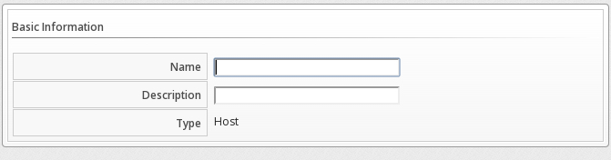

5.  Click **File** to collect information about a file or group of files.

6.  From the **File Entry** area, click  (**Click to add a new entry**) to add a file or group of files. 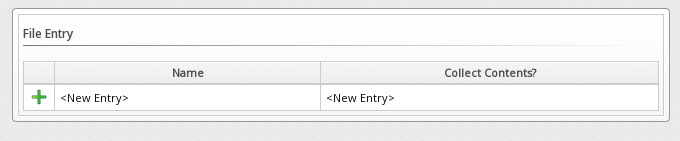

      - Check **Collect Contents** to not only check for existence, but also gather the contents of the file. If you do this, then you can use the contents to create policies in {{ site.data.product.title_short }} Control.

7.  Click **Event Log** to specify event log entries to collect.

8.  From the **Event Log Entry** area, click  **Click to add a new entry** to add a type of event log entry. Type in a **Name**. You can type in a specific message to find in **Filter Message**. In **Level**, set the value for the level of the entry and above. Specify the **Source** for the entry. Finally, set the \# number of days that you want to collect event log entries for. If you set this to 0, it will go as far back as there is data available.
    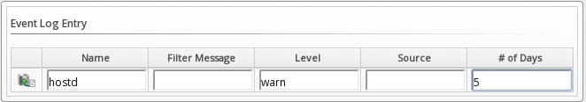

9.  Click **Add**.

##### Creating a Virtual Machine Analysis Profile

To create a virtual machine analysis profile:

1.  Browse to **Settings** > **Application Settings**.
2.  Click on the **Settings** accordion, then click **Analysis Profiles**.

3.  Click **Configuration**, and  **Add VM Analysis Profile**.

4.  In the **Basic Information** area, type in a **Name** and **Description** for the analysis profile. 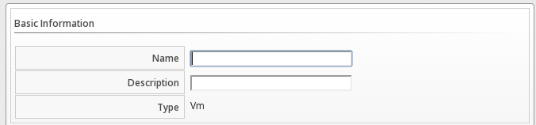

5.  You begin in the **Category** tab. From the **Category Selection** area, check the categories you want to collect information for. This is available for virtual machine profiles only.
    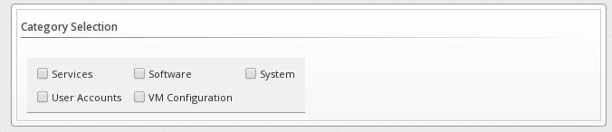

6.  Click the **File** tab to collect information about a file or group of files.

7.  From the **File Entry** area, click  **Add this entry** to add a file or group of files, then type a name. For virtual machines, specify the file to check for. Check the box under **Collect Contents** if you want to collect the file contents as well. The files can be no larger than 1 MB. 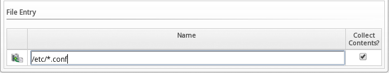

8.  Click the **Registry** tab to collect information on a registry key.

9.  From the **Registry Entry** area, type your **Registry Key** and **Registry Value**. To evaluate whether a registry key exists or does not exist on a virtual machine, without providing a value, type
    \* in the **Registry Value** field. Then, you do not need to know the registry value to collect the keys. This is available for virtual machine profiles only. 

10. Click **Event Log** to specify event log entries to collect.

11. From the **Event Log Entry** area, complete the fields to add a type of event log entry. You can type in a specific message to find in **Filter Message**. In **Level**, set the value for the level of the entry and above. Specify the **Source for the entry**. Finally, set the \# (number) of days that you want to collect event log entries for. If you set this to 0, it will go as far back as there is data available. 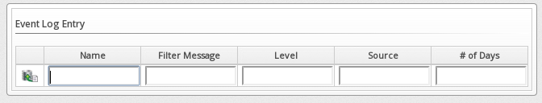

12. Click **Add**.

##### Editing an Analysis Profile

To edit an analysis profile:

1.  Browse to **Settings** > **Application Settings**.
2.  Click on the **Settings** accordion, then click **Analysis Profiles**.
3.  Check the analysis profile you want to edit.

4.  Click  **Edit the selected Analysis Profiles**.

5.  Make any changes.

6.  Click **Save**.

The changes are added to the analysis profile. The virtual machines or
hosts must be re-analyzed to collect the new or modified information.

##### Copying an Analysis Profile

To copy an analysis profile:

1.  Browse to **Settings** > **Application Settings**.
2.  Click on the **Settings** accordion, then click **Analysis Profiles**.

3.  Check the analysis profile you want to copy.

4.  Click **Configuration**, then  **Copy the selected Analysis Profiles**.

5.  Type a new **Name** and **Description**.

6.  Make required changes.

7.  Click **Add**.

##### Setting a Default Analysis Profile

If you want to set an analysis profile to be used for all virtual machines, you can create a default profile.

To create a default analysis profile:

1.  Browse to **Settings** > **Application Settings**.
2.  Click on the **Settings** accordion, then click **Analysis Profiles**.

3.  Click on the analysis profile you want to set as the default.

4.  Click **Configuration**, then  **Edit the selected Analysis Profile**.

5.  For a virtual machine profile, enter `default` in lower case in **Name**. For a host profile, enter `host default`. 

6.  Click **Save**.

#### Zones

You can organize your {{ site.data.product.title_short }} Infrastructure into zones to configure failover and isolate traffic. A provider that is discovered by a server in a specific zone gets monitored and managed in that zone. All jobs, such as a SmartState Analysis or VM power operation, dispatched by a server in a specific zone can get processed by any {{ site.data.product.title_short }} appliance assigned to that same zone.

Zones can be created based on your own environment. You can make zones based on geographic location, network location, or function. When first started, a new server is put into the default zone.

Suppose you have four {{ site.data.product.title_short }} appliances with two in the East
zone, appliances A and B, and two in the West zone, appliances C and D.
VC East is discovered by one of the {{ site.data.product.title_short }} appliances in the
{{ site.data.product.title_short }} Eastern zone. If Appliance A dispatches a job of
analyzing twenty virtual machines, this job can be processed by either
Appliance A or B, but not C or D.

**Note:**

Only users assigned the super administrator role can create zones. There must always be at least one zone. The **Default Zone** is provided and cannot be deleted.

##### Creating a Zone

To create a zone:

1.  Browse to **Settings** > **Application Settings**.
2.  Click on the **Settings** accordion, then click **Zones**.

3.  Click **Configuration**, and  **Add a new Zone** to create a zone.

4.  In the **Zone Information** area, type in a **Name** and **Description** for the new zone. 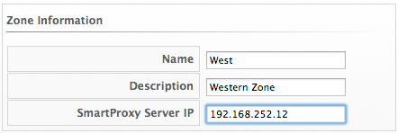

5.  Use **SmartProxy Server IP** to specify the IP address of the server that you want SmartProxies installed in this zone to report to. If this is not set, then the IP address of the server that deployed the SmartProxy is used. This does not apply to embedded SmartProxies.

6.  Optionally, you can configure **NTP servers** for the entire zone in the NTP Servers area. These settings will be used if the NTP servers have not been set for the appliance in the menu: **Operations** > **Server** page.

7.  In the **Settings** area, set the number for **Max Active VM Scans**. The default is `Unlimited`.

8.  Click **Save**.

##### Deleting a Zone

To delete a zone:

1.  Browse to **Settings** > **Application Settings**.
2.  Click on the **Settings** accordion, then click **Zones**.

3.  Click the zone you want to remove.

    **Note:**

    You cannot delete a zone if there are servers assigned to it.

4.  Click  **Configuration**, then click 
     **Delete this Zone**.

5.  Click **OK** to confirm.

##### Editing a Zone

To edit a zone:

1.  Browse to **Settings** > **Application Settings**.
2.  Click on the **Settings** accordion, then click **Zones**.
3.  Click the zone you want to edit.

4.  Click  **Configuration**, then click
     **Edit this Zone**.

5.  Complete the required changes.

6.  Click **Save**.

##### Adding SmartProxy Affinity to a Zone:

Enable SmartProxy Affinity for zones containing servers with the SmartProxy role to run a SmartState Analysis.

To add SmartProxy Affinity to a zone:

1.  Browse to **Settings** > **Application Settings**.
2.  Click on the **Settings** accordion, then click **Zones**.
3.  Click the zone in which you want to enable SmartProxy Affinity.
4.  Click the **SmartProxy Affinity** tab and click the appropriate
    server.
5.  Click **Save**.

#### Servers

Server settings enables you to control how each {{ site.data.product.title_short }} server
operates including authentication, logging, and email. If you have multiple servers in your environment that are reporting to one central
VMDB, then you can edit some of these settings from the console by specifying which server you want to change.

**Note:**

The server selection options are only available if you have multiple servers sharing one VMDB.

##### Changing Server Settings

To change server settings:

1.  Browse to **Settings** > **Application Settings**.
2.  Click on the **Settings** accordion, then click **Zones**.
3.  Click the zone where the {{ site.data.product.title_short }} server is located.

4.  In the **Servers** area, click on the {{ site.data.product.title_short }} server.

5.  Click **Server**.

6.  Make any required changes.

7.  Click **Save**.

###### Basic Information Settings 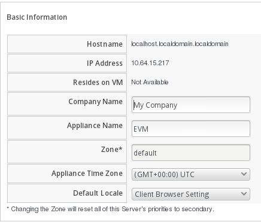

  - Use **Company Name** (maximum 20 characters) to customize the
    interface with your company’s name. You will see the company name
    when you are viewing or modifying the tags of an infrastructure
    object or virtual machine.

  - Specify the **Appliance Name** (maximum 20 characters) you want
    displayed as the appliance that you are logged into. You will see
    this in the upper right corner of the interface with the name of the
    consoles logged on user.

  - Use **Zone** to isolate traffic and provide load balancing
    capabilities. Specify the zone that you want this {{ site.data.product.title_short }}
    appliance to be a member of. At startup, the zone is set to default.

  - Use **Appliance Time Zone** to set the time zone for this server.

    **Note:**

    This is the time zone used when created scheduled analyses. This is
    not the same as the **Time Zone** parameter, which is found by
    navigating to the settings menu, then **My Settings**, then
    exploring the **Display Settings** area, and is the time zone
    displayed in the console.

  - Use **Default Locale** to specify the default language for this server.

###### Server Control Settings

A server role defines what a server can do. Red Hat recommends that
Database Operations, Event Monitor, Reporting, Scheduler, SmartState
Analysis, User Interface, Provider Inventory, Provider Operations, and
Web Services be enabled on at least one server in each zone. These roles
are enabled by default on all servers.

  - Use **Default Repository SmartProxy** to set the SmartProxy from
    which you refresh your virtual machine repositories. This host must
    have access to your repositories to analyze its virtual machines.

**Note:**

  - Only super administrators can change server roles.

  - If you are using more than one {{ site.data.product.title_short }} appliance, be sure to
    set this on all of the appliances.

###### Server Roles

**Note:**

  - Server roles that are in an active/active high availability
    configuration *(load balancing and failover protection)* are active
    in more than one location; whereas, roles that are in an
    active/passive *(primary/secondary in the case of
    {{ site.data.product.title_short }})* high availability configuration *(failover
    protection)*, if more than one {{ site.data.product.title_short }} server in a
    specific zone or region has this role, only one will be active
    *(primary)* at a time and a failover has to occur to the passive
    *(secondary)* appliance with that role.

  - For information on region and zone diagnostics and server role
    priorities, see [Diagnostics](#diagnostics).

| Server Role                           | Description                                                                                                                                                                                                                                                                                                                                                                                                                                                                                                                                                                                                                                          | Zone or Region Aware | Primary/Secondary or Active/Active |
| ------------------------------------- | ---------------------------------------------------------------------------------------------------------------------------------------------------------------------------------------------------------------------------------------------------------------------------------------------------------------------------------------------------------------------------------------------------------------------------------------------------------------------------------------------------------------------------------------------------------------------------------------------------------------------------------------------------- | -------------------- | ---------------------------------- |
| Automation Engine                     | Use this role if you want to use this {{ site.data.product.title_short }} server to process automation tasks.                                                                                                                                                                                                                                                                                                                                                                                                                                                                                                                                                     | N/A                  | Active/Active                      |
| Capacity and Utilization Coordinator  | The Capacity & Utilization Coordinator role checks to see if it is time to collect data, somewhat like a scheduler. If it is time, a job is queued for the Capacity and Utilization Data Collector. The coordinator role is required to complete Capacity and Utilization data collection. If more than one {{ site.data.product.title_short }} server in a specific zone has this role, only one will be active at a time.                                                                                                                                                                                                                                       | Zone                 | Primary/Secondary                  |
| Capacity & Utilization Data Collector | The Capacity & Utilization Data Collector performs the actual collection of capacity and utilization data. This role has a dedicated worker, and there can be more than one {{ site.data.product.title_short }} server with this role in a zone.                                                                                                                                                                                                                                                                                                                                                                                                                  | Zone                 | Active/Active                      |
| Capacity & Utilization Data Processor | The Capacity & Utilization Data Processor processes all of the data collected, allowing {{ site.data.product.title_short }} to create charts. This role has a dedicated worker, and there can be more than one {{ site.data.product.title_short }} server with this role in a zone.                                                                                                                                                                                                                                                                                                                                                                                            | Zone                 | Active/Active                      |
| Database Operations                   | Use Database Operations to enable this {{ site.data.product.title_short }} server to run database backups or garbage collection.                                                                                                                                                                                                                                                                                                                                                                                                                                                                                                                                  | Zone                 | Active/Active                      |
| Embedded Ansible                      | This role is disabled by default. The Embedded Ansible role supports Ansible Automation Inside functionality. Enable this role to configure playbook repositories and run playbooks natively to back service catalog items. **NOTE**: Enable the Provider Inventory server role in the same zone as the Embedded Ansible server role to ensure proper functionality.                                                                                                                                                                                                                                                                                 | Region               | Primary/Secondary                  |
| Event Monitor                         | This role is enabled by default and provides the information shown in timelines. The Event Monitor is responsible for the work between the {{ site.data.product.title_short }} server and your providers. It starts 2 workers for each provider. One worker, the monitor, is responsible for maintaining a connection to a provider, catching events, and putting them on the {{ site.data.product.title_short }} message queue for processing. The second worker, the handler, is a message queue worker responsible for delivering only those messages for a provider. You should have at least one of these in each zone.                                                   | Zone                 | Primary/Secondary                  |
| Git Repository                        | The Git Repositories Owner server role supports importing domains into automate from a git repository. This feature is available from the Automate \> Import/Export screen in the {{ site.data.product.title_short }} user interface.                                                                                                                                                                                                                                                                                                                                                                                                                             | Region               | Primary/Secondary                  |
| Notifier                              | Use this role if you will be using {{ site.data.product.title_short }} Control or Automate to forward SNMP traps to a monitoring system or send e-mails. See [Creating an Alert](#_to_create_an_alert) for details on creating SNMP alerts. If more than one {{ site.data.product.title_short }} server in a specific region has this role, only one will be active at a time.                                                                                                                                                                                                                                                                                                                | Region               | Primary/Secondary                  |
| Provider Inventory                    | This role is enabled by default. This role is responsible for refreshing provider information including EMS, hosts, virtual machines, and clusters, and is also responsible for capturing datastore file lists. If more than one {{ site.data.product.title_short }} server in a specific zone has this role, only one will be active at a time. Required in the same zone as a {{ site.data.product.title_short }} appliance with the Embedded Ansible role enabled.                                                                                                                                                                                                          | Zone                 | Primary/Secondary                  |
| Provider Operations                   | This role is enabled by default. This role sends stop, start, suspend, shutdown guest, clone, reconfigure, and unregister to the provider, directly from the console or through a policy action if you have {{ site.data.product.title_short }} Control. More than one {{ site.data.product.title_short }} server can have this role in a zone.                                                                                                                                                                                                                                                                                                                                | Zone                 | Active/Active                      |
| RHN Mirror                            | An appliance with RHN Mirror enabled acts as a server containing a repository with the latest {{ site.data.product.title_short }} packages. This also configures other appliances within the same region to point to the chosen RHN Mirror server for updates. This provides a low bandwidth method to update environments with multiple appliances.                                                                                                                                                                                                                                                                                                              | N/A                  | Active/Active                      |
| Reporting                             | This role is enabled by default. The Reporting role specifies which {{ site.data.product.title_short }} servers can generate reports. If you do not have a {{ site.data.product.title_short }} server set to this role in a zone, then no reports can be generated in that zone. You should have at least one of these in each zone.                                                                                                                                                                                                                                                                                                                                           | Zone                 | Active/Active                      |
| Scheduler                             | This role is enabled by default. The Scheduler sends messages to start all scheduled activities such as report generation and SmartState analysis. This role also controls all system schedules such as capacity and utilization data gathering. One server in each region must be assigned this role or scheduled {{ site.data.product.title_short }} events will not occur. If more than one {{ site.data.product.title_short }} server in a specific region has this role, only one will be active at a time.                                                                                                                                                               | Region               | Primary/Secondary                  |
| SmartProxy                            | Enabling the SmartProxy role turns on the embedded SmartProxy on the {{ site.data.product.title_short }} server. The embedded SmartProxy can analyze virtual machines that are registered to a host and templates that are associated with a provider. To provide visibility to repositories, install the SmartProxy on a host from the {{ site.data.product.title_short }} console. This SmartProxy can also analyze virtual machines on the host on which it is installed. Enabling the SmartProxy role on an appliance requires selecting the SmartProxy Affinity for a zone to run a SmartState Analysis. By default, no selections are enabled under SmartProxy Affinity. | Zone                 | Active/Active                      |
| SmartState Analysis                   | This role is enabled by default. The SmartState Analysis role controls which {{ site.data.product.title_short }} servers can control SmartState Analyses and process the data from the analysis. You should have at least one of these in each zone.                                                                                                                                                                                                                                                                                                                                                                                                              | Zone                 | Active/Active                      |
| User Interface                        | This role is enabled by default. The Web Services role must also be enabled with this role to log into the user interface, as the User Interface role queries the API to receive tokens for login. Uncheck User Interface if you do not want users to be able to access this {{ site.data.product.title_short }} server using the {{ site.data.product.title_short }} console. For example, you may want to turn this off if the {{ site.data.product.title_short }} server is strictly being used for capacity and utilization or reporting generation. More than one {{ site.data.product.title_short }} server can have this role in a zone.                                                          | Zone                 | Active/Active                      |
| Web Services                          | This role is enabled by default. The Web Services roles provides API access and must be enabled if the User Interface role is enabled to log into the user interface. You can also enable the Web Services role to provide API-only access to the server. Uncheck Web Services to stop this {{ site.data.product.title_short }} server from acting as a web service provider. More than one {{ site.data.product.title_short }} server can have this role in a zone.                                                                                                                                                                                                           | N/A                  | Active/Active                      |
| Websocket                             | This role enables starting or stopping websocket workers required for proxying remote consoles.                                                                                                                                                                                                                                                                                                                                                                                                                                                                                                                                                      | N/A                  | Active/Active                      |

###### VMware Console Settings

If you are using the {{ site.data.product.title_short }} control feature set, then you have
the ability to connect to a Web console for virtual machines that are
registered to a host. To use this feature, you must have VNC installed,
[VMware’s WebMKS SDK enabled in {{ site.data.product.title_short }}](../managing_infrastructure_and_inventory/index.html#configuring-webmks-support-in-manageiq),
or the VMRC native desktop application installed for your environment.

**Note:**

See vendor documentation to ensure you are installing appropriate
applications for your virtual infrastructure. Once you have installed
the required software, you must specify its version in the
{{ site.data.product.title_short }} configuration settings.

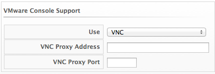

  - If you select **VNC**, type in the port number used. This port must
    be open on the target virtual machine and the VNC software must be
    installed there. On the computer that you are running the console
    from, you must install the appropriate version of Java Runtime if it
    is not already installed.

  - If you select **VMware WebMKS**, select the appropriate version.

  - If using **VMware VMRC** desktop application, be sure that you have
    fulfilled the requirements for your vCenter version. The correct
    version of the VMRC desktop application from VMware must be
    installed on the client computer. To do this, log into the vCenter
    Web Service and attempt to open a virtual machine console. The
    vSphere Web Client must be installed on vCenter version 5, and the
    provider must be registered to it. For vCenter version 4, the VMware
    vCenter Management Webservices must be running.

###### NTP Servers Settings In the **NTP Servers** area, you can
specify the NTP servers to use as source for clock synchronization here.
The NTP settings specified here will override Zone NTP settings. Enter
one NTP server hostname or IP address in each text box.

###### Configuring SNMP

You can use Simple Network Management Protocol (SNMP) traps to send
alerts for various aspects of a {{ site.data.product.title_short }} environment.

**Requirements**

  - Configure your SNMP management station to accept traps from
    {{ site.data.product.title_short }} appliances. Consult your management station’s
    documentation.

  - Each appliance that could process SNMP traps must have the `snmpd`
    and `snmptrapd` daemons running.

  - The region where the appliances are located must have the `Notifier`
    role enabled and the failover role priority set.

To enable the `snmpd` and `snmptrapd` daemons

1.  Access each SNMP processing appliance using SSH.

2.  Set the SNMP daemons to run on start up:

        # chkconfig --level 2345 snmpd on
        # chkconfig --level 2345 snmptrapd on

3.  The daemons run automatically when the appliance is restarted, but
    must be started manually now.

        # service snmpd start
        # service snmptrapd start

To enable the notifier role:

1. Access each SNMP processing appliance using their web interfaces.

2. Browse to **Settings** > **Application Settings**.
    
3. Click on the **Settings** accordion, then click **Zones**. Select the zone where the EVM server is located, and select the EVM server.

4.  In the **Server Control** area, set the **Notifier** server role
    option to `ON`.

5.  Click **Save**.

To set the failover priority role:

1.  Browse to **Settings** > **Application Settings** then click the **Diagnostics** accordion.

2.  Select the zone where the EVM server is located.

3.  Click **Roles by Servers** or **Servers by Roles** to view your servers.

4.  In the **Status of Roles for Servers** in **Zone Default Zone** area, click the role that you want to set the priority for.

5.  Click **Configuration**, and **Promote Server** to make this the primary server for this role.

###### Outgoing SMTP Email Settings

To use the email action in {{ site.data.product.title_short }}, set an email address to send
emails from.

**Note:**

To be able to send any emails from the server, you must have the Notifier server role enabled. You can test the settings without the role
enabled.


  - Use **Host** to specify the host name of the mail server.

  - Use **Port** to specify the port for the mail server.

  - Use **Domain** to specify the domain name for the mail server.

  - Set **Start TLS Automatically** on `ON` if the mail server requires TLS.

  - Select the appropriate **SSL Verify Mode**.

  - Use the **Authentication** drop down to specify if you want to use `login`, `plain`, or no authentication.

  - Use **User Name** to specify the user name required for login authentication.

  - Use **Password** to specify the password for login authentication.

  - Use **From E-mail Address** to set the address you want to send the email from.

  - Use **Test E-mail Address** if you want to test your email settings.
    Click **Verify** to send a test email.

###### Web Services Settings

Web services are used by the server to communicate with the SmartProxy.

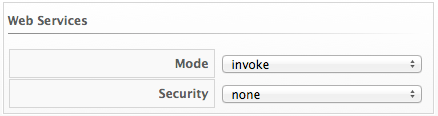

  - Set **Mode** to invoke to enable 2-way Web services communication
    between the {{ site.data.product.title_short }} appliance and the SmartProxy. Set
    **Mode** to disabled to use Web services from the SmartProxy to the
    {{ site.data.product.title_short }} appliance only. When the {{ site.data.product.title_short }} appliance
    has work for the SmartProxy, the work will be placed in a queue in the VMDB. The work will be completed either when the {{ site.data.product.title_short }} appliance is able to contact the SmartProxy or when the next SmartProxy heartbeat occurs, whichever comes first.

  - If **Web Services** are enabled, you have the option to use **ws-security**.

###### Logging Settings

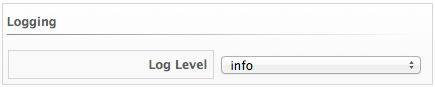

  - Use **Log Level** to set the level of detail you want in the log.
    You can select from **fatal**, **error**, **warn**, **info**, and
    **debug**. The default setting is 'info'.

###### Custom Support URL Settings

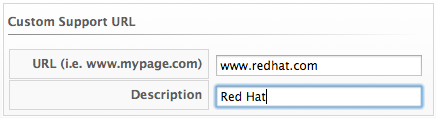

  - Use **URL** to specify a specific URL that you want to be accessible
    from the **About Product Assistance** area.

  - Use **Description** to set a label for the **URL**.

##### Authentication

Use the **Authentication** tab to specify how you want users authenticated on the console. You can use the VMDB or integrate with
LDAP, LDAPS, Amazon, or an external IPA server.

###### Changing Authentication Settings

To change authentication settings:

1.  Browse to **Settings** > **Application Settings**.

2.  Click the **Settings** accordion, then click **Zones**.

3.  Click the zone where the server is located.

4.  Click the server.

5.  Click the **Authentication** tab.

6.  Use **Session Timeout** to set the period of inactivity before a user is logged out of the console.

7.  Set the authentication method in **Mode**.

8.  Click **Save**.

##### Workers

Use the Workers page to specify the number of workers and amount of
memory allowed to be used for each type.

**Note:**

Only make these changes when directed to by Red Hat Support.

###### Changing Settings for a Worker

To change the settings for a worker

1.  Browse to **Settings** > **Application Settings**.

2.  Click on the **Settings** accordion, then click **Zones**.

3.  Click the zone where the server is located.

4.  Click on the server.

5.  Click **Workers**.

6.  Go to the type of worker you have been directed to change.

7.  If applicable, change Count or Memory Threshold using the dropdown boxes.

8.  Click **Save**.

##### Database

Use the Database page to specify the location of your Virtual Machine Database (VMDB) and its login credentials. By default, the type is
PostgreSQL on the Server.

**Note:**

The server may not start if the database settings are changed. Be sure
to validate your new settings before restarting the server.

###### Changing a Database Setting

To change a database setting:

1.  Browse to **Settings** > **Application Settings**.

2.  Click on the **Settings** accordion, then click **Zones**.

3.  Click the zone where the server is located.

4.  Click on the server.

5.  Click the **Database** tab.

6.  In the **Database** area, select the **Type** of database. You can select from **External Database on another CFME appliance**,
    **External Postgres Database**, and **Internal Database on this CFME Appliance**.

      - Use **Hostname** to specify the IP address or hostname of the external database server.

      - Use **Database Name** to specify the name of your VMDB.

      - Specify the **User Name** to connect to the VMDB.

      - Use **Password** and **Verify Password** to specify the password for the user name.

7.  Click **Validate** to check the settings.

8.  Click **Save**.

9.  Click **OK** to the warning that the server will restart immediately after you save the changes.

During the restart, you are unable to access the server. When the restart is complete, the new database settings are in effect.

##### Customization and Logos

###### Custom Logos

Use **Custom Logos** to display your own logo in the corner of the {{ site.data.product.title_short }} user interface and on the login screen. Use the procedures below to upload a custom logo to the user interface, and to
customize the login background and login panel text on the user interface.

**Note:**

  - If you have upgraded from an earlier {{ site.data.product.title_short }} version and your custom logo was already in use before migration, although your logo image file is still in place in `vmdb/public/upload` you may have to uncheck and recheck the option to **Use Custom Logo Image** to re-enable displaying your custom logo. See [Uploading a Custom Logo to the User Interface](#uploading-a-custom-logo-to-the-console) for the procedure on how to access the **Use Custom Logo Image** option, or if you want to upload another custom logo to the user interface and customize the login background image and login panel text.

  - Additionally, ensure the option to use configuration settings for the tenant under **Access Control** is set to `Yes`; see
    [Displaying the Custom Configuration Settings](#displaying-the-custom-configuration-settings) for the procedure on how to set the configuration settings.

###### Uploading a Custom Logo to the User Interface

**Note:**

Make sure the desired logo is accessible from the computer where you are running the {{ site.data.product.title_short }} user interface. The file must be in portable network graphics (png) format with dimensions of 350 px x 70 px.

To upload a custom logo to the user interface:

1.  Browse to **Settings** > **Application Settings**.

2.  Click on the **Settings** accordion, then click **Zones**.

3.  Click the zone where the {{ site.data.product.title_short }} server is located.

4.  Click on the server.

5.  Click the **Custom Logos** tab. 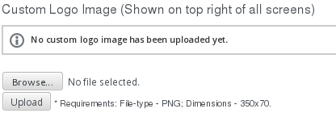

6.  In **Custom Logo Image (Shown on top right of all screens)**, click **Choose file** to go to the location where the logo file is located.

7.  Click **Upload**. The icon is displayed above the file name box, and an option is shown to use the logo.

8.  Check **Use Custom Logo Image** to add the logo to your user
    interface.

9.  Click **Save**.

**Note:**

To enable displaying your custom logo, ensure the option to use
configuration settings for the tenant under **Access Control** is set to
`Yes`. See [simpara\_title](#display-custom-settings) for the procedure
on how to set the configuration settings.

###### Customizing the Login Background

**Note:**

Make sure the background image that you want to use is accessible from the computer where you are running the user interface. The file must be in PNG format with dimensions of 1280 px x 1000 px.

To customize the login background:

1.  Browse to **Settings** > **Application Settings**.

2.  Click on the **Settings** accordion, then click **Zones**.

3.  Click the zone where the server is located.

4.  Click on the server.

5.  Click the **Custom Logos** tab.

6.  In **Custom Login & 'About' Screen Background Image**, click
    **Choose file** to go to the location where the background image
    file is located.

    

7.  Click **Upload**. The icon is displayed above the file name box, and
    an option is shown to use the logo.

8.  Check **Use Custom Login Background Image** to add the background
    image to the login screen of the user interface.

9.  Click **Save**.

###### Customizing the Login Panel Text

To customize the login panel text:

1.  Browse to **Settings** > **Application Settings**.

2.  Click on the **Settings** accordion, then click **Zones**.

3.  Click the zone where the server is located.

4.  Click on the server.

5.  Click the **Custom Logos** tab.

6.  In **Custom Login Panel Text**, enter the text that you want to
    display on the login screen.

7.  Click **Use Custom Login Text** to switch it to `Yes`. 

8.  Click **Save**.

###### Displaying the Custom Configuration Settings

To enable displaying your custom logo in the corner of the
{{ site.data.product.title_short }} user interface and on the login screen:

1.  Browse to **Settings** > **Application Settings**.

2.  Click the **Access Control** accordion.

3.  Click **Tenants**, then click **My Company**.

4.  Click (**Configuration**), then click
    (**Edit this item**).

    

5.  Click **Use Configuration Settings** to switch it to `Yes`.

6.  Click **Save**.

##### Advanced Settings

You may be instructed by Red Hat to edit some configuration settings
manually. This feature is available for a limited number of options and
can only be used by users assigned the super administrator role.
Changing settings using this procedure may disable your
{{ site.data.product.title_short }} server.

<div class="important">

  - Only make manual changes to your configuration files if directed to
    do so by Red Hat.

  - {{ site.data.product.title_short }} provides the ability to edit advanced
    configuration settings for all appliances through the **Advanced**
    tab from the user interface. You can also specify advanced settings
    for entire zones by clicking the **Advanced** tab at the zone level,
    with the advanced settings applied to individual appliances in that
    zone overriding zone-level settings when set.

</div>

###### Editing Configuration Files Manually

To edit configuration files manually:

1.  Click  **Configuration**.

2.  Click on the **Settings** accordion, then click **Zones**.

3.  Click the zone where the server is located.

4.  You can click the **Advanced** tab at the zone level to set advanced
    configuration settings for the entire zone. Or, you can click on the
    server, and then click the **Advanced** tab to set advanced
    configuration settings at the server (appliance) level, which will
    override zone-level settings.

5.  Make the required changes to the configuration file.

6.  Click **Save**.

###### Configuration Parameters

Table: authentication

| Parameters                     | Description                                                                                                                                                                                                                                                                                                                                                                                                                                             |
| ------------------------------ | ------------------------------------------------------------------------------------------------------------------------------------------------------------------------------------------------------------------------------------------------------------------------------------------------------------------------------------------------------------------------------------------------------------------------------------------------------- |
| amazon\_key                    | If using Amazon for the authentication mode, specify your Amazon Key. This is the same as Amazon Access Key in Configuration-Operations-Server-Amazon Settings in the appliance console. Default: blank                                                                                                                                                                                                                                                 |
| amazon\_secret                 | If using Amazon for the authentication mode, specify your Amazon Secret. This is the same as Amazon Secret Key in Configuration-Operations-Server-Amazon Settings in the appliance console. Default: blank                                                                                                                                                                                                                                              |
| basedn                         | If using ldap for the authentication mode, specify your Base DN. This is the same as Base DN in Configuration-Operations- Server-LDAP Settings in the appliance console. Default: blank                                                                                                                                                                                                                                                                 |
| bind\_dn                       | The user name to bind to the LDAP server. This user must have read access to all users and groups that will be used for {{ site.data.product.title_short }} authentication and role assignment. This is the same as Bind DN in Configuration-Operations-Server-LDAP Settings in the appliance console. Default: blank                                                                                                                                                       |
| bind\_pwd:                     | The password for the bind\_dn user. This is the same as Bind Password in Configuration-Operations- Server-LDAP Settings in the appliance console. Default: blank                                                                                                                                                                                                                                                                                        |
| get\_direct\_groups            | Use this to get the LDAP roles from the LDAP users' home forest. This is the same as Get Roles from Home Forest in the Authentication page for the {{ site.data.product.title_short }} Server. Default: true                                                                                                                                                                                                                                                                |
| group\_memberships\_max\_depth | When traversing group memberships in the LDAP directory it will stop at this value. Default: 2                                                                                                                                                                                                                                                                                                                                                          |
| ldaphost                       | Use ldaphost to specify the fully qualified domain name of your LDAP server. This is the same as LDAP Host Name in Configuration-Operations-Server-LDAP Settings in the appliance console. Default: blank                                                                                                                                                                                                                                               |
| ldapport                       | Specify the port of your LDAP server. This is the same as LDAP Port in Configuration-Operations- Server-LDAP Settings in the appliance console. Default: 389                                                                                                                                                                                                                                                                                            |
| mode                           | Use database to use the VMDB for security. Use ldap or ldaps to use directory services. This is the same as Mode in Configuration-Operations-Server-Authentication in the appliance console. Default: database                                                                                                                                                                                                                                          |
| user\_type                     | Use userprincipalname to type the user name in the format of user@domainname. Use mail to login with the user’s e-mail address. Use dn-cn for Distinguished Name (CN=\<user\>) or dn-uid Distinguished Name (UID=\<user\>) to use just the user name, but be sure to enter the proper user\_suffix for either one. This is the same as User Type in Configuration-Operations- Server-LDAP Settings in the appliance console. Default: userprincipalname |
| user\_suffix                   | Domain name to be used with user\_type of dn-cn or dn-uid. This is the same as User Suffix in Configuration-Operations- Server-LDAP Settings in the appliance console. Default: blank                                                                                                                                                                                                                                                                   |

Table: coresident\_miqproxy

| Parameters            | Description                                                                                                                                                                                                                                                                       |
| --------------------- | --------------------------------------------------------------------------------------------------------------------------------------------------------------------------------------------------------------------------------------------------------------------------------- |
| use\_vim\_broker      | Specify if you want the coresident SmartProxy to use a shared connection through the VIM broker to communicate with the VC or ESX host for SmartState Analysis. If it is disabled, then each SmartProxy SmartState Analysis would create its own connection. Default: true        |
| concurrent\_per\_ems  | Specify the number of co-resident SmartProxy SmartState Analyses that can be run against a specific management system at the same time. Default: 1                                                                                                                                |
| concurrent\_per\_host | Specify the number of co-resident SmartProxy SmartState Analyses that can be run against a specific host at the same time. Default: 1                                                                                                                                             |
| scan\_via\_host       | If you change scan\_via\_host to false, {{ site.data.product.title_short }} will use the Management System to scan which is limited by the concurrent\_per\_ems setting instead of the concurrent\_per\_host setting. Note this will greatly increase traffic to the Management System. Default: true |

Table: ems\_refresh

| Parameters                                          | Description                                                                                                                                                                                                                                                                                                                                                                                                                                                                             |
| --------------------------------------------------- | --------------------------------------------------------------------------------------------------------------------------------------------------------------------------------------------------------------------------------------------------------------------------------------------------------------------------------------------------------------------------------------------------------------------------------------------------------------------------------------- |
| capture\_vm\_created\_on\_date                      | Set to false to turn off historical event retrieval. Set to true to turn on. By setting the flag to true {{ site.data.product.title_short }} will try to set the "ems\_created\_on" column in the vms table after an ems refresh for new VMs and any VMs with a nil "ems\_created\_on" value. {{ site.data.product.title_short }} looks at event information in our database as well as looking up historical event data from the management system. This is optional since the historical lookup could timeout. Default: false |
| collect\_advanced\_settings                         | Set to false if you do not want to collect advanced Virtual Machine settings during a management system refresh. This will increase the speed of the refresh, but less data will be collected. If the parameter is not listed, then the value is true. Default: true                                                                                                                                                                                                                    |
| ec2                                                 |                                                                                                                                                                                                                                                                                                                                                                                                                                                                                         |
| get\_private\_images                                | For EC2 refreshes only; whether or not to retrieve private images. Default: true                                                                                                                                                                                                                                                                                                                                                                                                        |
| get\_public\_images                                 | For EC2 refreshes only; whether or not to retrieve public images. Default: false. Warning: setting get\_public\_images to true loads several thousand images in the VMDB by default and may cause performance issues.                                                                                                                                                                                                                                                                   |
| get\_shared\_images                                 | For EC2 refreshes only; whether or not to retrieve shared images. Default: true                                                                                                                                                                                                                                                                                                                                                                                                         |
| public\_images\_filters                             | For EC2 refreshes only; a filter to reduce the number of public images. Default: all public images                                                                                                                                                                                                                                                                                                                                                                                      |
| ignore\_terminated\_instances                       | For EC2 refreshes only; whether or not to ignore terminated instances. Default: true                                                                                                                                                                                                                                                                                                                                                                                                    |
| full\_refresh\_threshold                            | The number of targeted refreshes requested before they are rolled into a full refresh. For example, if the system and/or the user target a refresh against 7 VMs and 2 Hosts (9 targets), when the refresh actually occurs it will do a partial refresh against those 9 targets only. However, if a 10th had been added, the system would perform a full EMS refresh instead. Default: 100                                                                                              |
| raise\_vm\_snapshot\_complete\_if\_created\_within: | Raises vm\_snapshot\_complete event for a snapshot being added to VMDB only if the create time in Virtual Center is within the configured period of time. This prevents raising events for old snapshots when a new VC is added to {{ site.data.product.title_short }}. Default: 15.minutes                                                                                                                                                                                                                 |
| refresh\_interval                                   | Scheduler does a periodic full EMS refresh every refresh\_interval. Default: 24.hours                                                                                                                                                                                                                                                                                                                                                                                                   |

Table: host\_scan

| Parameters     | Description                                                                                          |
| -------------- | ---------------------------------------------------------------------------------------------------- |
| queue\_timeout | Time period after which a host SmartState analysis will be considered timed out. Default: 20.minutes |

Table: log

| Parameters            | Description                                                                                                                                                                                                                                                                                                                      |
| --------------------- | -------------------------------------------------------------------------------------------------------------------------------------------------------------------------------------------------------------------------------------------------------------------------------------------------------------------------------- |
| level                 | Specify the required level of logging for the {{ site.data.product.title_short }} appliance. Possible levels from most detailed to least detailed are: debug, info, warn, error, fatal. This is the same as Log Level in Configuration-Operations-Server-Logging in the appliance console and applies immediately to the evm.log file. Default: info |
| level\_aws            | Specify the level of logging for Amazon Web Services communications. Possible levels from most detailed to least detailed are: debug, info, warn, error, fatal. This applies to the aws.log file. Default: info                                                                                                                  |
| level\_aws\_in\_evm   | Specify what level of Amazon Web Services communication log should be also shown in evm.log. Possible levels from most detailed to least detailed are: debug, info, warn, error, fatal. Default: error                                                                                                                           |
| level\_fog            | Specify the level of logging for Fog communications. Possible levels from most detailed to least detailed are: debug, info, warn, error, fatal. This applies to the fog.log file. Default: info                                                                                                                                  |
| level\_fog\_in\_evm   | Specify what level of Fog communication log should be also shown in evm.log. Possible levels from most detailed to least detailed are: debug, info, warn, error, fatal. Default: error                                                                                                                                           |
| level\_rails          | Specify the level of logging for Rails. Possible levels from most detailed to least detailed are: debug, info, warn, error, fatal. Once changed, this applies immediately to the production.log file. Default: info                                                                                                              |
| level\_rhevm          | Specify the level of logging for Red Hat communications. Possible levels from most detailed to least detailed are: debug, info, warn, error, fatal. This applies to the rhevm.log file. Default: warn                                                                                                                            |
| level\_rhevm\_in\_evm | Specify what level of Red Hat communication log should be also shown in evm.log. Possible levels from most detailed to least detailed are: debug, info, warn, error, fatal. Default: error                                                                                                                                       |
| level\_vim            | Specify the level of logging for VIM (communication with VMware ESX and Virtual Center). Possible levels from most detailed to least detailed are: debug, info, warn, error, fatal. This applies to the vim.log file. Default: warn                                                                                              |
| level\_vim\_in\_evm   | Specify what level of vim logging should be also shown in evm.log. Possible levels from most detailed to least detailed are: debug, info, warn, error, fatal. Default: error                                                                                                                                                     |

Table: db\_stats

| Parameters     | Description                                                                                                                                                                                                                                                   |
| -------------- | ------------------------------------------------------------------------------------------------------------------------------------------------------------------------------------------------------------------------------------------------------------- |
| enabled        | Specify if you want to keep track of the number of queries, size of queries, number of responses, size of response, min/max for each, number of established connections at for each server process. This information will show in the EVM log. Default: false |
| log\_frequency | How frequently in seconds the process will log the database statistic in seconds. Default: 60                                                                                                                                                                 |

Table: callsites

| Parameters     | Description                                                                                                                                                                                                                                             |
| -------------- | ------------------------------------------------------------------------------------------------------------------------------------------------------------------------------------------------------------------------------------------------------- |
| enabled        | Specify if you want keep track of the code that is accessing the database. Enabling call sites will decrease performance because of the amount of information tracked. The db\_stats: enabled parameter must be set to true to use this. Default: false |
| depth          | Specify how many levels in the call stack to track for each database access. Default: 10                                                                                                                                                                |
| min\_threshold | Do not keep track of code that does not access the database this many times per log\_frequency. Default: 10                                                                                                                                             |
| path           | Set the path for the {{ site.data.product.title_short }} appliance log. This is the same as Log Path in Configuration-Operations- Server-Logging in the appliance console. Default: If no value is present, the path is /var/www/miq/vmdb/log.                              |
| line\_limit    | Limit how many characters are retained in a single log line. 0 means no limit. Default: 0                                                                                                                                                               |

Table: collection

<table>
<colgroup>
<col style="width: 30%" />
<col style="width: 69%" />
</colgroup>
<thead>
<tr class="header">
<th>Parameters</th>
<th>Description</th>
</tr>
</thead>
<tbody>
<tr class="odd">
<td><p>ping_depot</p></td>
<td><p>Whether to use TCP port ping to the log depot before performing log collection. Default: true</p></td>
</tr>
<tr class="even">
<td><p>ping_depot_timeout</p></td>
<td><p>Specify how long in seconds to wait for response from log depot before deciding that the TCP port ping failed. Default: 20</p></td>
</tr>
<tr class="odd">
<td><p>current</p></td>
<td><p>When collecting logs, specifies what is considered current logging as opposed to archived logging. Default: :pattern:</p>
<p>log/*.log</p>
<p>log/apache/*.log</p>
<p>log/*.txt</p>
<p>config/*</p>
<p>/var/lib/pgsql/data/*.conf</p>
<p>/var/lib/pgsql/data/pg_log/*</p>
<p>/var/log/syslog*</p>
<p>/var/log/daemon.log*</p>
<p>/etc/default/ntp*</p>
<p>/var/log/messages*</p>
<p>/var/log/cron*</p>
<p>BUILD</p>
<p>GUID</p>
<p>VERSION</p></td>
</tr>
<tr class="even">
<td><p>archive</p></td>
<td><p>Specifies what is considered archived logging. The default pattern is blank which means *.gz files in the log directory.</p></td>
</tr>
</tbody>
</table>

Table: log\_depot

| Parameters | Description                                                                                                                                                                         |
| ---------- | ----------------------------------------------------------------------------------------------------------------------------------------------------------------------------------- |
| uri        | Specify the URI for the log depot. This is the same as the URI in menu:Configuration\[Diagnostics \> Collect Logs\] in the appliance console. Default: blank                        |
| username   | Specify the user name for the log depot. This is the same as the user ID in menu:Configuration\[Diagnostics \> Collect Logs\] in the appliance console. Default: blank              |
| password   | Specify the password for the user for the log depot. This is the same as the password in menu:Configuration\[Diagnostics \> Collect Logs\] in the appliance console. Default: blank |

Table: performance

| Parameters                       | Description                                                                                                                                                                                                                                                                                                  |
| -------------------------------- | ------------------------------------------------------------------------------------------------------------------------------------------------------------------------------------------------------------------------------------------------------------------------------------------------------------ |
| capture\_threshold               |                                                                                                                                                                                                                                                                                                              |
| vm                               | Amount of time in minutes to wait after capture before capturing again. Default: 50.minutes                                                                                                                                                                                                                  |
| host                             | Amount of time in minutes to wait after capture before capturing again. Default: 50.minutes                                                                                                                                                                                                                  |
| ems\_cluster                     | Amount of time in minutes to wait after capture before capturing again. Default: 50.minutes                                                                                                                                                                                                                  |
| storage                          | Amount of time in minutes to wait after capture before capturing again. Default: 120.minutes                                                                                                                                                                                                                 |
| capture\_threshold\_with\_alerts |                                                                                                                                                                                                                                                                                                              |
| host                             | Amount of time in minutes to wait after capture before capturing again. This value is used instead of capture\_threshold for Hosts that have alerts assigned based on real time Capacity & Utilization data. Default: 20.minutes                                                                             |
| ems\_cluster                     | Amount of time in minutes to wait after capture before capturing again. This value is used instead of capture\_threshold for clusters that have alerts assigned based on real time Capacity & Utilization data. Default: 50.minutes                                                                          |
| vm                               | Amount of time in minutes to wait after capture before capturing again. This value is used instead of capture\_threshold for VMs that have alerts assigned based on real time Capacity & Utilization data. Default: 20.minutes                                                                               |
| concurrent\_requests             |                                                                                                                                                                                                                                                                                                              |
| vm                               | Amount of time in minutes to wait after capture before capturing again. This value is used instead of capture\_threshold for VMs that have alerts assigned based on real time Capacity & Utilization data. Default: 20.minutes                                                                               |
| hourly                           | Number of concurrent VC requests to make when capturing hourly raw metrics. Default: 1                                                                                                                                                                                                                       |
| realtime                         | Number of concurrent VC requests to make when capturing real time raw metrics. Default: 20                                                                                                                                                                                                                   |
| history                          |                                                                                                                                                                                                                                                                                                              |
| initial\_capture\_days           | How many days to collect data for on first collection. Default: 0                                                                                                                                                                                                                                            |
| Keep\_daily\_performances        | How long to keep daily performance data in the VMDB. Default: 6.months                                                                                                                                                                                                                                       |
| keep\_realtime\_performances     | How long to keep realtime performance data in the VMDB. Default: 4.hours                                                                                                                                                                                                                                     |
| keep\_hourly\_performances       | How long to keep hourly performance data in the VMDB. Default: 6.months                                                                                                                                                                                                                                      |
| purge\_window\_size              | When the purge needs to delete rows which are older than the keep\_realtime\_performances, keep\_hourly\_performances, and keep\_daily\_performances values, this value sets how many rows to delete in each batch. For example, a value of 1000 will cause us to issue ten 1,000 row deletes. Default: 1000 |

Table: repository\_scanning

| Parameters        | Description                                                                                                                                                                                      |
| ----------------- | ------------------------------------------------------------------------------------------------------------------------------------------------------------------------------------------------ |
| defaultsmartproxy | Specify the SmartProxy for repository scanning. This is the same as Default Repository Smartproxy in Configuration-Operations- Server-VM Server Control in the appliance console. Default: blank |

Table: server

| Parameters                    | Description                                                                                                                                                                                                                                                                                                                                                                                                                                                                                                                                                                               |
| ----------------------------- | ----------------------------------------------------------------------------------------------------------------------------------------------------------------------------------------------------------------------------------------------------------------------------------------------------------------------------------------------------------------------------------------------------------------------------------------------------------------------------------------------------------------------------------------------------------------------------------------- |
| case\_sensitive\_name\_search | Specify if you want the search by name on configuration item screens to be case senstive. Default: false                                                                                                                                                                                                                                                                                                                                                                                                                                                                                  |
| company                       | Specify the label you want to use for your company’s tagging. This is the same as Company Name in Configuration-Operations- Server-Basic Info. Default: "My Company"                                                                                                                                                                                                                                                                                                                                                                                                                      |
| custom\_logo                  | Specify if you want to use a custom logo. This is the same as Use Custom Logo in Configuration-Custom Logo-Logo Selection. Default: false                                                                                                                                                                                                                                                                                                                                                                                                                                                 |
| events                        |                                                                                                                                                                                                                                                                                                                                                                                                                                                                                                                                                                                           |
| disk\_usage\_gt\_percent      | For {{ site.data.product.title_short }} operational alerts, specify at what threshold the disk usage alerts will be triggered. Default: 80                                                                                                                                                                                                                                                                                                                                                                                                                                                                    |
| heartbeat\_timeout            | How long to wait until the server heartbeat is considered timed out. if the timeout is exceeded, other appliances in the zone/region can vie for the roles active on the timed out {{ site.data.product.title_short }} appliance. Default: 2.minutes                                                                                                                                                                                                                                                                                                                                                          |
| host                          | {{ site.data.product.title_short }} Server’s IP address. Default: blank                                                                                                                                                                                                                                                                                                                                                                                                                                                                                                                                       |
| hostname                      | {{ site.data.product.title_short }} Server’s hostname. Default: localhost.localdomain                                                                                                                                                                                                                                                                                                                                                                                                                                                                                                                         |
| listening\_port               | Specify the port number on which the web server is listening. Note that this does not set the port that VMDB listens on. When deploying the SmartHost from the {{ site.data.product.title_short }} appliance, it tells the SmartHost (miqhost) what port to talk to the VMDB on. Default: "443"                                                                                                                                                                                                                                                                                                               |
| mks\_version                  | Specify the version of the VMware MKS Plugin to use for the VM Console. This is the same as VMware MKS Plugin Version in Configuration-Operations- Server-VM Console. Default : 2.1.0.0                                                                                                                                                                                                                                                                                                                                                                                                   |
| name                          | Set the name to display for the {{ site.data.product.title_short }} appliance that you are logged on to in the appliance console. This is the same as appliance Name in Configuration-Operations- Server-Basic Information. Default : EVM                                                                                                                                                                                                                                                                                                                                                                     |
| role                          | Specify the roles for this {{ site.data.product.title_short }} Server, separated by commas without spaces. The possible values are automate, database\_operations, ems\_inventory, ems\_metrics\_collector, ems\_metrics\_coordinator, ems\_metrics\_processor, ems\_operations, event, notifier, reporting, scheduler, smartproxy, smartstate, user\_interface, web\_services. This is the same as Server Roles in Configuration-Operations- Server- Server Control. Default: database\_operations, event, reporting, scheduler, smartstate, ems\_operations, ems\_inventory, user\_interface, web\_services |
| session\_store                | Where to store the session information for all web requests. The possible values are sql, memory, or cache. SQL stores the session information in the database regardless of the type of database server. Memory stores all the session information in memory of the server process. Cache stores the information in a memcache server. Default: cache                                                                                                                                                                                                                                    |
| startup\_timeout              | The amount of time in seconds that the server will wait and prevent logins during server startup before assuming the server has timed out starting and will redirect the user to the log page after login. Default: 300                                                                                                                                                                                                                                                                                                                                                                   |
| vnc\_port                     | If using VNC for remote console, the port used by VNC. Default: 5800                                                                                                                                                                                                                                                                                                                                                                                                                                                                                                                      |
| zone                          | Set the Zone for this appliance belongs. This is the same as Zone in Configuration-Operations- Server-Basic Information. Default : default                                                                                                                                                                                                                                                                                                                                                                                                                                                |
| :worker\_monitor              | Starts and monitors the workers. Parameters specified here will override those set in the workers:default section.                                                                                                                                                                                                                                                                                                                                                                                                                                                                        |
| poll                          | How often the worker monitor checks for work. This value only is only used when the worker has no more work to do from the queue. It will wait for an amount of time determined by the poll value and poll method. Therefore, if there is constant work on the queue, the worker will not wait in between messages. Default: 15.seconds                                                                                                                                                                                                                                                   |
| miq\_server\_time\_threshold  | How much time to give the server to heartbeat before worker monitor starts to take action against non-responding server. Default: 2.minutes                                                                                                                                                                                                                                                                                                                                                                                                                                               |
| nice\_delta                   | Tells the worker monitor what Unix "nice" value to assign the workers when starting. A lower number is less nice to other processes. Default: 1                                                                                                                                                                                                                                                                                                                                                                                                                                           |
| sync\_interval                | Time interval to sync active roles and configuration for all workers. Default: 30.minutes                                                                                                                                                                                                                                                                                                                                                                                                                                                                                                 |
| wait\_for\_started\_timeout   | How long to wait for a started worker to heartbeat before considering the worker timed out. Default: 10.minutes                                                                                                                                                                                                                                                                                                                                                                                                                                                                           |
| kill\_algorithm               |                                                                                                                                                                                                                                                                                                                                                                                                                                                                                                                                                                                           |
| name                          | Criteria used to start killing workers. Default: used\_swap\_percent\_gt\_value                                                                                                                                                                                                                                                                                                                                                                                                                                                                                                           |
| value                         | Value of the criteria used. Default: 80                                                                                                                                                                                                                                                                                                                                                                                                                                                                                                                                                   |
| start\_algorithm              |                                                                                                                                                                                                                                                                                                                                                                                                                                                                                                                                                                                           |
| name                          | After server startup, criteria that must be met to decide if the {{ site.data.product.title_short }} Server can start a new worker. Default: used\_swap\_percent\_lt\_value                                                                                                                                                                                                                                                                                                                                                                                                                                   |
| value                         | Value of criteria used. Default: 60                                                                                                                                                                                                                                                                                                                                                                                                                                                                                                                                                       |

Table: session

| Parameters             | Description                                                                                                                                                                                                  |
| ---------------------- | ------------------------------------------------------------------------------------------------------------------------------------------------------------------------------------------------------------ |
| interval               | Set the time interval in seconds for checking inactive sessions in appliance console. Default: 60                                                                                                            |
| timeout                | Set the time period in seconds in which inactive console sessions are deleted. This is the same as Session Timeout in Configuration-Operations-Server-Authentication in the appliance console. Default: 3600 |
| memcache\_server       | If you choose memory for session\_store, you need to specify the memcache\_server to retrieve the session information from. Default: 127.0.1.1:11211                                                         |
| memcache\_server\_opts | Options to send to memcache server. : blank                                                                                                                                                                  |
| show\_login\_info      | Specify whether or not you want to see login info on start page. Default: true                                                                                                                               |

Table: smartproxy\_deploy

| Parameters     | Description                                                 |
| -------------- | ----------------------------------------------------------- |
| queue\_timeout | Timeout for host smartproxy deploy job. Default: 30.minutes |

Table: smtp

| Parameters     | Description                                                                                                                                                                                 |
| -------------- | ------------------------------------------------------------------------------------------------------------------------------------------------------------------------------------------- |
| host           | Specify the hostname of the smtp mail server. This is the same as Host in Configuration-Operations-Server-Outgoing SMTP E-mail Server. Default: localhost                                   |
| port           | Specify the port of the smtp mail server. This is the same as Port in Configuration-Operations-Server-Outgoing SMTP E-mail Server. Default: "25"                                            |
| domain         | Specify the domain of the smtp mail server. This is the same as Domain in Configuration-Operations-Server-Outgoing SMTP E-mail Server. Default: mydomain.com                                |
| authentication | Specify the type of authentication of the smtp mail server. This is the same as Authentication in Configuration-Operations-Server-Outgoing SMTP E-mail Server. Default: login               |
| user\_name     | Specify the username required for login to the smtp mail server. This is the same as User Name in Configuration-Operations-Server-Outgoing SMTP E-mail Server. Default: evmadmin            |
| password       | Specify the encrypted password for the user\_name account. This is the same as Password in Configuration-Operations-Server-Outgoing SMTP E-mail Server. Default: blank                      |
| from           | Set the address that you want to send e-mails from. This is the same as From E-mail Address in Configuration-Operations-Server-Outgoing SMTP E-mail Server. Default: <cfadmin@cfserver.com> |

Table: snapshots

| Parameters            | Description                                                                                                                                                                                                                                                                                                                                                                                                                                                                                                         |
| --------------------- | ------------------------------------------------------------------------------------------------------------------------------------------------------------------------------------------------------------------------------------------------------------------------------------------------------------------------------------------------------------------------------------------------------------------------------------------------------------------------------------------------------------------- |
| create\_free\_percent | Ensures the % of free space available on the main datastore (datastore where vmx file is located) can support the % growth of the snapshot. The default is to require space for 100% of the provisioned size of all disks that are taking part in the snapshot. A value of 0 means do not check for space before creating the snapshot. Default: 100                                                                                                                                                                |
| remove\_free\_percent | Ensures the % of free space available on the main datastore (datastore where vmx file is located) has the % free space available to support the snapshot deletion process. Note that the deletion process consists of first composing a new snapshot then removing it once the original snapshot to be deleted has been collapsed in the VM. The default is to require 100% of the size of all disks to complete this process. A value of 0 means do not check for space before removing the snapshot. Default: 100 |

Table: webservices

| Parameters       | Description                                                                                                                                                                                                                |
| ---------------- | -------------------------------------------------------------------------------------------------------------------------------------------------------------------------------------------------------------------------- |
| contactwith      | Set to ipaddress to contact miqhost using the IP address. Set to hostname to contact miqhost by its hostname. Set to resolved\_ipaddress to take the hostname and resolve it to an IP address. Default: ipaddress          |
| mode             | Set to invoke to use webservices. Set to disable to turn off webservices. This is the same as Mode in Configuration-Operations- Server-Web Services in the appliance console. Default: invoke                              |
| nameresolution   | If set to true, the hostname will be resolved to an IP address and saved with the host information in the VMDB. Default: false                                                                                             |
| security         | If Web Services are enabled, you can set this to ws-security. This is the same as Security in Configuration-Operations- Server-Web Services in the appliance console. Note: This is not currently supported. Default: none |
| timeout          | Specify the web service timeout in seconds. Default: 120                                                                                                                                                                   |
| password         | Specify the encrypted password for the user\_name account. This is the same as Password in Configuration-Operations-Server-Outgoing SMTP E-mail Server. Default: blank                                                     |
| use\_vim\_broker | Controls if the vim\_broker is used to communicate with VMware infrastructure. Default: true                                                                                                                               |

Table: workers

| Parameters                                              | Description                                                                                                                                                                                                                                                                                                                                                                               |
| ------------------------------------------------------- | ----------------------------------------------------------------------------------------------------------------------------------------------------------------------------------------------------------------------------------------------------------------------------------------------------------------------------------------------------------------------------------------- |
| worker\_base                                            |                                                                                                                                                                                                                                                                                                                                                                                           |
| defaults                                                | If the following parameters are NOT explicitly defined for a specific worker, then these values will be used.                                                                                                                                                                                                                                                                             |
| count                                                   | Number of this type of worker. Default: 1                                                                                                                                                                                                                                                                                                                                                 |
| gc\_interval                                            | How often to do garbage collection for this worker. Default: 15.minutes                                                                                                                                                                                                                                                                                                                   |
| poll                                                    | How often the workers checks for work. This value only is only used when the worker has no more work to do from the queue. It will wait for an amount of time determined by the poll value and poll method. Therefore, if there is constant work on the queue, the worker will not wait in between messages. Default: 3.seconds                                                           |
| poll\_method                                            | If set to normal, the worker checks for work the number of seconds set in the poll parameter. If set to escalate, the worker will increase the time between checks when there is no work to be done. Default: normal                                                                                                                                                                      |
| poll\_escalate\_max                                     | The maximum number of time to wait between checks for work. Poll\_method must be set to escalate for this option to be used. Default: 30.seconds                                                                                                                                                                                                                                          |
| heartbeat\_freq                                         | How often to "heartbeat" the worker. Default: 60.seconds                                                                                                                                                                                                                                                                                                                                  |
| heartbeat\_method                                       | Set which way to dispatch work. Possible values are sql or drb. Default: drb                                                                                                                                                                                                                                                                                                              |
| heartbeat\_timeout                                      | How long to wait until the worker heartbeat is considered timed out. Default: 2.minutes                                                                                                                                                                                                                                                                                                   |
| parent\_time\_threshold                                 | How long to allow the parent to go without heartbeating before considering the "parent' not responding. For workers, the worker monitor is the parent. For Worker monitor, the Server is the parent. Default: 3.minutes                                                                                                                                                                   |
| memory\_threshold                                       | How much memory to allow the worker to grow to before gracefully requesting it to exit and restart. Default: 150.megabytes                                                                                                                                                                                                                                                                |
| nice\_delta                                             | Tells the worker monitor what Unix "nice" value to assign the workers when starting. A lower number is less nice to other processes. Default: 10                                                                                                                                                                                                                                          |
| restart\_interval                                       | How long to let a worker remain up before asking it to restart. All queue based workers are set to 2.hours and every other worker does not get restarted by a 0.hours value. Default: 0.hours                                                                                                                                                                                             |
| starting\_timeout                                       | How long to wait before checking a worker’s heartbeat when it is starting up to mark it as not responding, similar to a grace period before you begin monitoring it. Default: 10.minutes                                                                                                                                                                                                  |
| event\_catcher                                          | Associated with Event Monitor Server Role. Captures ems events and queues them up for the event\_handler to process. Parameters specified here will override those set in the worker\_base:default section.                                                                                                                                                                               |
| ems\_event\_page\_size                                  | Internal system setting which sets the maximum page size for the event collector history. This should not be modified. Default: 100                                                                                                                                                                                                                                                       |
| ems\_event\_thread\_shutdown\_timeout                   | Internal system setting which determines how long the event catcher at shutdown will wait for the event monitor thread to stop. This should not be modified. Default: 10.seconds                                                                                                                                                                                                          |
| memory\_threshold                                       | How much memory to allow the worker to grow to before gracefully requesting it to exit and restart. Default: 2.gigabytes                                                                                                                                                                                                                                                                  |
| nice\_delta                                             | Tells the worker monitor what Unix "nice" value to assign the workers when starting. A lower number is less nice to other processes. Default: 1                                                                                                                                                                                                                                           |
| poll                                                    | How often the workers checks for work. This value only is only used when the worker has no more work to do from the queue. It will wait for an amount of time determined by the poll value and poll method. Therefore, if there is constant work on the queue, the worker will not wait in between messages. Default: 1.seconds                                                           |
| event\_catcher\_redhat                                  | Contains settings that supersede the event\_catcher for event\_catcher\_redhat.                                                                                                                                                                                                                                                                                                           |
| event\_catcher\_vmware                                  | Contains settings that supersede the event\_catcher for event\_catcher\_vmware.                                                                                                                                                                                                                                                                                                           |
| poll                                                    | How often the workers checks for work. This value only is only used when the worker has no more work to do from the queue. It will wait for an amount of time determined by the poll value and poll method. Therefore, if there is constant work on the queue, the worker will not wait in between messages. Default: 1.seconds                                                           |
| event\_catcher\_openstack                               | Contains settings that supersede the event\_catcher for event\_catcher\_openstack.                                                                                                                                                                                                                                                                                                        |
| poll                                                    | How often the workers checks for work. This value only is only used when the worker has no more work to do from the queue. It will wait for an amount of time determined by the poll value and poll method. Therefore, if there is constant work on the queue, the worker will not wait in between messages. Default: 15.seconds                                                          |
| topics                                                  | List of AMQP topics that should be monitored by {{ site.data.product.title_short }} when gathering events from OpenStack.                                                                                                                                                                                                                                                                                     |
| duration                                                | Qpid Specific. Length of time (in seconds) the receiver should wait for a message from the Qpid broker before timing out. Default: 10.seconds                                                                                                                                                                                                                                             |
| capacity                                                | Qpid Specific. The total number of messages that can be held locally by the Qpid client before it needs to fetch more messages from the broker. Default: 50.seconds                                                                                                                                                                                                                       |
| amqp\_port                                              | Port used for AMQP. Default: 5672                                                                                                                                                                                                                                                                                                                                                         |
| schedule\_worker                                        | Settings for Scheduler Server Role and any other work that runs on a schedule. Parameters specified here will override those set in the worker\_base:default section.                                                                                                                                                                                                                     |
| db\_diagnostics\_interval                               | How frequently to collect database diagnostics statistics. Default: 30.minutes                                                                                                                                                                                                                                                                                                            |
| job\_proxy\_dispatcher\_interval                        | How often to check for available SmartProxies for SmartState Analysis jobs. Default: 15.seconds                                                                                                                                                                                                                                                                                           |
| job\_proxy\_dispatcher\_stale\_message\_check\_interval | How often to check for the dispatch message in the queue Default: 60.seconds                                                                                                                                                                                                                                                                                                              |
| job\_proxy\_dispatcher\_stale\_message\_timeout         | Kill a message if this value is reached. Default: 2.minutes                                                                                                                                                                                                                                                                                                                               |
| job\_timeout\_interval                                  | How often to check to see if a job has timed out. Default: 60.seconds                                                                                                                                                                                                                                                                                                                     |
| license\_check\_interval                                | How often to check for valid license. Default: 1.days                                                                                                                                                                                                                                                                                                                                     |
| memory\_threshold                                       | How much memory to allow the worker to grow to before gracefully requesting it to exit and restart. Default: 150.megabytes                                                                                                                                                                                                                                                                |
| nice\_delta                                             | Tells the worker monitor what Unix "nice" value to assign the workers when starting. A lower number is less nice to other processes. Default: 3                                                                                                                                                                                                                                           |
| performance\_collection\_interval                       | Controls how often the schedule worker will put performance collection request on the queue to be picked up by the collection worker. Default: 3.minutes                                                                                                                                                                                                                                  |
| performance\_collection\_start\_delay                   | How long after {{ site.data.product.title_short }} Server has started before starting capacity and utilization collection, if collection needs to be done. Default: 5.minutes                                                                                                                                                                                                                                 |
| poll                                                    | How often the workers checks for work. This value only is only used when the worker has no more work to do from the queue. It will wait for an amount of time determined by the poll value and poll method. Therefore, if there is constant work on the queue, the worker will not wait in between messages. Default: 15.seconds                                                          |
| server\_logs\_stats\_interval                           | How often to log the {{ site.data.product.title_short }} Server statistics. Default: 5.minutes                                                                                                                                                                                                                                                                                                                |
| server\_stats\_interval                                 | How often to collect the {{ site.data.product.title_short }} Server statistics. Default: 60.seconds                                                                                                                                                                                                                                                                                                           |
| session\_timeout\_interval                              | How often to check to see if a UI (appliance console) session has timed out. Default: 30.seconds                                                                                                                                                                                                                                                                                          |
| storage\_file\_collection\_interval                     | How often to perform file inventory of storage locations. Default: 1.days                                                                                                                                                                                                                                                                                                                 |
| storage\_file\_collection\_time\_utc                    | What time to perform file inventory of storage locations. Default: "06:00"                                                                                                                                                                                                                                                                                                                |
| vdi\_refresh\_interval                                  | How often to refresh vdi inventory. Default: 20.minutes                                                                                                                                                                                                                                                                                                                                   |
| vm\_retired\_interval                                   | How often to check for virtual machines that should be retired. Default: 10.minutes                                                                                                                                                                                                                                                                                                       |
| vm\_scan\_interval                                      | How often to check virtual machines to see if scan needs to be done. Default: 10.minutes                                                                                                                                                                                                                                                                                                  |
| smis\_refresh\_worker                                   | Settings for Storage Inventory Server Role and any other work that runs on a schedule. Parameters specified here will override those set in the worker\_base:default section                                                                                                                                                                                                              |
| poll                                                    | How often the workers checks for work. This value only is only used when the worker has no more work to do from the queue. It will wait for an amount of time determined by the poll value and poll method. Therefore, if there is constant work on the queue, the worker will not wait in between messages. Default: 15.seconds                                                          |
| connection\_pool\_size                                  | Maximum number of database connections allowed per process. Default: 5                                                                                                                                                                                                                                                                                                                    |
| memory\_threshold                                       | How much memory to allow the worker to grow to before gracefully requesting it to exit and restart. Default: 1.gigabytes                                                                                                                                                                                                                                                                  |
| nice\_delta                                             | Tells the worker monitor what Unix "nice" value to assign the workers when starting. A lower number is less nice to other processes. Default: 3                                                                                                                                                                                                                                           |
| smis\_update\_period                                    | How frequently to update smis information. Default: 1.hours                                                                                                                                                                                                                                                                                                                               |
| status\_update\_period                                  | How frequently to update smis status. Default: 5.minutes                                                                                                                                                                                                                                                                                                                                  |
| stats\_update\_period                                   | How frequently to update smis statistics. Default: 10.minutes                                                                                                                                                                                                                                                                                                                             |
| vim\_broker\_worker                                     | Launched for any of these roles: Capacity & Utilization Collector, SmartProxy, SmartState Analysis, Management System Operations, Management System Inventory. Also launched if the use\_vim\_broker setting is on. Provides connection pooling, caching of data to and from the VMware infrastructure. Parameters specified here will override those set in the workers:default section. |
| heartbeat\_freq                                         | How often to heartbeat the worker. Default: 15.seconds                                                                                                                                                                                                                                                                                                                                    |
| memory\_threshold                                       | How much memory to allow the worker to grow to before gracefully requesting it to exit and restart. Default: 1.gigabytes                                                                                                                                                                                                                                                                  |
| nice\_delta                                             | Tells the worker monitor what Unix "nice" value to assign the workers when starting. A lower number is less nice to other processes. Default: 3                                                                                                                                                                                                                                           |
| poll                                                    | How often the workers checks for work. This value only is only used when the worker has no more work to do from the queue. It will wait for an amount of time determined by the poll value and poll method. Therefore, if there is constant work on the queue, the worker will not wait in between messages. Default: 1.seconds                                                           |
| reconnect\_retry\_interval                              | Period after which connection is retried. Default: 5.minutes                                                                                                                                                                                                                                                                                                                              |
| vim\_broker\_status\_interval                           | Internal system setting which configures how much time to wait after receiving event updates before checking for more updates. Default: 0.seconds                                                                                                                                                                                                                                         |
| wait\_for\_started\_timeout                             | Time between the worker’s preload and startup time before considering the worker timed out. Default: 10.minutes                                                                                                                                                                                                                                                                           |
| ui\_worker:                                             | Settings for User Interface Server Role. Parameters specified here will override those set in the worker\_base:default section.                                                                                                                                                                                                                                                           |
| connection\_pool\_size                                  | Maximum number of database connections allowed per process. Default: 5                                                                                                                                                                                                                                                                                                                    |
| memory\_threshold                                       | How much memory to allow the worker to grow to before gracefully requesting it to exit and restart. Default: 1.gigabytes                                                                                                                                                                                                                                                                  |
| nice\_delta: 1                                          | Tells the worker monitor what Unix "nice" value to assign the workers when starting. A lower number is less nice to other processes. Default: 1                                                                                                                                                                                                                                           |
| poll                                                    | How often the workers checks for work. This value only is only used when the worker has no more work to do from the queue. It will wait for an amount of time determined by the poll value and poll method. Therefore, if there is constant work on the queue, the worker will not wait in between messages. Default: 60.seconds                                                          |
| web\_service\_worker                                    | Settings for Web Services Server Role. Parameters specified here will override those set in the worker\_base:default section.                                                                                                                                                                                                                                                             |
| connection\_pool\_size                                  | Maximum number of database connections allowed per process. Default: 5                                                                                                                                                                                                                                                                                                                    |
| memory\_threshold                                       | How much memory to allow the worker to grow to before gracefully requesting it to exit and restart. Default: 1.gigabytes                                                                                                                                                                                                                                                                  |
| nice\_delta                                             | Tells the worker monitor what Unix "nice" value to assign the workers when starting. A lower number is less nice to other processes. Default: 1                                                                                                                                                                                                                                           |
| poll                                                    | How often the workers checks for work. This value only is only used when the worker has no more work to do from the queue. It will wait for an amount of time determined by the poll value and poll method. Therefore, if there is constant work on the queue, the worker will not wait in between messages. Default: 60.seconds                                                          |
| queue\_worker\_base                                     | Base class of all queue workers that work off of the queue..                                                                                                                                                                                                                                                                                                                              |
| defaults                                                | If the following parameters are NOT explicitly defined for a queue worker, then these values will be used.                                                                                                                                                                                                                                                                                |
| cpu\_usage\_threshold                                   | How much cpu to allow the worker to grow to before gracefully requesting it to exit and restart. Default: 100.percent                                                                                                                                                                                                                                                                     |
| queue\_timeout                                          | How long a queue message can be worked on before it is considered timed out. Default: 10.minutes                                                                                                                                                                                                                                                                                          |
| memory\_threshold                                       | How much memory to allow the worker to grow to before gracefully requesting it to exit and restart. Default: 400.megabytes                                                                                                                                                                                                                                                                |
| restart\_interval                                       | Queue workers restart interval. Default: 2.hours                                                                                                                                                                                                                                                                                                                                          |
| poll\_method                                            | If set to normal, the worker checks for work the number of seconds set in the poll parameter. If set to escalate, the worker will increase the time between checks when there is no work to be done. Default: normal                                                                                                                                                                      |
| generic\_worker                                         | Performs work that is not classified as any specific type of work. Processes all normal priority or non-specific queue items. Parameters specified here will override those set in the queue\_worker\_base:default section                                                                                                                                                                |
| count                                                   | Number of this type of worker. Default: 4                                                                                                                                                                                                                                                                                                                                                 |
| ems\_refresh\_worker                                    | Performs all ems (management system) refreshes to keep the vmdb in sync with the state of the components of the virtual infrastructure in the various management systems. Parameters specified here will override those set in the queue\_worker\_base:default section                                                                                                                    |
| poll                                                    | How often the workers checks for work. This value only is only used when the worker has no more work to do from the queue. It will wait for an amount of time determined by the poll value and poll method. Therefore, if there is constant work on the queue, the worker will not wait in between messages. Default: 10.seconds                                                          |
| memory\_threshold                                       | How much memory to allow the worker to grow to before gracefully requesting it to exit and restart. Default: 2.gigabytes                                                                                                                                                                                                                                                                  |
| nice\_delta                                             | Tells the worker monitor what Unix "nice" value to assign the workers when starting. A lower number is less nice to other processes. Default: 7                                                                                                                                                                                                                                           |
| restart\_interval                                       | Queue workers restart interval. Default: 2.hours                                                                                                                                                                                                                                                                                                                                          |
| queue\_timeout                                          | How long a message can be worked on before it is considered timed out. Default: 120.minutes                                                                                                                                                                                                                                                                                               |
| event\_handler                                          | Associated with Event Monitor Server Role. Handles all events caught by the event catcher worker. Parameters specified here will override those set in the workers:default section. Parameters specified here will override those set in the queue\_worker\_base:default section                                                                                                          |
| cpu\_usage\_threshold                                   | How much cpu to allow the worker to grow to before gracefully requesting it to exit and restart. The value of 0 means that this worker will never be killed due to CPU usage. Default: 0.percent                                                                                                                                                                                          |
| nice\_delta                                             | Tells the worker monitor what Unix "nice" value to assign the workers when starting. A lower number is less nice to other processes. Default: 7                                                                                                                                                                                                                                           |
| perf\_collector\_worker                                 | Connects to VC/ESX to collect the raw performance data. Same as the Capacity & Utilization Data Collector Server Role. Parameters specified here will override those set in the queue\_worker\_base:default section count. Number of this type of worker. Default: 2                                                                                                                      |
| count                                                   | Number of this type of worker. Default: 2                                                                                                                                                                                                                                                                                                                                                 |
| poll\_method                                            | If set to normal, the worker checks for work the number of seconds set in the poll parameter. If set to escalate, the worker will increase the time between checks when there is no work to be done. Default: escalate                                                                                                                                                                    |
| nice\_delta                                             | Tells the worker monitor what Unix "nice" value to assign the workers when starting. A lower number is less nice to other processes. Default: 3                                                                                                                                                                                                                                           |
| perf\_processor\_worker                                 | Processes the raw performance data into a reportable format. Same as the Capacity & Utilization Data Processor Server Role. Parameters specified here will override those set in the queue\_worker\_base:default section                                                                                                                                                                  |
| count                                                   | Number of this type of worker. Default: 2                                                                                                                                                                                                                                                                                                                                                 |
| poll\_method                                            | If set to normal, the worker checks for work the number of seconds set in the poll parameter. If set to escalate, the worker will increase the time between checks when there is no work to be done. Default: escalate                                                                                                                                                                    |
| memory\_threshold                                       | How much memory to allow the worker to grow to before gracefully requesting it to exit and restart. Default: 400.megabytes                                                                                                                                                                                                                                                                |
| nice\_delta                                             | Tells the worker monitor what Unix "nice" value to assign the workers when starting. A lower number is less nice to other processes. Default: 7                                                                                                                                                                                                                                           |
| priority\_worker                                        | Performs all high priority queue items including many tasks on behalf of the UI. UI requests are normally executed by a priority worker so they will not to block the UI. Parameters specified here will override those set in the queue\_worker\_base:default section                                                                                                                    |
| count                                                   | Number of this type of worker. Default: 2                                                                                                                                                                                                                                                                                                                                                 |
| memory\_threshold                                       | How much memory to allow the worker to grow to before gracefully requesting it to exit and restart. Default: 200.megabytes                                                                                                                                                                                                                                                                |
| nice\_delta                                             | Tells the worker monitor what Unix "nice" value to assign the workers when starting. A lower number is less nice to other processes. Default: 1                                                                                                                                                                                                                                           |
| poll                                                    | How often the workers checks for work. This value only is only used when the worker has no more work to do from the queue. It will wait for an amount of time determined by the poll value and poll method. Therefore, if there is constant work on the queue, the worker will not wait in between messages. Default: 1.seconds                                                           |
| reporting\_worker                                       | Compiles reports. Settings for Reporting Server Role. Parameters specified here will override those set in the queue\_worker\_base:default section                                                                                                                                                                                                                                        |
| count                                                   | Number of this type of worker. Default: 2                                                                                                                                                                                                                                                                                                                                                 |
| nice\_delta                                             | Tells the worker monitor what Unix "nice" value to assign the workers when starting. A lower number is less nice to other processes. Default: 7                                                                                                                                                                                                                                           |
| smart\_proxy\_worker                                    | Performs the embedded scanning of virtual machines. Settings for SmartProxy Server Role. Parameters specified here will override those set in the queue\_worker\_base:default section                                                                                                                                                                                                     |
| count                                                   | Number of this type of worker. Default: 3                                                                                                                                                                                                                                                                                                                                                 |
| memory\_threshold                                       | How much memory to allow the worker to grow to before gracefully requesting it to exit and restart. Default: 600.megabytes                                                                                                                                                                                                                                                                |
| queue\_timeout                                          | How long a queue message can be worked on before it is considered timed out. Default: 20.minutes                                                                                                                                                                                                                                                                                          |
| restart\_interval                                       | Queue workers restart interval. Default: 2.hours                                                                                                                                                                                                                                                                                                                                          |

#### Schedules

##### Scheduling SmartState Analyses and Backups

From the **Schedules** area in **Settings**, you can schedule the
analyses of virtual machines, hosts, clusters, and datastores to keep
the information current. Depending on which resource you want to
analyze, you can filter which ones to analyze. You may also specify only
one virtual machine or perform an analysis on all virtual machines. In
addition, you can schedule compliance checks, and database backups.

###### Scheduling a SmartState Analysis or Compliance Check

To schedule a SmartState Analysis or Compliance Check:

1.  Browse to **Settings** > **Application Settings**.

2.  Click on the **Settings** accordion, then click **Schedules**.

3.  Click (**Configuration**), and (**Add a new Schedule**).

4.  In the **Basic Information** area, type in a **Name** and
    **Description** for the schedule.

5.  Select **Active** to enable this scan.

6.  From the **Action** list, select the type of analysis to schedule.
    Based on the type of analysis you choose, you are presented with one
    of the following group boxes: 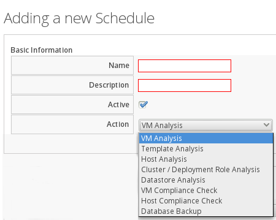

      - **VM Analysis**: Displays **VM Selection** where you can choose
        to analyze **All VMs**, **All VMs for Provider**, **All VMs for
        Cluster**, **All VMs for Host**, **A single VM**, or **Global
        Filters**.

      - **Template Analysis**: Displays **Template Selection** where you
        can choose to analyze **All Templates**, **All Templates for
        Provider**, **All Templates for Cluster**, **All Templates for
        Host**, **A single Template**, or **Global Filters**.

      - **Host Analysis**: Displays **Host Selection** where you can
        choose to analyze **All Hosts**, **All Hosts for Provider**, **A
        single Host**, or **Global Filters**.

        **Note:**

        You can only schedule host analyses for connected virtual
        machines, not repository virtual machines that were discovered
        through that host. Since repository virtual machines do not
        retain a relationship with the host that discovered them, there
        is no current way to scan them through the scheduling feature.
        The host is shown because it may have connected virtual machines
        in the future when the schedule is set to run.

      - **Cluster / Deployment Role Analysis**: Displays **Cluster Selection** where you can choose to analyze **All Clusters**,
        **All Clusters for Provider**, or **A single Cluster**.

      - **Datastore Analysis**: Displays **Datastore Selection** where
        you can choose to analyze **All Datastores**, **All Datastores for Host**, **All Datastores for Provider**, **A single Datastore**, or **Global Filters**.

      - **VM Compliance Check**: Displays **VM Selection** where you can
        choose to analyze **All VMs**, **All VMs for Provider**, **All VMs for Cluster**, **All VMs for Host**, **A single VM**, or
        **Global Filters**.

      - **Host Compliance Check**: Displays **Host Selection** where you
        can choose to analyze **All Hosts**, **All Hosts for Provider**,
        **All Hosts for Cluster**, **A single Host**, or **Global Filters**.

      - **Database Backup**: Under **Type**, displays **Network File System**, **Samba**, **Amazon AWS S3** and **OpenStack Swift**..
        See [Scheduling a Database Backup](#database_backup) for details
        on scheduling a database backup.

7.  By applying **Global Filters** within any of the above items, you
    can designate which virtual machines or hosts to analyze.

8.  In **Run**, set the frequency of the analysis to run. There are
    further options based on which **Run** option you choose.

      - Click **Once** to have the analysis run only one time.

      - Click **Daily** to run the analysis on a daily basis. You will
        be prompted to select the number of days between each analysis.

      - Click **Hourly** to run the analysis hourly. You will be
        prompted to select the number of hours between each analysis.

9.  Select a **Time Zone**.

    **Note:**

    If you change the **Time Zone**, you will need to reset the stating
    date and time.

10. Type or select a date to begin the schedule in **Starting Date**.

11. Select a **Starting Time** based on a 24 hour clock in the selected
    Time Zone.

12. Click **Add**.

##### Scheduling a Database Backup

**Note:**

Set `wal_keep_segments` parameter to a value that ensures
{{ site.data.product.title_short }} scheduled backups finish. Create a test backup
using a value based on the calculation:

**(\<pg-volume-free-space\>MB/4)/16MB**.

Measure free space in MB and ensure the denominator matches in units.

Setting `wal_keep_segments` to this value will cause the transaction log
to occupy, at a minimum, one quarter of the current free space. Adjust
your calculation accordingly upon successful testing.

To set the `wal_keep_segments` value:

1.  SSH to the database appliance

2.  Access the database

        # psql DBNAME USERNAME

3.  Set the `wal_keep_segments` value

        postgres=# ALTER SYSTEM SET wal_keep_segments = <value>;

4.  Reload `wal_keep_segments`

        postgres=# SELECT pg_reload_conf();

On successful backup, revise the value for `wal_keep_segments` to save
space based on transaction log size.

To schedule a database backup:

1.  Browse to **Settings** > **Application Settings**.

2.  Click on the **Settings** accordion, then click **Schedules**.

3.  Click  (**Configuration**), and (**Add a new Schedule**).

4.  In the **Basic Information** area, type in a **Name** and
    **Description** for the schedule. 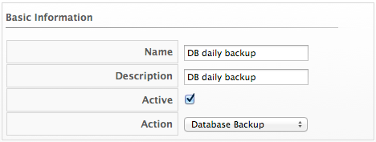

5.  Select **Active** to enable this backup schedule.

6.  From the **Action** list, select **Database backup**.

7.  In the **Database Backup Settings** area, select a type of server to
    put the backups. You can either use **Network File System** or
    **Samba**.

      - If selecting **Samba**, enter the **Depot Name**, **URI**,
        **User ID**, and a valid **Password**. Then, click **Validate**
        to check the settings.

      - If you choose **Network File System**, enter the **Depot Name**
        and **URI**.

8.  In **Run**, set the frequency of the analysis to run. There are
    further options based on which **Run** option you choose.

      - Click **Once** to have the backup run only one time.

      - Click **Daily** to run the backup on a daily basis. You will be
        prompted to select the number of days between each backup.

      - Click **Hourly** to run the backup hourly. You will be prompted
        to select the number of hours between each backup.

9.  Select a **Time Zone**.

    **Note:**

    If you change the **Time Zone**, you will need to reset the stating
    date and time.

10. Type or select a date to begin the schedule in **Starting Date**.

11. Select a **Starting Time** (UTC) based on a 24 hour clock in the
    selected time zone.

12. Click **Add**.

###### Modifying a Schedule

To modify a schedule:

1.  Browse to **Settings** > **Application Settings**.

2.  Click on the **Settings** accordion, then click **Schedules**.

3.  Click the schedule that you want to edit.

4.  Click  (**Configuration**), and then click
     (**Edit this Schedule**).

5.  Make the required changes.

6.  Click **Save**.

##### Importing and Exporting Schedules

{{ site.data.product.title_short }} provides the ability to import and export
schedules using the `import_export_schedules.rb` script:

    ./var/www/miq/vmdb/tools/import_export_schedules.rb -h

| Option                              | Description                        |
| ----------------------------------- | ---------------------------------- |
| \-u, --user=\<s\>                   | userid (default: admin)            |
| \-d, --output-dir=\<s\>             | Output directory (default: ./)     |
| \-s, --schedule=\<s\>               | Schedule name or id                |
| \-o, --operation=\<s\>              | Export or import (default: export) |
| \-y, --import-yaml=\<filename/uri\> | Imported yaml                      |
| \-h, --help                         | Show this message                  |

**Usage Example.**

Import:

    ./var/www/miq/vmdb/tools/import_export_schedules.rb -o import -y ./filename.yaml

Export:

    ./var/www/miq/vmdb/tools/import_export_schedules.rb -s 158

Note that the `import_export_schedules.rb` script works for all types of
schedules, including:

  - Report

  - Policy

  - Alert

  - SmartState Analysis

  - Database Backup

  - Automation Task

  - Service Template

### Access Control

Browse to **Settings** > **Application Settings**. Click
on the **Access Control** accordion to see a hierarchy of the
configurable items for users, groups, roles, and tenants. You can add and modify users, groups, account roles, tenants, and projects.

#### Creating a Tenant

Tenants are used in {{ site.data.product.title_short }} for controlling visibility of
objects.

To create a tenant:

1.  Browse to **Settings** > **Application Settings**.

2.  Click on the **Access Control** accordion, then click **Tenants**.

3.  Click on the top-level **Tenant**, click 
    (**Configuration**), and 
    (**Add child Tenant to this Tenant**) to create a tenant.

4.  Enter a name for the tenant in the **Name** field.

5.  Enter a description for the tenant in the **Description** field.

6.  Click **Add**.

#### Creating a Project

A tenant can also contain a self-contained child tenant known as a
'project'. A project cannot have a child tenant, but it is useful for
allocating resources to a small group or team within a larger
organization.

To create a project:

1.  Browse to **Settings** > **Application Settings**.

2.  Click on the **Access Control** accordion, then click **Tenants**.

3.  Click on the **Tenant** where you want to add a **Project**, click
     (**Configuration**), and  (**Add Project to this Tenant**) to
    create a project.

4.  Enter a name for the project in the **Name** field.

5.  Enter a description for the project in the **Description** field.

6.  Click **Add**.

#### Managing Tenant and Project Quotas

Use the following procedure to allocate or edit quotas for tenants and
projects.

**Note:**

Quota is allocated based on the user’s current group. If the user
belongs to multiple groups, you must change to the desired group before
allocating or editing group quota. See [Groups](#groups) for more
details.

1.  Browse to **Settings** > **Application Settings**.

2.  Click on the **Access Control** accordion, then click **Tenants**.

3.  Click on the **Tenant** or **Project** where you want to add a
    quota, click  (**Configuration**), and
     (**Manage quotas for the Selected Item**)
    to create a quota.

4.  In the list of pre-built quotas, switch **Enforced** next to the
    quota item you want to enable to `Yes`.

5.  In the **Value** field, enter the constraints you want to apply to
    the quota. 

6.  Click **Save**.

#### Tagging Tenants and Projects

To tag tenants and projects:

1.  Browse to **Settings** > **Application Settings**.

2.  Click on the **Access Control** accordion, then click **Tenants**.

3.  Select the tenant or project, then click **Policy**, and select
    **Edit My Company Tags for this Tenant**.

4.  In **Tag Assignment**, click **Select a customer tag to assign**,
    and select a tag from the list. In the next column, set a
    corresponding value.

5.  Click **Save**.

#### Creating a User

To create a user:

1.  Browse to **Settings** > **Application Settings**.

2.  Click on the **Access Control** accordion, then click **Users**.

3.  Click  (**Configuration**), and  (**Add a new User**) to create a
    user.

4.  Enter a **Full Name**, **Username**, **Password** with confirmation,
    and **Email Address** for the user. An email address is required;
    omitting the user email address can result in unsuccessful
    provisioning requests.

    

    <div class="important">

      - If you are using LDAP, but did not enable **Get User Groups from
        LDAP** in your server’s **Authentication** tab, you will need to
        define a user. The UserID must match exactly the user’s name as
        defined in your directory service. Use all lowercase characters
        to ensure the user can be found in the VMDB.

      - When the user logs in, they use their LDAP password.

    </div>

5.  Select one or more groups from **Available Groups**.

6.  Click **Add**.

#### Deleting a User

For security reasons, delete any user that no longer needs access to the
information or functions of the server.

To delete a user:

1.  Browse to **Settings** > **Application Settings**.

2.  Click on the **Access Control** accordion, then click **Users**.

3.  Select the user you want to delete.

4.  Click  (**Configuration**), and  (**Delete selected Users**) to
    delete a user.

#### Groups

User groups create filters and assign roles to users. You can either
create your own groups, or leverage your LDAP directory service to
assign groups of users to account roles. For a list of what each
pre-defined account role can do, see [Roles](#roles).

A user can exist in multiple groups. However, a group can only be
assigned one account role.

If a user belongs to multiple groups, you can change the user’s current
group by navigating to the settings menu, clicking **Change Group**,
then selecting the desired group. The **Current Group** affects quota
and other settings for the user.


#### Creating a Group

To create a user group:

1.  Browse to **Settings** > **Application Settings**.

2.  Click on the **Access Control** accordion, then click **Groups**.

3.  Click  (**Configuration**), and  (**Add a new Group**) to create a
    group.

4.  Enter a name for the group in the **Name** field. To ensure
    compatibility with tags, use underscores in place of spaces. For
    example, {{ site.data.product.title_short }}-`test_group`.

5.  Select a **Role** to map to this group. For a description of each
    {{ site.data.product.title_short }} role, see [Account Roles and
    Descriptions](#account-roles-and-descriptions).

6.  Select the **Project/Tenant** this group must belong to.

7.  Limit what users in this group can view by selecting filters in the
    **Assign Filters** area.

    1.  Click the **\<My Company\> Tags** tab to select the tags that
        users in this group can access. Resources with the selected tags
        attached can be accessed by this group. Select tags using one of
        the options in the **This user is limited to** list:

          - Select **Specific Tags**, then check the boxes for the tags
            that you want to limit this user to. The items that have
            changed will show in blue italicized font.

          - Select **Tags Based On Expression**, then create tags based
            on an expression using AND, OR, or NOT. This allows you to
            further limit the resources accessible to a user: for
            example, to specify a combination of tags that must exist on
            a resource. 

    2.  Click the **Host & Clusters** tab.

        1.  Check the boxes for the host and clusters that you want to
            limit this user to. The items that have changed will show in
            blue italicized font. 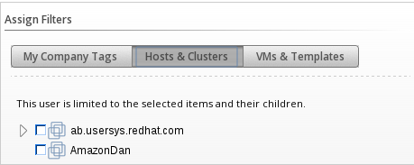

    3.  Click the **VMs & Templates** tab. This shows folders that you
        have created in your virtual infrastructure.

        1.  Check the boxes for the folders that you want to limit this
            user to. The items that have changed will show in blue
            italicized font.

8.  Click **Add**.

After creating a group, assign one or more users to the group by editing
a user.

#### Roles

When you create a group, you must specify a role to give the group
rights to resources in the console. The group’s role determines the
scope of access for the users that are members of the group.


{{ site.data.product.title_short }} provides a default group of roles, but you can also
create your own, or copy and edit the default groups.

**Note:**

If you have enabled **Get Role from LDAP** under **LDAP Settings**, then
the role is determined by the LDAP user’s group membership in the
directory service.

To view details of a role and its level of access:

1.  Browse to **Settings** > **Application Settings**.

2.  Click on the **Access Control** accordion, then click **Roles**.

3.  Click on a role from the list to display role information and the
    product features the role can access (marked by a checkmark). You
    can expand the categories under **Product Features** to see further
    detail.

The table below shows a summary of the functions available to each role.

##### Account Roles and Descriptions

| Role                       | Description                                                                                                                                                                                                                                         |
| -------------------------- | --------------------------------------------------------------------------------------------------------------------------------------------------------------------------------------------------------------------------------------------------- |
| Administrator              | Administrator of the virtual infrastructure. Can access all infrastructure functionality. Cannot change server configuration.                                                                                                                       |
| Approver                   | Approver of processes, but not operations. Can view items in the virtual infrastructure, view all aspects of policies and assign policies to policy profiles. Cannot perform actions on infrastructure items.                                       |
| Auditor                    | Able to see virtual infrastructure for auditing purposes. Can view all infrastructure items. Cannot perform actions on them.                                                                                                                        |
| Container Administrator    | Administrator with capabilities to configure, view and execute tasks on all containers and related underlying infrastructure. Has access to Nodes, Pods and Projects dashboards.                                                                    |
| Container Operator         | This role can view and execute tasks related to containers and related underlying infrastructure. The Container Operator has access to locked versions of the same dashboards as the Container Administrator.                                       |
| Desktop                    | Access to VDI pages.                                                                                                                                                                                                                                |
| Operator                   | Performs operations of virtual infrastructure. Can view and perform all functions on virtual infrastructure items including starting and stopping virtual machines. Cannot assign policy, but can view policy simulation from Virtual Machine page. |
| Security                   | Enforces security for the virtual environment. Can assign policies to policy profiles, control user accounts, and view all parts of virtual infrastructure. Cannot create policies or perform actions on virtual infrastructure.                    |
| Super Administrator        | Administrator of {{ site.data.product.title_short }} and the virtual infrastructure. Can access all functionality and configuration areas.                                                                                                                              |
| Support                    | Access to features required by a support department such as diagnostics (logs). Can view all infrastructure items and logs. Cannot perform actions on them.                                                                                         |
| Tenant Administrator       | Configures settings applicable to a Tenant. Sets Branding, maps groups/roles, configures LDAP credentials, and configures dashboard settings.                                                                                                       |
| Tenant Quota Administrator | Configures quota limits for the tenant, applying usage constraints for CPU, Memory, Storage, Maximum number of VMs, and Maximum number of Templates.                                                                                                |
| User                       | User of the virtual infrastructure. Can view all virtual infrastructure items. Cannot perform actions on them.                                                                                                                                      |
| User Limited Self Service  | Limited User of virtual machines. Can make provision requests. Can access some functions on the virtual machine that the user owns including changing power state.                                                                                  |
| User Self Service          | User of virtual machines. Can make provision requests. Can access some functions on the virtual machine that the user owns and that the user’s LDAP groups own including changing power state.                                                      |
| Vm User                    | User of virtual machines. Can access all functions on the virtual machine including changing power state and viewing its console. Cannot assign policy, but can view policy simulation from virtual machine page.                                   |

#### Creating a Role

To create a role:

1.  Click **Settings** > **Application Settings**.

2.  Click on the **Access Control** accordion, then click **Roles**.

3.  Click **Configuration**, and  **Add a new Role**. Alternatively, you can copy an existing role to a new role by clicking **Copy the selected Role to a new Role**.

4.  In the **Role Information** area, type a name for the new role. For
    **Access Restriction for Catalog Items, Orchestration Stacks, Key Pairs, Services, VMs, and Templates**, select if
    you want to limit users with this role to only see resources owned
    by the user or their group, owned by the user, or all resources
    (**None**): 

5.  Under **Product Features (Editing)**, navigate to the appropriate
    feature and enable or disable it: 

6.  Click **Add**.

### Diagnostics

Browse to **Settings** > **Application Settings**. Click on the **Diagnostics** tab to see the status of the different {{ site.data.product.title_short }} roles and workers for each server, view and collect logs, and gather data if there are any gaps in capacity and utilization information. The Diagnostics area is designed in a hierarchy.

  - At the **region** level, you can see replication status, backup the VMDB, and run garbage collection on the VMDB.

  - At the **zone** level, you can see {{ site.data.product.title_short }} roles by servers and servers by roles. In addition, you can set log collection values for a specific zone, and collect gap data for capacity and utilization.

  - At the **server** level, you can see the workers for each server, set log collection values for a specific server, and view current logs.

#### Region Diagnostics

Using the console, you can set the priority of server regional roles, review and reset replication, and create backups of your database either on demand or on a schedule.

Regions are used primarily to consolidate multiple VMDBs into one master VMDB for reporting while zones are used to define functional groups of servers. There can be only one region per VMDB, but multiple zones per region (or VMDB). Some server roles are aware of each other across {{ site.data.product.title_short }} appliances at the region level. This means that redundancy and failover rules apply at the region level. You can also set priorities for the server roles that provide failover.

##### Server Role Priorities

If you have multiple servers in your environment with duplicate failover roles, then you can set the priority of the server role.

  - Only server roles that support failover can be marked as primary.
    These roles only allow one server to be active at a time. These are
    **Notifier**, **Capacity & Utilization Coordinator**, **Event Monitor**, **Scheduler**, **Storage Inventory**, and **Provider Inventory**.

  - All other server roles are additive. The more servers with that role in a zone the more work that can be performed.

There are three role priorities.

  - **Primary**: There can only be one primary per zone or region per
    role. When an appliance is started, the system looks to see if any
    role is set to primary. If that is the case, the role is activated
    on that appliance and deactivated from the secondary. In the
    console, primary roles are shown in bold letters. The text turns red
    if the server goes down. You must actively set the primary priority.

  - **Secondary**: This is the default priority. There can be multiple
    secondaries. When an appliance is started, if no primary is found in
    the zone, the first appliance to start takes the role. In the
    console, secondary roles are displayed normally with the word
    "secondary".

  - **Tertiary**: If all appliances with primary roles or secondary
    roles were down, one of the tertiary would be activated. The reason
    for tertiary is to ensure that if a server with crucial roles such
    as Provider Inventory or Event Monitor goes down, you have a way to
    associate those roles to different appliances by organizing the
    priorities. Tertiary roles simply show as active in the console.

#### Region Aware Server Roles

| Role                | More than one per Region | Can have Priority Set |
| ------------------- | ------------------------ | --------------------- |
| Automation Engine   | Y                        | N                     |
| Database Operations | Y                        | N                     |
| Notifier            | N                        | Y                     |
| Reporting           | Y                        | N                     |
| Scheduler           | N                        | Y                     |
| User Interface      | Y                        | N                     |
| Web Services        | Y                        | N                     |

#### Setting the Priority of a Failover Role

To set the priority of a failover role:

1.  Browse to **Settings** > **Application Settings**.

2.  Click on the **Diagnostics** accordion, then click the **Zone** that
    you want to view.

3.  Depending on how you want to view your servers, click either the
    **Roles by Servers** tab or the **Servers by Roles** tab.

4.  In the **Status** of **Roles for Servers** in **Zone Default Zone**
    area, click on the role that you want to set the priority for.

5.  Click  (**Configuration**), and
     (**Promote Server**) to make this the
    primary server for this role.

6.  Click  (**Configuration**), and  (**Demote Server**) to demote the
    priority of this server for this role.

#### Zone Diagnostics

The console provides a way to see all the server roles that a server has
been assigned and if these roles are running. This is especially helpful
when you have multiple servers with different server roles. For each
zone you can also set a central place for all logs to be collected, and
collect capacity and utilization data that may be missing.

##### Viewing the Status of Server Roles

To view the status of server roles:

1.  Browse to **Settings** > **Application Settings**.

2.  Click on the **Diagnostics** accordion, then click the **Zone** that
    you want to view.

3.  Depending on how you want to view your servers, click either **Roles
    by Servers** or the **Servers by Roles**.

##### Zone Aware Server Roles

| Role                                  | More than one per Region | Can have Priority Set |
| ------------------------------------- | ------------------------ | --------------------- |
| Automation Engine                     | Y                        | N                     |
| Capacity & Utilization Coordinator    | N                        | Y                     |
| Capacity & Utilization Data Collector | Y                        | N                     |
| Capacity & Utilization Data Processor | Y                        | N                     |
| Database Operations                   | Y                        | N                     |
| Event Monitor                         | N                        | Y                     |
| Provider Inventory                    | N                        | Y                     |
| Provider Operations                   | Y                        | N                     |
| Notifier                              | N                        | Y                     |
| Reporting                             | Y                        | N                     |
| Scheduler                             | N                        | Y                     |
| SmartProxy                            | Y                        | N                     |
| SmartState Analysis                   | Y                        | N                     |
| User Interface                        | Y                        | N                     |
| Web Services                          | Y                        | N                     |

###### Removing an Inactive Server

To remove an inactive server:

1.  Browse to **Settings** > **Application Settings**.

2.  Click on the **Diagnostics** accordion, then click the **Zone** that
    you want to view.

3.  Click on the name of the server in the tree view.

4.  Click  (**Delete Server**).
    This button is available only if the server is inactive.

##### Zone Log Collections

If you have multiple servers reporting to one central VMDB, then you can
collect the configuration files and logs from the console of any of the
servers. While you can set this either at the zone or server level,
settings at the server level supersede the ones at the zone level.

Log depot options include:

  - Anonymous File Transfer Protocol (FTP)

  - File Transfer Protocol (FTP)

  - Network File System (NFS)

  - Red Hat Dropbox

  - Samba

See your network administrator if you need to set up one of these
shares. You will also need a user that has write access to that
location.

###### Setting the Location of the Log Depot

To set the location of the log depot:

1.  Browse to **Settings** > **Application Settings**.

2.  Click the **Diagnostics** accordion, then click the **Zone** that
    you want to view.

3.  Click **Collect Logs**.

4.  Click (**Edit**).

5.  Select the **Type** of share. 

6.  Using the fully qualified domain name (**FQDN**) of the depot
    server, type in the appropriate settings for the **URI**.

    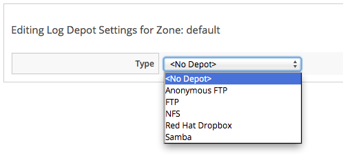

7.  If required, enter your user **ID** and **password** then click
    **Validate** to confirm the settings.

8.  Click **Save**.

###### Collecting and Downloading Logs from All Servers in a Zone

To collect and download logs from all servers in a zone:

1.  Browse to **Settings** > **Application Settings**.

2.  Click on the **Diagnostics** accordion, then click the **Zone** that
    you want to view.

3.  Click the **Collect Logs** tab.

4.  Click (**Collect all logs**). All files in
    the logs directory as well as configuration files are collected from
    the selected zone.

5.  Click **OK**. The status of the log retrieval shows in the
    {{ site.data.product.title_short }} console.

##### Capacity and Utilization Repair

Under certain circumstances, it is possible that {{ site.data.product.title_short }} is not
able to collect capacity and utilization data. This could be due to
password expiration, a change in rights to the cloud provider and this
change didn’t provide enough granularity to the {{ site.data.product.title_short }} service
account, or network connectivity. The gap data is collected directly by
extracting the monthly performance data. Gap collection need to be
completed for each zone individually. Therefore, the procedure below
need to be repeated for each zone.

###### Repairing Capacity and Utilization Data

To repair capacity and utilization data:

1.  Log in to a {{ site.data.product.title_short }} appliance located in the zone for which you want to gather the data.

2.  Browse to **Settings** > **Application Settings**.

3.  Click on the **Diagnostics** accordion, then click the **Zone** that you want to view.

4.  Click **C & U Gap Collection**.

    1.  Select the appropriate **Timezone**.

        **Note:**

        Do not select more than one week unless instructed to do so by
        Red Hat Support.

    2.  Select a **Start Date**.

    3.  Select an **End Date**.

5.  Click **Submit**.

After the gap collection has completed for this zone, repeat these same steps for the next zone. You can check for completion by going to the clusters page and checking for the capacity and utilization data for the time period specified.

#### Server Diagnostics

Under **Diagnostics** for a server, you can view the status of
{{ site.data.product.title_short }} workers running on the server, set log collection setting for only that server, and view the server’s current {{ site.data.product.title_short }} and audit logs.

##### Workers

The **Workers** tab enables you to see the status of and restart
{{ site.data.product.title_short }} workers.

You can see additional information on and restart the following items:

  - **C & U Metrics Collectors** that collects capacity and utilization
    data.

  - **C & U Metrics Processors**, which processes the collected capacity
    and utilization data.

  - **Event Handlers** put events from the Event Monitor into the VMDB
    and starts {{ site.data.product.title_short }} processes if needed base on that
    information.

  - **Event Monitors** that communicate with the external cloud provider
    to deliver up to date event information.

  - **Generic Workers** that perform long running and priority
    processes.

  - **Priority Workers** that perform high priority, short processes.

  - **Schedule Workers** that maintains any items that run on a
    schedule.

  - **Session Broker** that maintains a single connection to the cloud
    providers .

  - **Refresh Workers** that runs the refresh processes.

  - **Reporting Workers** that generate reports.

  - **SmartProxy Workers** that run SmartState Analyses on virtual
    machine.

  - **User Interface Worker** that allows users access to the console.

  - **Web Services Worker** that maintains {{ site.data.product.title_short }} Web services.

  - **VM Analysis Collectors** that run and process SmartState Analyses
    on virtual machines.

###### Reloading Worker Display

To reload worker display:

1.  Browse to **Settings** > **Application Settings**.

2.  Click on the **Diagnostics** accordion, then click the **Zone** that
    you want to view.

3.  Select the server that you want to view.

4.  Click the **Workers** tab.

5.  Click  (**Refresh Current Workers
    display**).

###### Restarting a Worker

To restart a worker:

1.  Browse to **Settings** > **Application Settings**.

2.  Click on the **Diagnostics** accordion, then click the **Zone** that
    you want to view.

3.  Select the server that you want to view.

4.  Click on the **Workers** tab.

5.  Click on the worker you want to restart.

6.  Click  (**Configuration**), then
     (**Restart selected worker**).

7.  Click **OK**.

##### Server and Audit Logs

###### Collecting Server Logs and Configuration Files

While you can designate a central location to collect logs for all
servers in a specific zone, you can override those values for a specific
server. To do this, designate a log depot location to store the files.

Log depot options include:

  - Anonymous File Transfer Protocol (FTP)

  - File Transfer Protocol (FTP)

  - Network File System (NFS)

  - Red Hat Dropbox

  - Samba

See your network administrator to set up one of these shares. You also
need a user that has write access to that location. Settings at the
server level supersede the ones at the zone level.

###### Setting the Location of the Log Depot for a Specific Server

To set the location of the log depot for a specific server

1.  Browse to **Settings** > **Application Settings**.

2.  Click on the **Diagnostics** accordion, then click the **Zone** that
    you want to view.

3.  Select the server that you want to collect logs for.

4.  Click on the **Collect Logs** tab.

5.  Click  (**Edit Log Depot Settings for the
    selected Server**).

6.  Select the **Type** of share.

    

7.  Using the fully qualified domain name (**FQDN**) of the depot
    server, type in the appropriate settings for the **URI**.

8.  Enter your user ID and password, then click **Validate** to confirm
    the settings.

9.  Click **Save**.

###### Collecting the Current Log Set of a Server

To Collect the Current Log Set of a Server

1.  Browse to **Settings** > **Application Settings**.

2.  Click on the **Diagnostics** accordion, then click the **Zone** that
    you want to view.

3.  Select the server that you want to collect logs for.

4.  Click on the **Collect Logs** tab.

5.  Click  (**Collect**), then click
     (**Collect current logs**). All current
    log files in as well as configuration files are collected.

6.  Click **OK**. The status of the log retrieval shows in the
    {{ site.data.product.title_short }} console.

###### Collecting All Log Sets from a Server

To Collect All Log Sets from a Server

1.  Browse to **Settings** > **Application Settings**.

2.  Click on the **Diagnostics** accordion, then click the **Zone** that
    you want to view.

3.  Select the server that you want to collect logs for.

4.  Click **Collect Logs**.

5.  Click  (**Collect**), then click
     (**Collect all logs**). All files in the
    logs directory as well as configuration files are collected.

6.  Click **OK**. The status of the log retrieval shows in the
    {{ site.data.product.title_short }} console.

###### Viewing the Server, Audit, and Production Logs

The server and audit logs roll over daily. The previous logs are stored
as zipped files in the `/var/www/miq/vmdb/log` folder. The current logs
can be easily viewed and downloaded from the settings menu; select
 **Configuration**, then click
on the **Diagnostics** accordion.

Use the server log to see all actions taken by the server including
communication with the SmartProxy and tasks.

###### Viewing the Server Log

To view the server log:

1.  Browse to **Settings** > **Application Settings**.

2.  Click on the **Diagnostics** accordion, then click the **Zone** that
    you want to view.

3.  Select the server that you want to view.

4.  Click **CFME Log**.

The {{ site.data.product.title_short }} server automatically retrieves the last 1000 lines
of the log.

###### Reloading the Server Log

To reload the server log:

1.  Browse to **Settings** > **Application Settings**.

2.  Click on the **Diagnostics** accordion, then click the **Zone** that
    you want to view.

3.  Select the server that you want to view.

4.  Click **CFME Log**.

5.  Click  (Reload the Log Display).

###### Downloading the Server Log

To download the server log:

1.  Browse to **Settings** > **Application Settings**.

2.  Click on the **Diagnostics** accordion, then click the **Zone** that
    you want to view.

3.  Select the server that you want to view.

4.  Click **CFME Log**.

5.  Click  (**Download the Entire EVM Log
    File**).

**Note:**

Use the **Audit Log** to see changes to the user interface and authentication.

###### Viewing the Audit Log

To view the audit log:

1.  Browse to **Settings** > **Application Settings**.

2.  Click on the **Diagnostics** accordion, then click the **Zone** that
    you want to view.

3.  Select the server that you want to view.

4.  Click **Audit Log**.

The server automatically retrieves the last 1000 lines of the log.

###### Reloading the Audit Log

To reload the audit log:

1.  Browse to **Settings** > **Application Settings**.

2.  Click on the **Diagnostics** accordion, then click the **Zone** that
    you want to view.

3.  Select the server that you want to view.

4.  Click **Audit Log**.

5.  Click  (**Reload the Audit Log Display**).

###### Downloading the Audit Log

To download the audit log:

1.  Browse to **Settings** > **Application Settings**.

2.  Click on the **Diagnostics** accordion, then click the Zone that you want to view.

3.  Select the server that you want to view.

4.  Click Audit Log.

5.  Click  (**Download the Entire Audit Log
    File**).

###### Viewing the Production Log

Use the production log to see all actions performed using the console.

To view the production log:

1.  Browse to **Settings** > **Application Settings**.

2.  Click on the **Diagnostics** accordion, then click the **Zone** that
    you want to view.

3.  Select the server that you want to view.

4.  Click **Production Log**.

The {{ site.data.product.title_short }} server automatically retrieves the last 1000 lines
of the log.

###### Reloading the Production Log

To reload the production log:

1.  Browse to **Settings** > **Application Settings**.

2.  Click on the **Diagnostics** accordion, then click the Zone that you want to view.

3.  Select the server that you want to view.

4.  Click **Production Log**.

5.  Click  (**Reload the Product Log
    Display**).

###### Downloading the Production Log

To download the production log:

1.  Browse to **Settings** > **Application Settings**.

2.  Click on the **Diagnostics** accordion, then click the **Zone** that you want to view.

3.  Select the server that you want to view.

4.  Click **Production Log**.

5.  Click  (**Download the Production Log
    File**).

### Database Operations

#### Viewing Information on the VMDB

The **Database** accordion displays a summary of VMDB information, a
list of all tables and indexes, settings for the tables, active client
connection, and database utilization.

To view information on the VMDB:

1.  Browse to **Settings** > **Application Settings**.

2.  Click the **Database** accordion.

3.  Click **VMDB** in the tree view on the left.

4.  Click the appropriate tab to view the desired information:

      - **Summary**: displays statistics about the database.

      - **Tables**: displays a clickable list of all the tables.

      - **Indexes**: displays a clickable list of all the indexes.

      - **Settings**: displays a list of all tables, their descriptions,
        and other valuable Information.

      - **Client Connections**: displays all current connections to the
        VMDB.

      - **Utilization**: displays usage charges for the disk and index
        nodes.

#### Database Regions and Replication

Regions are used to create a central database for reporting and
charting. Do not use the database at the top level for operational tasks
such as SmartState analysis or capacity and utilization data collection.
Assign each server participating in the region a unique number during
the regionalization process, then set your subordinate regions to
replicate to the top region.

**Important**

All {{ site.data.product.title_short }} databases in a multi-region deployment must use the same security key.

##### Creating a Region

In principle, a region is created when you set up your {{ site.data.product.title_short }} environment on the first appliance for the region. However, you can also create a region on an appliance where a database has already been set up. This process involves dropping and rebuilding the existing database to accommodate the new region number, and takes several minutes to complete.

**Warning**

Performing this procedure destroys any existing data and cannot be
undone. Back up the existing database before proceeding. By default, new appliances are assigned region 0. Do not use this number when creating a region because duplicate region numbers can compromise the integrity of the data in the database.

1.  Log in to the appliance as the **root** user.

2.  Enter `appliance_console`, and press **Enter**.

3.  Press any key.

4.  Select `Stop EVM Server Processes`.

5.  Enter `Y` to confirm.

6.  Choose `Configure Application`.

7.  Enter a database region number that has not been used in your
    environment. Do not enter duplicate region numbers because this can
    corrupt the data.

8.  Enter `Y` to confirm.

9.  The menu reappears after all processes are complete.

10. Select `Start EVM Server Processes`.

11. Enter `Y` to confirm.

12. Select **Quit** to exit the advanced settings menu.

#### Configuring Database Replication and Centralized Administration

To configure database replication, you must configure one
{{ site.data.product.title_short }} instance to act as a global copy, and one or more other instances to act as remote copies. This database replication relationship can only be configured on {{ site.data.product.title_short }} instances that are of the same version. Configuring database replication in this version of {{ site.data.product.title_short }} automatically enables centralized
administration, eliminating the need for further configuration.
Centralized administration in {{ site.data.product.title_short }} supports life cycle management operations that can be initiated from the global copy and processed and executed on the remote copy.

**Important**

  - You must configure at least one remote copy before you can configure the global copy. Changes to the role of a {{ site.data.product.title_short }} instance take several minutes to take effect.

  - The region number must be unique on each {{ site.data.product.title_short }} instance where replication is configured. See [Creating a Region](#creating_a_region) for instructions on how to create a region.

  - Enabling the `EvmRole-user_global_region` role will only provide
    access to specific operations that can be performed on a global
    region.

##### Configuring a Remote Copy

Configure a {{ site.data.product.title_short }} instance to act as a remote copy from which data will be replicated to the global copy.

1.  Browse to **Settings** > **Application Settings**.

2.  Click the **Settings** accordion.

3.  Click the region where the instance is located.

4.  Click **Replication**.

5.  Select **Remote** from the **Type** list.

6.  Click **Save**.

##### Configuring the Global Copy

Configure a {{ site.data.product.title_short }} instance to act as the global copy to which
data is replicated from the remote copies.


1.  Click  **Configuration**.

2.  Click the **Settings** accordion.

3.  Click the region where the instance is located.

4.  Click **Replication**.

5.  Select **Global** from the **Type** list.

6.  Click **Add Subscription**.

    1.  Enter the name of the database on the remote copy in the
        **Database** field.

    2.  Enter the IP address or fully qualified domain name of the
        remote copy in the **Host** field.

    3.  Enter the name of a database user able to access the database in
        the **Username** field.

    4.  Enter the password of the database user in the **Password**
        field.

    5.  Enter the port by which the database is accessed in the **Port**
        field.

    6.  In **Actions**, click **Accept**. You can also **Update** your
        subscription if required, or click the menu on the right in
        order to **Validate** or **Discard**.

7.  Click **Save**.

**Note:**

Once you configure a {{ site.data.product.title_short }} instance to act as a global copy,
and one or more other instances to act as remote copies: \* centralized
administration is automatically enabled after the initial data sync is
complete. \* you will see the type of region you are logging into
(global or remote) on the {{ site.data.product.title_short }} user interface login
screen.

Database replication and centralized administration are now enabled on
your instances. To open virtual machines of a remote region from the
global region and perform required operations:

1.  Navigate to menu:Compute\[Infrastructure \> Virtual Machines\], then
    click **VMs & Templates** and select a virtual machine in the global
    region.

2.  In the **Multi Region** table on the summary screen, click **Connect
    to VM in its Region** to perform required operations in a new
    browser tab.

##### Resetting Database Replication

You can reset the replication relationship between the global copy and
remote copies by temporarily removing and re-enabling the subscription
from the global copy.

1.  Browse to **Settings** > **Application Settings**.

2.  Click the **Settings** accordion.

3.  Click the region where the instance is located.

4.  Click **Replication**.

5.  Remove the subscription:

    1.  Click the actions button for the subscription to reset.

    2.  Click **OK**.

6.  Click **Save**.

7.  Re-add the subscription:

    1.  Click **Add Subscription**.

    2.  Enter the name of the database on the remote copy in the
        **Database** field.

    3.  Enter the IP address or fully qualified domain name of the
        remote copy in the **Host** field.

    4.  Enter the name of a database user able to access the database in
        the **Username** field.

    5.  Enter the password of the database user in the **Password**
        field.

    6.  Enter the port by which the database is accessed in the **Port**
        field.

8.  Click **Save**.

#### Backing Up and Restoring {{ site.data.product.title_short }} in a Kubernetes Based Environment (podified)

**Prerequisites:**
   - Velero and Restic must be installed and working in your cluster. For more information on Velero, see the [Velero documentation](https://velero.io/docs/v1.5/). For more information on Restic, see the [Restic documentation](https://restic.readthedocs.io/en/stable/) 

**Note:** The operator adds labels and/or annotations to everything that needs to be backed up. You can easily and quickly backup only what is required. The operator will add annotations for restic volume backups for example, `backup.velero.io/backup-volumes: <volume-label>`.

1. The backup label key can be configured by adding the following to the CR. The default label is applied if no value is specified for `backupLabelName`.
   ```
   ...
   spec:
     ...
     backupLabelName: <your label name>
   ```
2. Create a backup by running the command:
   ```
   velero backup create <your backup name> --include-namespaces <your namespace> -l <your label name>=t
   ```
3. In order to restore a backup, first ensure the {{ site.data.product.title_short }} CRD exists. Then, restore the backup by running the commands:
   ```
   oc new-project <your namespace>
   velero restore create --from-backup <your backup name>
   ```

#### Backing Up and Restoring a Database for an Appliance Based Environment

##### Running a Single Database Backup 

{{ site.data.product.title_short }} supports database backups to **Network File System
(NFS)**, **Samba**, **Amazon Web Service(AWS) S3** and **OpenStack
Swift** storage.

**Note:**

Database backups to **AWS S3** require valid AWS credentials to perform
this operation.

To run a single database backup:

1.  Browse to **Settings** > **Application Settings**.

2.  Click the **Diagnostics** accordion and click the **Region** name.

3.  Click the **Database** tab.

4.  If you have created a backup schedule and want to use the same depot
    settings, select the schedule in the **Backup Schedules** box.

5.  If you do not want to use the settings from a backup schedule,
    select a type of server for storing the backups from the Type
    drop-down list in the **Database Backup Settings** box. You can use
    **Network File System** (NFS), **Samba** or **AWS S3**.

      - If you select **Samba**, enter the **Depot Name**, **URI**,
        **Username**, and a valid **Password**. Click **Validate** to
        check the settings.

      - If you select **AWS S3**, enter the **Depot Name**, **URI**, and
        select the **AWS Region** from the drop-down list. Enter the
        **Username**, and a valid **Password**. Click **Validate** to
        check the settings.

      - If you select **OpenStack Swift**, enter the **Depot Name**,
        **URI**, **Security Protocol** and **API Port**. Enter the
        **Username**, and a valid **Password**. Click **Validate** to
        check the settings.

      - If you select **Network File System**, enter the **URI**.

6.  Click **Submit** to run the database backup.

##### Restoring a Database from a Backup

If a database is corrupt or fails, restore it from a backup. You can
restore a backup from a local file, NFS, or Samba.

To restore a database from a backup:

1.  Save the database backup file as `/tmp/evm_db.backup`.
    {{ site.data.product.title_short }} looks specifically for this file when restoring a
    database from a local backup.

2.  If you are restoring a database backup on a high availability
    environment, stop the replication manager service
    (`repmgr10.service`). This is not required in other
    {{ site.data.product.title_short }} configurations.

        # systemctl stop repmgr10.service

3.  Log in to the appliance as the **root** user.

4.  Enter `appliance_console`, and press **Enter**.

5.  Select `Stop EVM Server Processes` to stop processes on all servers
    that connect to this VMDB.

6.  Enter `Y` to confirm.

7.  After all processes are stopped, press **Enter** to return to the
    menu.

8.  Press **Enter** again to manually configure settings.

9.  Select `Restore Database From Backup`, then specify the location to
    restore the backup from in the `Restore Database File` menu:

    1.  If you saved the database backup file locally as
        `/tmp/evm_db.backup`, select `Local file`. You can also restore
        from a `Network File System (nfs)` or `Samba (smb)`.

    2.  Specify the location of the backup file.

        **Note:**

        The appliance console menu may respond slowly if connections are
        open and the server is still shutting down. If this occurs, wait
        a minute and try again.

10. Enter `Y` to keep the database backup after restoring from it. Enter `N` to delete it.

11. Press `Y` to confirm.

12. After the backup completes, press **Enter** to return to the menu.

13. Press **Enter** again to manually configure settings.

14. Select `Start EVM Server Processes` to restart all processes on
    servers that connect to this VMDB.

15. Enter `Y` to confirm.

16. If you are restoring a database backup on a high availability
    environment, start the replication manager service
    (`repmgr10.service`). This is not required in other
    {{ site.data.product.title_short }} configurations.

        # systemctl start repmgr10.service

#### Performing a Binary Backup and Restoring the Database

Preserve data at the file system level by performing a binary backup.
This includes all databases, users and roles, and other objects.

**Note:**

This procedure uses the `pg_basebackup` utility to perform a remote
database backup and create a full replacement of the PostgreSQL data
directory, capturing the exact state of the database when the backup
finishes. For more information on the `pg_basebackup` utility, see the
PostgreSQL documentation.

##### Performing a Binary Backup

Create a binary backup and store it as a `gzip` tar file inside the
{{ site.data.product.title_short }} backup directory.

<div class="important">

A PostgreSQL superuser or user with *Replication* permissions are
required to perform this procedure.

</div>

1.  SSH into the database server as the **root** user or provide
    PostgreSQL superuser credentials.

2.  Run the `pg_basebackup` command to create the backup:

        # pg_basebackup -X fetch -h hostname -U root -Ft -z -D filename

    **Note:**

    **-h** *hostname* specifies the IP address of the database server.

    **-D** *filename* specifies the name of the directory created to
    contain the backup.

##### Restoring a Database from the Binary Backup

Restore your PostgreSQL binary backup using the following steps. This
process will require stopping both EVM and PostgreSQL services before
restoring data.

1.  Copy the existing backup to the target VM:

        # scp filename/base.tar.gz root@hostname:/var/www/miq

2.  SSH to the target VM:

        # ssh root@hostname

3.  Stop both the EVM and PostgreSQL servers:

        # systemctl stop evmserverd
        # systemctl stop $APPLIANCE_PG_SERVICE

4.  Rename the existing data directory:

        # mv /var/lib/pgsql/data /var/lib/pgsql/data.backup

5.  Create a clean data directory:

        # mkdir /var/lib/pgsql/data

6.  Unzip the tar file to the new directory:

        # tar -xzf /var/www/miq/base.tar.gz -C /var/lib/pgsql/data

7.  Correct permissions:

        # chown postgres:postgres /var/lib/pgsql/data
        # chmod 700 /var/lib/pgsql/data

8.  Restart the PostgreSQL and EVM servers:

        # systemctl start $APPLIANCE_PG_SERVICE
        # systemctl start evmserverd

#### Running Database Garbage Collection

The database server collects garbage automatically, but Red Hat may
occasionally direct you to run database garbage collection manually in
order to reclaim unused space in your VMDB.

To run database garbage collection:

1.  Browse to **Settings** > **Application Settings**.

2.  Click the **Diagnostics** accordion and click the **Region** name.

3.  Click the **Database** tab.

4.  In the **Run Database Garbage Collection Now** box, click
    **Submit**.

#### Changing the Database Password

Use the following procedures to change the password on appliances
containing an internal database, and on worker appliances.

To change the password for an external database, use the procedure in
[Changing the Password on the Worker
Appliances](#changing-the-password-on-the-worker-appliances).

**Note:**

See [Appliance Types](../deployment_planning_guide/index.html#appliance-types)
in the *Deployment Planning Guide* for a summary of different types of
appliances.

##### Changing the Password on the Database Appliance

{{ site.data.product.title_short }} provides a default database password for the internal
PostgreSQL database.

To change the password, you need to stop the {{ site.data.product.title_short }}
service, change the password for the PostgreSQL database, run a command
to change the password in the configuration file that `evmserverd` uses
to access the server, and restart the {{ site.data.product.title_short }} appliance.

1.  Stop the {{ site.data.product.title_short }} service:

    1.  SSH into the appliance.

    2.  To stop the {{ site.data.product.title_short }} service, run the following
        command:

            service evmserverd stop

2.  Use `pgadmin` to change the password for your {{ site.data.product.title_short }}
    database (default is `vmdb_production`). If you do not have
    `pgadmin`, you can change the password by running:

        psql -U root -d vmdb_production

    1.  At the vmdb\# prompt, type:

            ALTER USER root WITH PASSWORD 'newpassword';

    2.  To exit `psql`, type:

        ```
        \q
        ```

3.  Change the password in the configuration file that `evmserverd` uses
    to access the server:

        /var/www/miq/vmdb/tools/fix_auth.rb --databaseyml --password newpassword

4.  Restart the {{ site.data.product.title_short }} service:

        service evmserverd start

5.  Verify that you can log in to the {{ site.data.product.title_short }} console.

##### Changing the Password on the Worker Appliances

1.  Stop the {{ site.data.product.title_short }} service:

    1.  SSH into the appliance.

    2.  To stop the {{ site.data.product.title_short }} service, run the following
        command:

            service evmserverd stop

2.  Change the password in the configuration file that `evmserverd` uses
    to access the server:

        /var/www/miq/vmdb/tools/fix_auth.rb --databaseyml --password newpassword

3.  Restart the {{ site.data.product.title_short }} service:

        service evmserverd start

    <div class="important">

    In a high availability environment, if using the same PostgreSQL
    user for replication, you must also change the password in the
    `/var/lib/pgsql/.pgpass` file on every database node.

    Additionally, if the password for the user being used for
    region-to-region replication is changing, users must also change the
    password in the replication subscription screen. See [Configuring
    the Global Copy](#configuring-the-global-copy).

    </div>

#### Adding a New Appliance to an Existing Region with a Non-default Password

1.  Create the new appliance.

2.  Start the appliance, but do not go into any of the configuration
    options, instead **SSH** into the new appliance.

3.  In the **/var/www/miq/vmdb** directory, create a file called
    `REGION`. Its only contents should be the number of the Region that
    it is joining. (You could also just copy the `REGION` file from the
    VMDB appliance.)

4.  Edit the **database.yml** file in the **/var/www/miq/vmdb**
    directory. (You may want to save from the original.)

    1.  Replace the contents of the **"production"** section with the
        contents of the **"base"** section.

    2.  Edit the **"host"** parameter to match the IP of the appliance
        hosting the VMDB.

    3.  Save the new **database.yml**.

5.  Run the following command to change the password in the
    configuration file that `evmserverd` uses to access the server:

        /var/www/miq/vmdb/tools/fix_auth.rb --databaseyml --password newpassword

6.  Restart the new worker appliance:

        service evmserverd restart

#### Creating a Database Dump


