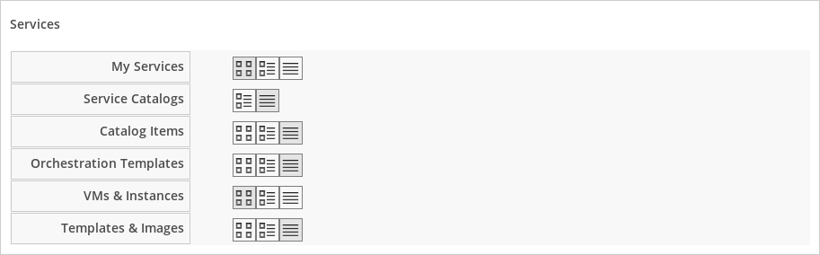

## My Settings

The options under the **My Settings** menu allow you to configure user
interface display options specific to the user account with which you
log in to {{ site.data.product.title_short }}, such as the default view displayed on login,
and personal tags. You can also configure the color scheme, and button
options on the main dashboard.

These options are available by clicking your username
 to open the settings menu, then **My
Settings**.

### Visual Settings

The options under the **Visual** menu allow you to configure how user
interface elements are displayed in the web user interface. For all
options, click **Save** to update the settings, or click **Reset** to
undo any unsaved changes that have been made on the current screen.

#### Grid and Tile Icons

This group of settings is used to control the view of your virtual
thumbnails. Each thumbnail can be viewed as a single icon or as an icon
with four quadrants. Use the quadrant view to see a component’s
properties at a glance.

Use the following procedure to change grid and tile icons:

1.  From the settings menu, navigate to **My Settings**, then click on
    the **Visual** tab.

2.  In **Grid/Tile Icons**, set items to `ON` to display all four
    quadrants for the item, or `OFF` to display only one icon.

3.  Click **Save**.

  - Set **Show Infrastructure Provider Quadrants** to `ON` to see the
    four icons in your provider under menu:Compute\[Infrastructure \>
    Providers\].

  - Set **Show Cloud Provider Quadrants** to `ON` to see the four icons
    in your hosts under menu:Cloud\[Providers\].

  - Set **Show Host Quadrants** to `ON` to see the four icons in your
    hosts under menu:Compute\[Infrastructure \> Hosts\].

  - Set **Show Datastores Quadrants** to `ON` to see the four icons in
    your datastores under menu:Compute\[Infrastructure \> Datastores\].

  - Set **Show VM Quadrants** to `ON` to see the four icons in your
    virtual machines under menu:Compute\[Infrastructure \> Virtual
    Machines\].

  - Set **Show Template Quadrants** to `ON` to see the four icons in
    your templates under menu:Compute\[Infrastructure \> Virtual
    Machines \> Templates\].

Set any of the above options to `OFF` to see only one icon instead of
four quadrants.

  - Use the **Truncate Long Text** list to specify how the names of
    items are displayed if they are too long to show in full. Select the
    option based on the pattern shown.

#### Setting Default Items Per Page

Use the following procedure to set the default number of items to
display on each resource page.

1.  From the settings menu, navigate to **My Settings**, then click on
    the **Visual** tab.

2.  In the **Default Items Per Page** area, select the default number of
    items to display for each view from the corresponding drop down
    list. 

3.  Click **Save**.

#### Setting the Start Page

Use the following procedure to set the default start page after logging
in. For example, instead of going to the **{{ site.data.product.title_short }}** dashboard,
you can set the default start page to see a list of your virtual
machines.

1.  From the settings menu, navigate to **My Settings**, then click on
    the **Visual** tab.

2.  In the **Start Page** area, select the page to display at login.

3.  Click **Save**.

#### Setting Display Settings

Use the following procedure to set your own themes, colors, and time
zone for the console. These settings are specific to the logged-on user.

1.  From the settings menu, navigate to **My Settings**, then click on
    the **Visual** tab.

2.  Make selections from **Display Settings** for the following items:
    

    1.  Use **Chart Theme** to select a group of colors and font sizes
        specifically for charts.

    2.  Use **Time Zone** to select the time zone in which to display
        the console.

        **Note:**

        In time zones where clocks are set forward for daylight savings
        time, the time zone correctly displays as EDT (Eastern Daylight
        Time) in the console. When the clocks are set back, it correctly
        displays as EST (Eastern Standard Time).

    3.  Use **Locale** to select the language in which to display the console.

3.  Click **Save**.

### Default Views

The options under the **Default Views** menu allow you to configure the
default layout used to display individual screens in the {{ site.data.product.title_short }}
user interface. The options you select under this menu specify the
default options for each screen, but you can also change the layout for
each screen using the layout buttons on each screen.

#### Setting Default Views for the User Interface

Use the following procedure to set general view options:

1.  From the settings menu, navigate to **My Settings**, then click on
    the **Default Views** tab.

2.  In the **General** area, click the appropriate button for the way
    you want to view each type of screen listed. The selected view shows
    as a blue icon.

    

3.  Click  (**Grid View**) to view virtual
    thumbnails or icons.

4.  Click (**Tile View**) for a view that
    combines the virtual thumbnail with some text properties that
    describe the items.

5.  Click (**List View**) to view a detailed
    text listing.

6.  Click (**Expanded View**) for an expanded
    view.

7.  Click (**Compressed View**) for a
    compressed view.

8.  Click (**Exists Mode**) to view only
    whether an attribute exists or not.

9.  Click **Save**.

#### Setting Default Views for Services

Use the following procedure to set default views for services in the
menu:Compute\[Services\] tab.

1.  From the settings menu, navigate to **My Settings**, then click on
    the **Default Views** tab.

2.  In the **Services** area, click the appropriate button for the way
    you want to view each item. 

      - Click  (**Grid View**) to view virtual
        thumbnails or icons.

      - Click  (**Tile View**) for a view that
        combines the virtual thumbnail with some text properties that
        describe the items.

      - Click  (**List View**) to view a text
        listing.

3.  Click **Save**.

#### Setting Default Views for Clouds

Use the following procedure to set default views for clouds in the
menu:Compute\[Clouds\] tab.

1.  From the settings menu, navigate to **My Settings**, then click on
    the **Default Views** tab.

2.  In the **Clouds** area, click the appropriate button for the way you
    want to view each item. 

      - Click  (**Grid View**) to view virtual
        thumbnails or icons.

      - Click  (**Tile View**) for a view that
        combines the virtual thumbnail with some text properties that
        describe the items.

      - Click  (**List View**) to view a
        detailed text listing.

3.  Click **Save**.

#### Setting Default Views for Infrastructure Components

Use the following procedure to set default views for infrastructure
components in the menu:Compute\[Infrastructure\] tab.

1.  From the settings menu, navigate to **My Settings**, then click on
    the **Default Views** tab.

2.  In the **Infrastructure** area, click the appropriate button for the
    way you want to view each item. 

      - Click  (**Grid View**) to view virtual
        thumbnails or icons.

      - Click  (**Tile View**) for a view that
        combines the virtual thumbnail with some text properties that
        describe the items.

      - Click  (**List View**) to view a
        detailed text listing.

3.  Click **Save**.

#### Setting Default Views for Containers

Use the following procedure to set default views for containers in the
menu:Compute\[Containers\] tab.

1.  From the settings menu, navigate to **My Settings**, then click on
    the **Default Views** tab.

2.  In the **Containers** area, click the appropriate button for the way
    you want to view each item. 

      - Click  (**Grid View**) to view virtual
        thumbnails or icons.

      - Click  (**Tile View**) for a view that
        combines the virtual thumbnail with some text properties that
        describe the items.

      - Click  (**List View**) to view a text
        listing.

3.  Click **Save**.

### Default Filters

The options in the **Default Filters** menu allow you to configure the
default filters displayed for your hosts, virtual machines, and
templates. These settings are available to all users.

#### Setting Default Filters for Cloud

To set default filters for cloud components:

1.  From the settings menu, navigate to **My Settings**, then click on
    the **Default Filters** tab.

2.  From the **Cloud** folder, check the boxes for the default filters
    that you want available. Items that have changed show in blue text.

3.  Click **Save**.

#### Setting Default Filters for Containers

To set default filters for containers:

1.  From the settings menu, navigate to **My Settings**, then click on
    the **Default Filters** tab.

2.  From the **Containers** folder, check the boxes for the default
    filters that you want available. Items that have changed show in
    blue text.

3.  Click **Save**.

#### Setting Default Filters for Infrastructure

To set default filters for infrastructure components:

1.  From the settings menu, navigate to **My Settings**, then click on
    the **Default Filters** tab.

2.  In the **Infrastructure** folder, select the default filters that
    you want available. Items that have changed show in blue text.

3.  Click **Save**.

#### Setting Default Filters for Physical Infrastructure

To set default filters for physical infrastructure components:

1.  From the settings menu, navigate to **My Settings**, then click on
    the **Default Filters** tab.

2.  In the **Physical Infrastructure** folder, select the default
    filters that you want available. Items that have changed show in
    blue text.

3.  Click **Save**.

#### Setting Default Filters for Services

To set default filters for services:

1.  From the settings menu, navigate to **My Settings**, then click on
    the **Default Filters** tab.

2.  In the **Services** folder, select the default filters that you want
    available. Items that have changed show in blue text.

3.  Click **Save**.

### Time Profiles

The options under the **Time Profiles** menu allow you to specify the
hours for which data is displayed when viewing capacity and utilization
screens. Time profiles are also used to configure performance and trend
reports.

#### Creating a Time Profile

To create a time profile:

1.  From the settings menu, navigate to **My Settings**, then click on
    the **Time Profiles** tab.

2.  Click (**Configuration**), and (**Add a new Time Profile**).
    

3.  Type a meaningful name in the **Description** field.

4.  Select the users who can access the time profile from the **Scope**
    list:

      - Select **All Users** to create a time profile that is available
        to all users. Only the super administration and administration
        roles can create, edit, and delete a global profile.

      - Select **Current User** if this time profile should only be
        available to the user creating it.

5.  Check the **Days** and **Hours** for the time profile.

6.  For **Timezone**, you can select a specific time zone or, you can
    let the user select a time zone when displaying data.

7.  If you select a specific time zone, you also have the option to
    **Roll Up Daily Performance** data. This option is only available to
    users with the administration or super administration role. Enabling
    the **Roll Up Daily Performance option** reduces the time required
    to process daily capacity and utilization reports and to display
    daily capacity and utilization charts.

8.  Click **Add**.

**Note:**

The following relationships exist between time zones and performance
reports:

  - The configured time zone in a performance report is used to select
    rolled up performance data, regardless of the user’s selected time
    zone.

  - If the configured time zone is null, it defaults to UTC time for
    performance reports.

  - If there is no time profile with the report’s configured time zone
    that is also set to roll up capacity and utilization data, the
    report does not find any records.

For non-performance reports, the user’s time zone is used when displaying dates and times in report rows.

#### Editing a Time Profile

To edit a time profile:

1.  From the settings menu, navigate to **My Settings**, then click on
    the **Time Profiles** tab.

2.  Check the time profile you want to edit.

3.  Click  (**Configuration**), and
     (**Edit selected Time Profile**).

4.  Make the required changes.

5.  Click **Save**.

#### Copying a Time Profile

To copy a time profile:

1.  From the settings menu, navigate to **My Settings**, then click on
    the **Time Profiles** tab.

2.  Check the time profile you want to copy.

3.  Click  (**Configuration**), and
     (**Copy selected Time Profile**).

4.  Make the required changes.

5.  Click **Save**.

#### Deleting a Time Profile

To delete a time profile:

1.  From the settings menu, navigate to **My Settings**, then click on
    the **Time Profiles** tab.

2.  Check the time profile you want to delete.

3.  Click  (**Configuration**), and  (**Delete selected Time Profiles**).

4.  Click **Save**.
