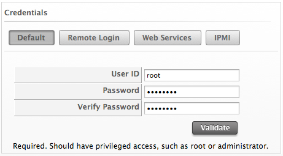

## SmartProxies

The embedded SmartProxy can analyze virtual machines that are registered
to a host and templates that are associated with a provider.

### Installing the SmartProxy from the Console

The server comes with one SmartProxy version already available. It can
also be installed on an ESX Server version 3.0.2, 3.5 or 4.

Contact Red Hat before installing a new SmartProxy on an ESX Server.

Requirements:

  - On ESX, SSH (Secure Shell) must be enabled. This is usually port 22.

  - 300 MB free disk space to install and run the SmartProxy.

  - Administrator or root credentials.

  - The host must already be in the VMDB either by discovery or
    manually.

### Entering Credentials and Operating System for the Target Host

Set the credentials and operating system for the target host to prepare
for the installation of SmartProxy.

To Enter Credentials and Operating System for the Target Host:

1.  Navigate to menu:Compute\[Infrastructure \> Hosts\].

2.  Select the host you want to edit.

3.  Click  (**Configuration**), then
     (**Edit this item**).

4.  In **Credentials**, click the **Default** tab and enter your login
    credentials. If you are using domain credentials, the format for
    User ID must be in the format of `<domainname>\<username>`. For ESX
    hosts, if SSH login is disabled for the default user, click the
    **Remote Login** tab and enter a user with remote login access.

    

    

    If the target is a Windows host, disconnect all network connections
    between the Windows proxy and the target. If an existing connection
    uses a different set of credentials than those set in the console,
    the installation may fail.

    

5.  Click **Validate** to verify the credentials.

6.  If you added the host manually instead of **Host Discovery** or
    **Provider Refresh** finding it, select the host’s operating system
    from the **Host Platform** drop-down box to ensure the host platform
    is available.

7.  Click **Save**.

When remotely installing on Windows hosts, the SmartProxy file is first
copied to a Windows proxy. That computer then installs the file to the
target host. The Windows proxy is the same as when you select the
Default Repository SmartProxy box. You can locate this by navigating to
the settings menu and selecting **Configuration**, then clicking on the
desired server, then the **Server** tab, and exploring the **Server
Control** area.
