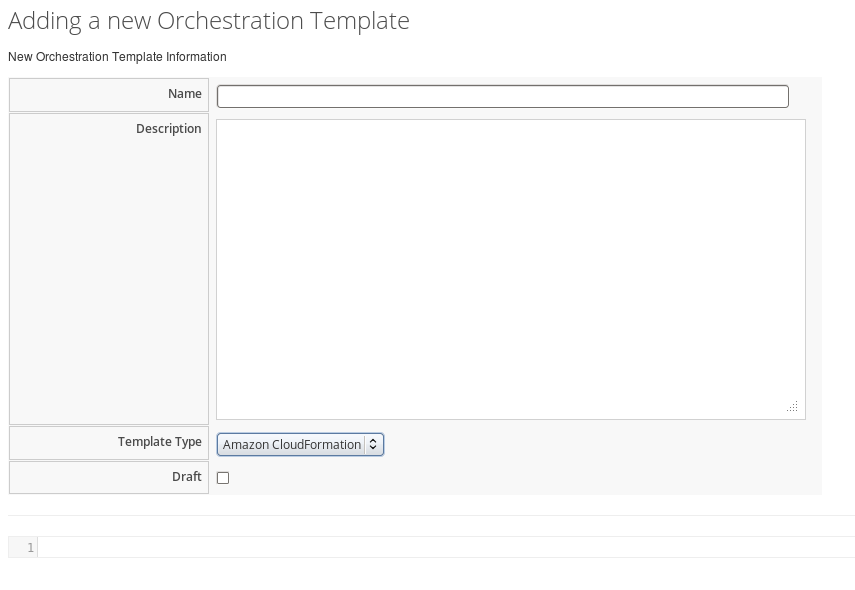

## Cloud Orchestration

Cloud Orchestration is a service that allows you to create, update and
manage cloud resources and their software components as a single unit
and then deploy them in an automated, repeatable way through a template.
Templates use a human-readable syntax and can be defined in text files
(thereby allowing users to check them into version control). Templates
allow you to easily deploy and re-configure infrastructure for
applications within your cloud. A user can author the stack templates,
or can upload them from other sources.

### Adding a New Orchestration Template

Use this procedure to add new orchestration templates using the
dashboard UI.

1.  Navigate to menu:Services\[Catalogs\] and select **Orchestration
    Templates** in the accordion menu.

2.  Click  **Configuration**, then
    click  **Create a new
    Orchestration Template**. The **Adding a new Orchestration
    Template** window is displayed.
    

3.  In **Name**, enter a name for the new template.

4.  In **Description**, enter a description for the template. Select
    Amazon CloudFormation or OpenStack Heat from the **Template Type**
    list. The default is Amazon CloudFormation.

5.  You can select the **Draft box** to create a draft template.

6.  Define your new template following the specification structure of
    the selected **Template Type**.

7.  Click **Add**.

### Editing Orchestration Templates

Use this procedure to edit orchestration templates using the dashboard
UI.

1.  Navigate to menu:Services\[Catalogs\] and select **Orchestration
    Templates** in the accordion menu.

2.  Select the orchestration template you want to edit from the **All
    Orchestration Templates** list.

3.  Click  **Configuration**, then
    click  **Edit selected Orchestration
    Template**. The **Edit selected Orchestration Template** window is
    displayed.

4.  You can only edit the **Name** and **Description** of a read-only
    template as there can be stacks associated with the selected
    template. For templates that are not read-only, you can edit all
    content in the template as required.

5.  Click **Save**.

### Copying Orchestration Templates

Use this procedure to copy an orchestration template to create a new
template.

1.  Navigate to menu:Services\[Catalogs\] and select **Orchestration
    Templates** in the accordion menu.

2.  Click  **Configuration**, then
    click  **Copy selected Orchestration
    Template**. The **Copy selected Orchestration Template** window is
    displayed.

3.  You can copy the selected template to create a new template, and
    include the changes as required.

    **Note:**

    In order to create the new template its content must be unique.

    

4.  Click **Save**.

### Deleting Orchestration Templates

Use this procedure to delete orchestration templates using the dashboard
UI.

1.  Navigate to menu:Services\[Catalogs\] and select **Orchestration
    Templates** in the accordion menu.

2.  Select the orchestration template you want to delete from the **All
    Orchestration Templates** list.

3.  Click  **Configuration**, then
    click  **Remove selected Orchestration
    Template from Inventory**.

4.  A warning window to confirm the permanent removal of the selected
    item from the VMDB appears.

5.  Click **OK**.

This instantly deletes the selected orchestration template. Note that
only non read-only templates can be removed.
