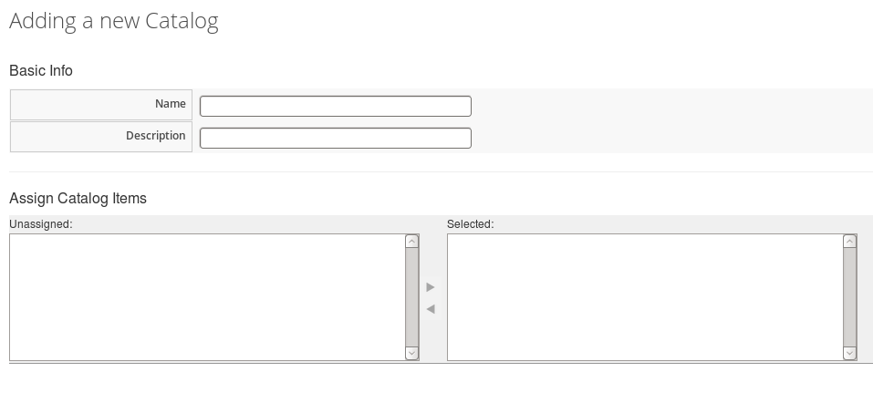
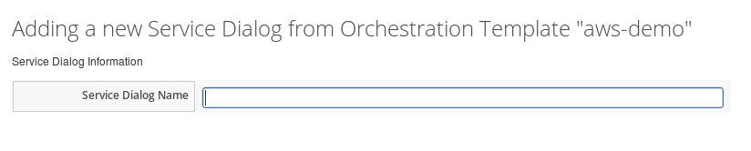
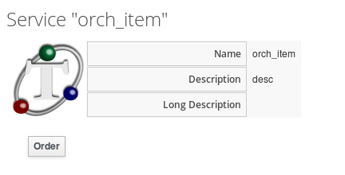
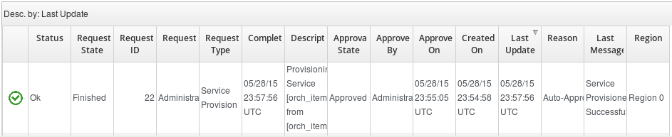
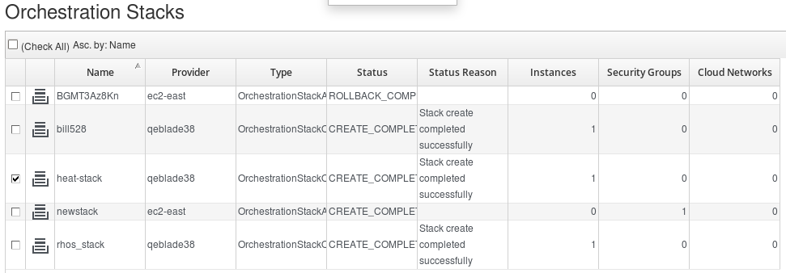
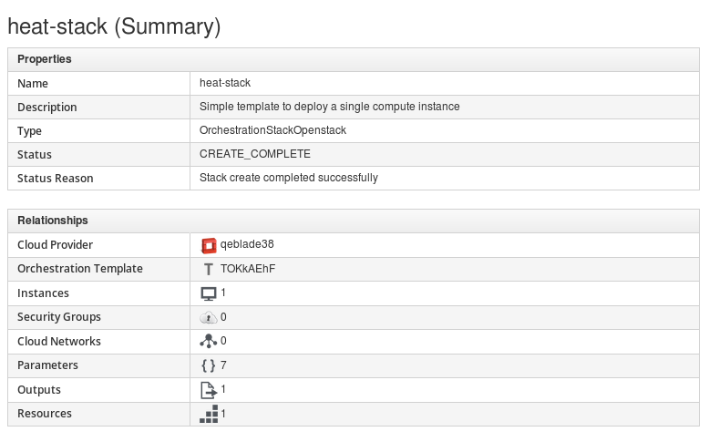

## CloudFormation Provisioning via Services

After creating your template, you can add it as a catalog item to the
**Service Catalog**. **Stacks** can then be created from templates and
launched from the **Service Catalog**.

### Adding a New Catalog

Use this procedure to add a new catalog using the dashboard UI.

1.  Navigate to menu:Services\[Catalogs\] and select **Catalogs** in the
    accordion menu.

2.  Click  **Configuration**, then
    click  **Add a New Catalog**.
    The **Adding a new Catalog** window is displayed.

3.  In **Basic Info**, add **Name** and **Description** for the new
    catalog.

4.  You can assign catalog items in **Assign Catalog Item**.

5.  Click **Add**.

### Adding a New Service Dialog

Use this procedure to add a new service dialog based on the input
parameters defined in the orchestration template.

1.  Navigate to menu:Services\[Catalogs\] and click **Orchestration
    Templates** in the accordion menu.

2.  From **All Orchestration Templates**, select the orchestration
    template you want to create a service dialog from.

3.  Click  **Configuration**, then
    click  **Create Service
    Dialog** from **Orchestration Template**. The **Adding a new Service
    Dialog from Orchestration Template** window is displayed.
    

4.  In **Service Dialog Information**, add a **Service Dialog Name**.

5.  Click **Save**.

### Adding a New Catalog Item

Use this procedure to add a new service catalog item using the dashboard
UI.

1.  Navigate to menu:Services\[Catalogs\] and select **Catalog Items**
    in the accordion menu.

2.  Click  **Configuration**, then
    click  **Add a New Catalog
    Item**. The **Adding a new Service Catalog Item** window is
    displayed.
    

3.  Choose **Orchestration** from **Catalog Item Type**.

4.  In **Basic Info**, add **Name** and **Description**. Select the
    **Display** in **Catalog box**. 

5.  Select the **Catalog**, **Dialog**, and **Orchestration Template**
    from their respective list.

6.  Select **Provisioning Entry Point**. The default is

        /Cloud/Orchestration/Provisioning/StateMachines/Provision/default.

7.  Click **Add**.

### Ordering Service

Use this procedure to order a service catalog item using the dashboard
UI.

1.  Navigate to menu:Services\[Catalogs\] and select **Service
    Catalogs** in the accordion menu. From **All Services** catalogs,
    select the **catalog item** that you want to order. The **Service**
    window with the name and description of the service to be ordered is
    displayed. 

2.  Click **Order**. The **Order Service** window with **Options** and
    **Parameter** is displayed. 

3.  Enter stack name in **Stack Name**.

4.  The **On Failure** value is Rollback by default.

5.  **Timeout** is optional. You can type the number of seconds to
    timeout the provision at the provider side.

    

    The number of seconds get converted (rounded) to minutes when
    ordering the provision through Red Hat Enterprise Linus OpenStack
    Platform. For example, 100 seconds rounds to two minutes.

    

6.  You can use the default parameter values from the template, or enter
    new values as appropriate.

    

    The Parameters vary per dialog; therefore, the parameters shown in
    the **Order Service** window may or may not exist depending on the
    dialog.

    

7.  Click **Submit**.

The order request is submitted. After a request has been approved, the
various stages of fulfillment are executed. You can see the progress
status of the provisioning process in menu:Services\[Requests\].

### Orchestration Stacks

After ordering a service, you can see the progress state of the
provisioning process in menu:Services\[Requests\].

1.  Initially, the **Request State** shows **Pending** with its
    **Approval State** as **Pending Approval**.
    

2.  After the request is **Approved**, the various stages of fulfillment
    are executed, and reflect accordingly under **Request State**.
    
    

3.  After the **Request State** is **Finished**, you can see the stack
    entry created in menu:Compute\[Clouds \> Stacks\]. In the screen
    capture below, you can see the heat-stack we created from the
    catalog item ordered from the **Service Catalog** as shown in the
    previous section. 

4.  You can click on the stack to see a summary of its properties and
    relationships, and the instance(s) included in the stack. You can
    click on the instance(s) to see all instance details.
    

You have now deployed instances and its associated collection of
resources (called a stack) using an orchestration template.
