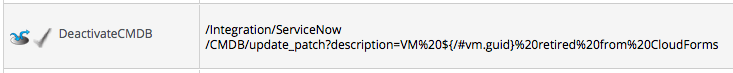

## Use Cases

The following examples show how ServiceNow can be integrated with
automation workflows.

### Provisioning a Virtual Machine from a Template

The Cloud and Infrastructure **Provision VM from Template** State
Machines contain **RegisterCMDB** and **ActivateCMDB** states.

To create a new ServiceNow record during virtual machine provisioning,
amend the **ActiveCMDB** state to call the `create` method, for example:

    /Integration/ServiceNow/CMDB/create

### Virtual Machine Retirement

The Cloud and Infrastructure default **Retirement** State Machines
contain the **DeactivateCMDB** state.

To update a virtual machine’s ServiceNow record during virtual machine
retirement, amend the **DeactivateCMDB** state to call the
`update_patch` method, for example:

    Integration/ServiceNow/CMDB/update_patch?description=VM%20${/#vm.guid}%20retired%20from%20{productname_short}

### Virtual Machine Reconfiguration (VMware Only)

Create a new **System Event** instance to update the ServiceNow record
after a virtual machine reconfiguration request has been approved and
completed.

Create a new **/System/Event/ReconfigVM\_Task\_Complete** instance with
a relationship value:

    /Integration/ServiceNow/CMDB/update_patch

