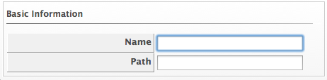

# Adding a Repository

To refresh a repository for more detailed information, add it to your
VMDB first. The VMDB requires a universal naming convention (UNC)
network path to the repository.

1.  Navigate to **Compute > Infrastructure > Repositories**.

2.  Click  (**Configuration**), then click
     (**Add a new Repository**).

3.  In **Basic Information**, enter a **Name** and a UNC network
    **Path** to the repository location.

    

4.  Click **Save**.
