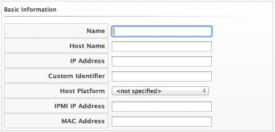
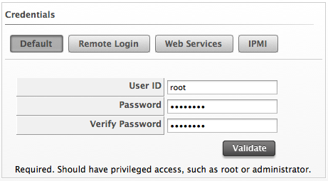

# Adding a Single Host

To analyze a host for more detailed information, add it to the VMDB
first. If the host has not been found during **Host Discovery** or
**Provider Refresh**, and the host’s IP address is known, use the **Add
a New Host** button.

1.  Browse to menu: **Compute > Infrastructure > Hosts**.

2.  Click **Configuration**, then click (../images/1862.png)**Add a New item**.

3.  Type the **Name**, **Host Name**, and **IP Address** of the host to
    add. **Name** is how the device is labeled in the console. Select
    the type of operating system from the **Host Platform** dropdown. If
    the Host has been found during **Discovery** or **Refresh** and the
    host’s operating system has been identified, the **Host Platform**
    selector remains disabled. If adding an IPMI server for
    provisioning, add in the IP address of that host.

    **Important:**
    The **Host Name** must use a unique fully qualified domain name.

    

4.  In the **Credentials** box, the **Default** tab provides fields to
    type a user name with elevated security credentials and the user’s
    password. If using domain credentials, the format for **User ID** is
    in the format of `[domainname]\[username]`. On ESX hosts, if the
    `SSH` login is disabled for the **Default** user, type in a user
    with remote login access on the **Remote Login** tab.

    

5.  Click **Validate** to check the credentials.

6.  Click **Save**.
