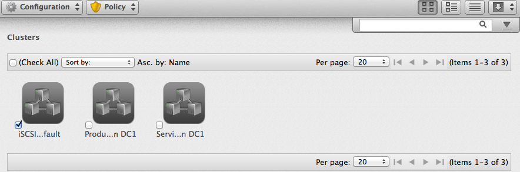
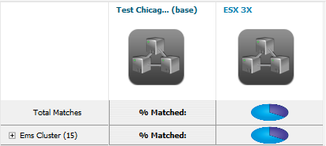

# Clusters

Clusters provide high availability and load balancing for a group of
hosts. The **Clusters** page under menu:Compute\[Infrastructure\]
displays the clusters discovered in your enterprise environment.

**Note:**

Any filter applied will be in effect here.

Use the **Clusters Taskbar** to manage the analysis and tagging of your
clusters. These buttons manage multiple clusters at one time. To manage
one cluster, click on that cluster in the main area of the screen.



## Comparing Clusters

{{ site.data.product.title }} provides features to compare properties of clusters.

1.  Navigate to menu:Compute\[Infrastructure \> Clusters\].

2.  Check the clusters to compare.

3.  Click  (**Configuration**), and then
     (**Compare Selected items**). The
    comparison displays in a default expanded view and lists a limited
    set of properties.

    

4.  To delete a cluster from the comparison, click
    (**Remove this Cluster from the
    Comparison**).

5.  To go to a compressed view, click 
    (**Compressed View**). To return to an expanded view, click
     (**Expanded View**).

6.  To change the base cluster that all other clusters compare to, click
    its label at the top of its column.

7.  To go to the cluster summary screen, click its virtual thumbnail or
    icon.

8.  There are three buttons in the taskbar to limit the type of views:

      - Click  (**All attributes**) to see all
        attributes.

      - Click  (**Attributes with different
        values**) to see only the attributes that are different across
        clusters.

      - Click  (**Attributes with the same
        values**) to see only the attributes that are the same across
        clusters.

9.  To limit the mode of the view, there are two taskbar buttons.

      - Click  (**Details Mode**) to see all
        details for an attribute.

      - Click  (**Exists Mode**) to only see if
        an attribute exists compared to the base or not. This only
        applies to attributes that can have a Boolean property. For
        example, a user account exists or does not exist, or a piece of
        hardware that does or does not exist.

This creates a comparison between clusters. Export this data or create a
report from your comparison for analysis using external tools.
















