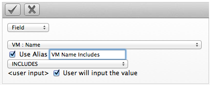
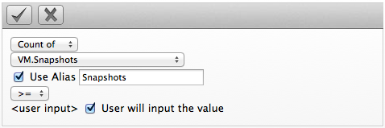
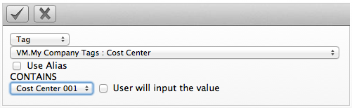
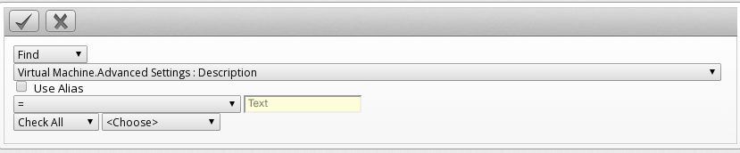

# Creating an Instance or Image Filter

1. Browse to menu: **Compute > Clouds > Instances**.

2. Go to the **Instances** or **Images** accordion.

3. Click **All Instances** or **All Images**, then click
     **Advanced Search** to open the
    expression editor.

4. Use the expression editor to choose the appropriate options for your
    criteria. Based on what you choose, different options will show.

      - For all of the types of searches, you have the options of
        creating an alias and requested user input. Select **Use Alias**
        to create a user friendly name for the search. If you are
        requested user input for the search, this text will show in the
        dialog box where the input is requested.

      - Click **Field** to create criteria based on field values.

        

      - Click **Count of** to create criteria based on the count of
        something, such as the number of snapshots for an instance, or
        the number of instances on a host.

        

      - Click **Tag** to create criteria based on tags assigned to your
        virtual infrastructure, such as for power states or production
        tagging.

        

      - Click **Find** to seek a particular value, and then check a
        property.

        

5. Click  **Commit Expression Element Changes** to add the expression.

6. Click **Save**.

7. Type in a name for the search expression in **Save this Instance
    search as**. To set the filter to show globally, check **Global
    Search**.

8. Click **Save**.

The filter is saved and shows in the **My Filters** area of the
**Filter** accordion. If you checked **Global Search**, the filter shows
there.
