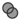

# Detecting Drift on Clusters

Over time, a cluster’s configuration might change. Drift is the
comparison of a cluster to itself at different points in time. The
cluster requires analysis at least twice to collect information.
Detecting drift provides users with the following benefits:

  - See the difference between the last known state of a cluster and its
    current state

  - Review the configuration changes that happen to a particular cluster
    between multiple points in time.

  - Capture the configuration drifts for a single cluster across a time
    period.

Detect drift on clusters:

1.  Browse to menu: **Compute > Infrastructure > Clusters**.

2.  Click on the cluster to view drift.

3.  Click **Relationships** in the cluster accordion.

4.  Click **Drift History**.

5.  Check the analyses to compare.

6.  Click  (**Drift Analysis**) at the top of
    the screen. The results are displayed.

7.  Check the **Comparison** sections on the left to view in your
    comparison.

8.  Click the plus sign next to the section name to expand it.

      - An item displayed on red text shows a change from the base
        analysis. An item displayed in black text shows no change from
        the base analysis.

      - A  (**Changed from previous**) shows
        there has been a change since the last analysis.

      - A  (**Same as previous**) means there
        has been no change since the last analysis.

      - Click  (**Remove from drift**) at the
        bottom of a column to remove a specific analysis. The drift is
        then recalculated and the new results display.

9.  Click  (**Expanded View**) to see the
    expanded view. Click  (**Compressed
    View**)\] to compress the information.

10. Click the minus sign next to the section name to collapse it.

11. To limit the type of views, there are three buttons in the taskbar.

      - Click  (**All attributes**) to see all
        attributes of the sections selected.

      - Click  (**Attributes with different
        values**) to see only the attributes different across drifts.

      - Click  (**Attributes with the same
        values**) to see only the attributes the same across drifts.

The drift displays for your cluster. Download the data or create a
report from the drift for analysis using external tools.
