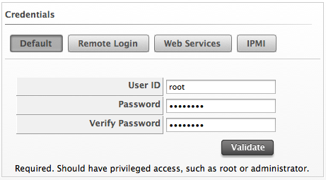

# Editing Hosts

If multiple hosts have the same settings or credentials, edit them at
the same time.

1.  Browse to menu: **Compute > Infrastructure > Hosts**.

2.  Click **Configuration**.

3.  Check the Hosts to edit.

4.  Click  (**Edit Selected items**).

5.  Use **Credentials** to provide login credentials required for this
    host.

    

      - On the **Default** tab, type a user name with elevated security
        credentials and the users password. If you are using domain
        credentials, the format for User ID must be in the format of
        `[domainname]\[username]`.

      - On `ESX` hosts, if `SSH` login is disabled for the **Default**
        user, type in a user with remote login access on the **Remote
        Login** tab. If this is not supplied, *Default* credentials will
        be used.

      - Use **Web Services** to supply credentials for any web service
        calls made directly to the host system. If this is not supplied,
        **Default** credentials are used.

        **Note:**

        Login credentials are required for performing SmartState Analysis on the host’s virtual machines and templates.

        For each type of credential used, the following information is required:

      - Use **User ID** to specify a login ID.

      - Use **Password** to specify the password for the User ID.

      - Use **Verify Password** to confirm the password.

6.  Test the credentials by using the *Select Host to validate against*
    drop down and click **Validate**.

7.  Click **Save**.
