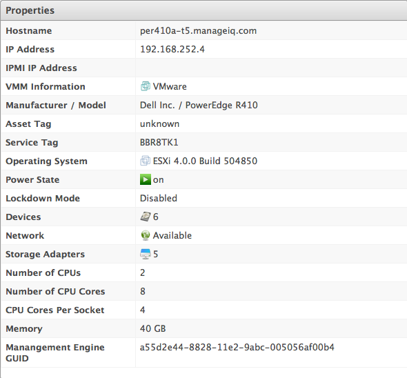
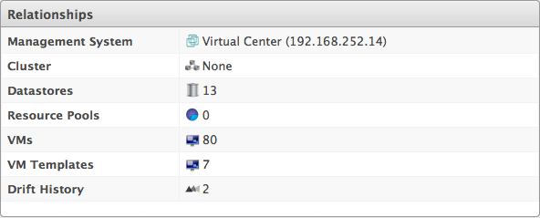
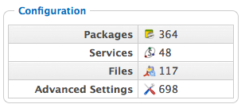

# Host Virtual Summary

Clicking on a specific host shows the Host’s Virtual Thumbnail and an
`operating system-sensitive` screen of host information, called the Host
Summary. Where applicable, click on a subcategory of the Host Summary to
see more detail on that section.

A **Refresh** provides some basic information on the Host. To get more
detail, enter credentials for the host and perform a SmartState
Analysis.

The Summary divides into the following categories.

  - **Properties** include information such as base operating system,
    hostname, IP addresses, devices attached to the system, and storage
    adapters. Some categories can be clicked on for additional detail.
    For example, click **Network** to view the network adapters
    connected to the host.

    

  - **Relationships** include information on the provider, cluster,
    datastores, resource pools, and installed virtual machines.

    

  - **Security** shows the number of users, groups, patches installed,
    and firewall rules on the host. Click on any of these items to see
    further details.

    **Note:**

    Run a SmartState Analysis on the host to retrieve this information.

  - **Storage Relationships** shows the relationship the host has to
    LUNs, volumes, and file shares. The **Storage Inventory Role** must
    be enabled in the zone for these items to be populated.

  - **Configuration** shows the number of packages and services
    installed. Click on any of these items to see more details.

    **Note:**

    Run a SmartState Analysis on the host to retrieve this information.

    

  - **Smart Management** shows all tags assigned to this host.

  - **Authentication Status** shows all the types of credentials entered
    for this host and the whether those credentials are valid.
