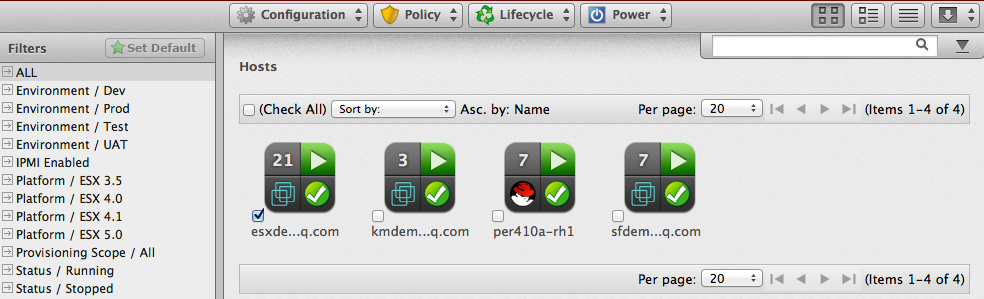
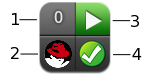

# Hosts

The **Hosts** page under menu:Compute\[Infrastructure\] displays the
hosts discovered in your enterprise environment.

**Note:**

Any applied filters will be in effect here.

After adding or sorting your hosts, click on one to examine it more closely and see its virtual machines, SmartProxy settings, and properties.

1.  Top left quadrant: Number of virtual machines on this host

2.  Bottom left quadrant: Virtual machine software

3.  Top right quadrant: Power state of host

4.  Bottom right quadrant: Authentication status

| Icon                      | Description                                                                    |
| ------------------------- | ------------------------------------------------------------------------------ |
|  | Validated: Valid authentication credentials have been added.                   |
|  | Invalid: Authentication credentials are invalid                                |
|  | Unknown: Authentication status is unknown or no credentials have been entered. |

## Filtering Hosts

The Host Filter accordion is provided to easily navigate through the
hosts. Use the ones provided or create your own. In addition, you can
set a default filter.







## Comparing Hosts

{{ site.data.product.title_short }} allows you to compare hosts and check operating systems,
host software and version information, and hardware.

1.  Navigate to menu:Compute\[Infrastructure \> Hosts\].

2.  Check the hosts to compare.

3.  Click  (**Configuration**), and then
     (**Compare selected Hosts**). The
    comparison displays in a default expanded view, which lists a
    limited set of properties.

4.  To remove a host from the comparison, click
     (**Remove this Host from the comparison**)
    at the bottom of the column.

5.  To go to a compressed view, click 
    (**Compressed View**). To return to an expanded view, click
     (**Expanded View**).

6.  To limit the mode of the view, there are two buttons in the taskbar.

      - Click  (**Details Mode**) to see all
        details for an attribute.

      - Click  (**Exists Mode**) to limit the
        view to if an attribute exists compared to the base or not. This
        only applies to attributes that can have a Boolean property. For
        example, a user account exists or does not exist, or a piece of
        hardware that does or does not exist.

7.  To change the base host that compare to the other hosts, click its
    label at the top of its column.

8.  To go to the summary screen for a host, click its virtual thumbnail
    or icon.



















## Scaling Down Compute Hosts




















