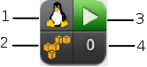

# Instances and Images

**Images** are the static templates containing the software
configuration from which you provision a running **Instance** - a
virtual machine, with which you can interact - on your cloud provider.

The **Instance** and **Images** containers, combined with the ability to
analyze information inside each instance or image, provides in-depth
information across the cloud environment. This rich set of information
enables {{ site.data.product.title_short }} users to improve problem resolution times and
effectively manage instances and images in their cloud environment.

The **Instances** and **Images** pages display all instances and images
the server discovered from your cloud providers. The taskbar on each
page is a menu driven set of buttons that provide access to functions
related to instances and images.

1.  History button

2.  Refresh screen button

3.  Taskbar

4.  Download buttons

5.  View buttons

6.  Name search bar/Advanced Search button

7.  Sort dropdown

8.  Navigation bar

9.  Main area in List View

10. Cloud/Filter Navigation

Console uses Virtual Thumbnails to describe instances and images. Each
thumbnail contains four quadrants by default. This allows you to glance
at an instance or image for a quick view of its contents.

1.  Top left quadrant: Operating system of the Instance

2.  Bottom left quadrant: Instance Cloud Provider

3.  Top right quadrant: Power state of Instance or Status icon

4.  Bottom right quadrant: Number of Snapshots for this Instance

| Icon                      | Description                                                                              |
| ------------------------- | ---------------------------------------------------------------------------------------- |
|  | Template: Cloud Image                                                                    |
|  | Retired: Instance has been retired                                                       |
|  | Archived: Instance has no provider or availability zone associated with it.              |
|  | Orphaned: Instance has no availability zone but does have a provider associated with it. |
|  | Disconnected: Instance is disconnected.                                                  |
|  | On: Instance is powered on.                                                              |
|  | Off: Instance is powered off.                                                            |
|  | Suspended: Instance has been suspended.                                                  |

The **Instances** page has four accordions organizing your instances and
images in different ways. All of these accordions share a set of common
controls:

  - Use **Instances by Provider** and **Images by Provider** to view
    your instances and images organized by provider. In addition, you
    can see archived and orphaned items here.

  - Use the **Instances** to view, apply filters, and collect
    information about all of your instances.

  - Use **Images** to view, apply filters, and collect information about
    all of your images.

Through the console, you can view your instances and images in multiple
ways:

  - Filter instances

  - Change views

  - Sort

  - Create a report

  - Search by Tags

  - Search by collected data

## Filtering Instances and Images

The **Instance Filter** accordion is provided so that you can easily
navigate through groups of instances. You can use the ones provided or
create your own through **Advanced Filtering** capabilities.

















## Comparing Instances and Images

You can compare multiple instances in {{ site.data.product.title_short }} server. This
allows you to see how different instances are from their original image.
This helps detect missing patches, unmanaged user accounts, or
unauthorized services.

Use the comparison feature to:

  - Compare multiple instances from different hosts

  - Compare multiple instances side-by-side

  - Quickly see similarities and differences among multiple instances
    and a base

  - Narrow the comparison display to categories of properties

  - Print or export in the comparison results to a PDF or CSV file

Compare instances and images:

1.  Browse to menu: **Compute > Clouds > Instances**.

2.  Click the accordion for the items to analyze.

3.  Click the checkboxes for the items to compare.

4.  Click **Configuration**, and then
     (**Compare Selected items**). The
    comparison displays in a compressed view with a limited set of
    properties listed.

5.  To delete an item from the comparison, click
    (**Remove this VM from the comparison**) at
    the bottom of the items column.

6.  To view many items on one screen, go to a compressed view by
    clicking  (**Compressed View**). To return
    to an expanded view, click  (**Expanded
    View**).

7.  To limit the mode of the view, there are two buttons in the task
    bar.

      - Click  (**Details Mode**) to see all
        details for an attribute.

      - Click  (**Exists Mode**) to limit the
        view to if an attribute exists compared to the base or not. This
        only applies to attributes that can have a boolean property. For
        example, a user account exists or does not exist, or a piece of
        hardware that does or does not exist.

8.  To change the base instance that all the others are compared to,
    click its label at the top of its column.

9.  To go to the summary screen for an instance, click its **Virtual
    Thumbnail** or icon.

























## Resizing an Instance



## Migrating a Live Instance



## Evacuating an Instance






















