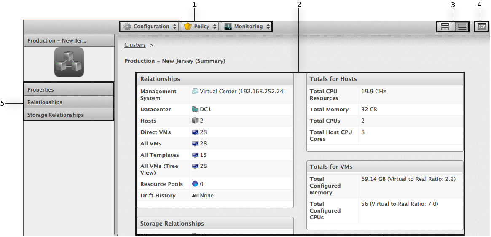

# Viewing a Cluster

You can click on a specific cluster to view its details. The screen
provides you with a cluster taskbar, a cluster accordion, and a cluster
summary.

**Cluster Management Screen.**

1.  **Cluster Taskbar**: Choose between **Configuration**, **Policy**
    and **Monitoring** options for the selected cluster

2.  **Cluster Summary**: See cluster summary such as **Relationships**,
    **Totals for Hosts**, **Totals for VMs**

3.  **Cluster Summary Views**: Choose between graphical or text view of
    the cluster summary

4.  **Cluster Summary PDF**: Generates cluster summary in PDF format

5.  **Cluster Accordion**: See details about **Properties**,
    **Relationships**, **Storage Relationships** for the selected
    cluster
