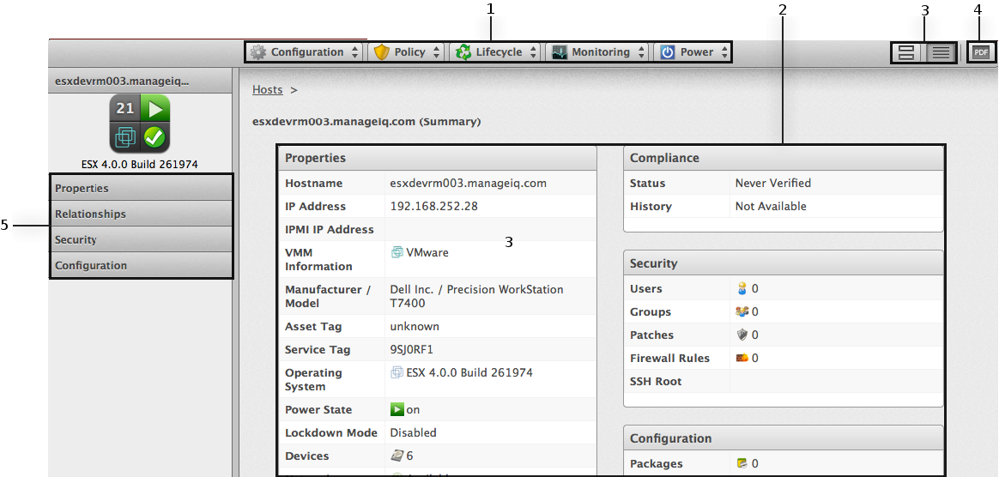

# Viewing a Host

You can click on a specific host to review it. The screen shows a host
virtual thumbnail, a host taskbar, a host accordion, and a host summary.

**Host Management Screen.**

1.  **Host Taskbar**: Use the host taskbar to take actions on the
    selected host

2.  **Host Summary**: Use the host summary to see the properties of a
    host, drill down to a host’s information, and view its installed
    virtual machines

3.  **Host Summary Views**: Choose between graphical or text view of the
    provider summary

4.  **Host PDF**: Generates host summary in PDF format

5.  **Host Accordion**: See details about **Properties**,
    **Relationships**, **Security** and **Configuration** for the
    selected host
